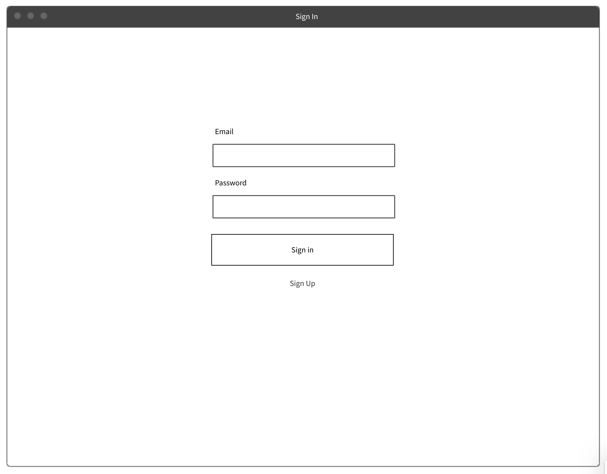

# React Hooks and Routing

## (MMT-B2018)

---

### storybook.js

> Storybook is an open source tool for developing UI components in isolation for React, Vue, and Angular

----

### storybook.js

- helps develop components in isolation
- makes debugging components more easy
  - especially styling
- makes it possible to insert fake data
  - bring components in different states

----

### storybook.js

```js
import React from 'react'
import { storiesOf } from '@storybook/react'
import UserList from './UserList'

const FAKE_USERS =  [
  {id: 1, name: "Sepp"},
  {id: 2, name: "Mike"}
]

storiesOf('UserList', module)
  .add('default', () => <UserList users={FAKE_USERS} />)
  .add('without any users', () => <UserList users={[]} />)
```

---

### React Hooks

- Introduced recently to reduce boilerplate
- Makes it possible to use state in functional components
  - Previously one had to convert between functional/class components when state introduced
- hooks are prefixed with `use`
- Can't be called inside loops, conditions or nested functions

----

### State without hooks

```js
class App extends React.Component {
  state = { count: 0 }

  handleIncrement = () => {
    this.setState({ count: this.state.count + 1 })
  }
  render() {
    return (
      <div>
        <div>
          {this.state.count}
        </div>
        <button onClick={this.handleIncrement}>Increment by 1</button>
      </div>
    )
  }
}
```

----

### useState

```js
const App = () => {
  const [count, setCount] = useState(0);
  const handleIncrement = () => setCount(count + 1);

  return (
    <div>
      <div>{count}</div>
      <button onClick={handleIncrement}>Increment by 1</button>
    </div>
  );
}
```

----

### Extract into custom hook

```js
const useCounter = () => {
  const [count, setCount] => useState(0);
  const handleIncrement = () => setCount(count + 1);
  return { count, handleIncrement };
}

const App = () => {
  const {count,handleIncrement} => useCounter();

  return (
    <div>
      <div>{count}</div>
      <button onClick={handleIncrement}>Increment by 1</button>
    </div>
  );
}
```

---

### useEffect

```js
// Executed on every rerender
useEffect(() => {})

// Executed when component rendered initially
useEffect(() => {}, [])

// Executed when component rendered initially
// and when variable changes.
useEffect(() => {}, [variable])

// Cleanup when component unmounts (eg. eventHandlers, setInterval/setTimeout)
useEffect(() => {
  // do something fancy
  return () => { console.log('cleanup') }
}, [variable])
```

----

### Previous Example

```js
const useCounter = () => {
  const [count, setCount] => useState(0);
  const handleIncrement = () => setCount(count + 1);
  return { count, handleIncrement };
}

const App = () => {
  const {count,handleIncrement} => useCounter();

  return (
    <div>
      <div>{count}</div>
      <button onClick={handleIncrement}>Increment by 1</button>
    </div>
  );
}
```

----

### Update title with counter

```js
const useCounter = () => {
  const [count, setCount] => useState(0);
  const handleIncrement = () => setCount(count + 1);
  return { count, handleIncrement };
}

const App = () => {
  const {count,handleIncrement} => useCounter();

  // Is executed when component is rendered for the first time
  // And when the counter variable changes.
  useEffect(() => {
    document.title = `Counter clicked ${counter} times`;
  }, [counter]);

  return (
    <div>
      <div>{count}</div>
      <button onClick={handleIncrement}>Increment by 1</button>
    </div>
  );
}
```

----

### Extract to custom hook

```js
const useCounter = () => {
  const [count, setCount] => useState(0);
  const handleIncrement = () => setCount(count + 1);
  useEffect(() => {
    document.title = `Counter clicked ${counter} times`;
  }, [counter]);

  return { count, handleIncrement };
}

const App = () => {
  const {count,handleIncrement} => useCounter();

  return (
    <div>
      <div>{count}</div>
      <button onClick={handleIncrement}>Increment by 1</button>
    </div>
  );
}
```

---

### React Context API

- Available since the beginning of React
- Prevent "prop drilling"

----

### React Context API


----

### React Context API


----

### React Context API


----

### Creating a context

```js
const DEFAULT_VALUE = 1
const MyContext = React.createContext(DEFAULT_VALUE)

const RootComponent = () => {
  return (
    <MyContext.Provider value={2}>
      <ANestedComponent />
    </MyContext.Provider>
  )
}

const ANestedComponent = () => {
  const value = useContext(MyContext)
  return (
    <h1>The value from context is {value}</h1>
  )
}
```

----

### Pitfalls 1

- fine granular context


----

### Pitfalls/Tips

- Prefer passing props down to components
  - prefer explicit (pass down) vs implicit (context)
- only use when multiple components need to access same data
  - if possible pass data down
- don't overuse
- values from A context are globals
  - use only a hand full of Context.Providers
  - testing becomes trickier

----

### Other hooks

- [API Reference](https://reactjs.org/docs/hooks-reference.html)
  - useReducer
  - useCallback
  - useMemo
  - useRef
  - useImperativeHandle
  - useLayoutEffect
  - useDebugValue

---

### Task

- build a clock component
  - component displays current time in seconds
  - automatically updates itself
  - remove setInterval when component unmounts
- You'll need
  - useEffect, useState
  - setInterval or setTimeout
  - (new Date()).toLocaleTimeString()

---

### React Router

- dynamic routing library for
- react native
- react web
- [Documentation](https://reacttraining.com/react-router/web/guides/quick-start)

----

### Installation

 ```txt
npm install react-router-dom --save
```

----

### Usage

 ```js
import { BrowserRouter as Router, Route, Switch, Redirect } from "react-router-dom";
import Homepage from './components/homepage'
import SignIn from './components/sign-in'

const App = () => {
  return (
    <Router> { /* creates a new routing context */ }
      <Switch> { /* render only one route */ }
        { /* define routes and pass component as prop to the route */ }
        <Route path="/sign-in" component={SignIn}>
        <Route path="/" component={Homepage}>
        { /* if no route matches redirect to 'Homepage' */ }
        <Redirect to='/'>
      </Switch>
    </Router>
  );
}
```

----

### Route priority (without exact)

 ```js
// path === "/" => renderes Homepage
// path === "/sign-in" => renderes Homepage
const Routes = () => (
  <Switch>
    <Route path="/" component={Homepage} />
    <Route path="/sign-in" component={SignIn} />
  </Switch>
);
```

----

### Route priority (without exact)

 ```js
// path === "/" => renderes Homepage
// path === "/sign-in" => renderes SignIn
const Routes = () => (
  <Switch>
    <Route path="/sign-in" component={SignIn} />
    <Route path="/" component={Homepage} />
  </Switch>
);
```

----

### Route priority (with exact)

 ```js
// path === "/" => renderes Homepage
// path === "/sign-in" => renderes sign-in
const Routes = () => (
  <Switch>
    <Route exact path="/" component={Homepage} />
    <Route exact path="/sign-in" component={SignIn} />
  </Switch>
);
```

----

### Add Links from html

 ```js
 import { Link } from 'react-router-dom'

 const Routes = () => (
   <nav>
     <Link to='/'>Home</Link>
     <Link to='/sign-in'>Sign in</Link>
   </nav>
)
```

----

### Add redirects from JS

 ```js
 import { withRouter } from 'react-router-dom'

 const SignIn = withRouter(({ history }) => {
   const onSubmit = (evt) => {
     evt.preventDefault()
     history.push('/')
   }

   return (
     <form onSubmit={onSubmit}>
       {/* ... */}
     </form>
   )
})
```

---

## Homework 1

- Build the following components in Storybook
  - UserSignIn -> onSubmit => { username, password }
  - UserSignUp -> onSubmit => { username, password }
  - MoneyTransactionCreate
    - users => { id, name }
    - onSubmit => { debitorId, creditorId, amount }

  - MoneyTransactionList (Lists all Money Transactions)
    - moneyTransactions
    - onMoneyTransactionPaid => { id, paidAt: (new Date()).toISOSTring() }

----

## Homework 2

- You probably need the following core components
  - `<TextInput {...} />`
  - `<DecimalInput {...} />`
  - `<SelectInput {...} />`
  - `<Button {...} />`
  - ...

----

## Homework 3

- Allowed to use CSS Frameworks
- Not allowed to use Component Libraries
- You can use as a starting point <https://github.com/webpapaya/fhs-react-redux-starter-kit>
- Mock Data for the API <https://gist.github.com/webpapaya/ba25ac39138b6f6a50a04f2b0820cf65>

----

## Homework 4

- Add the following routes
  - /sign-in
    - Sign-In component is rendered
  - /sign-up
    - Sign-Up component is rendered
  - /money-transactions
    - money-transactions-create component is rendered
    - money-transaction-list component is rendered

----

## Homework 5

- No need to connect to the backend
- Form submissions (just log to the screen or alert them)
- Don't update UI on form submissions
  - eg.: when creating a transaction the list doesn't need to update
  - we'll do this together next time with redux

----



----


----


---

## Feedback/Questions

- <https://de.surveymonkey.com/r/J6693VN>
- tmayrhofer.lba@fh-salzburg.ac.at
