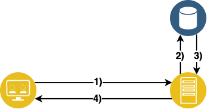
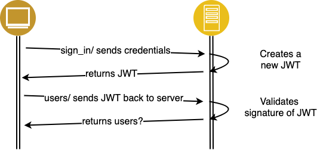
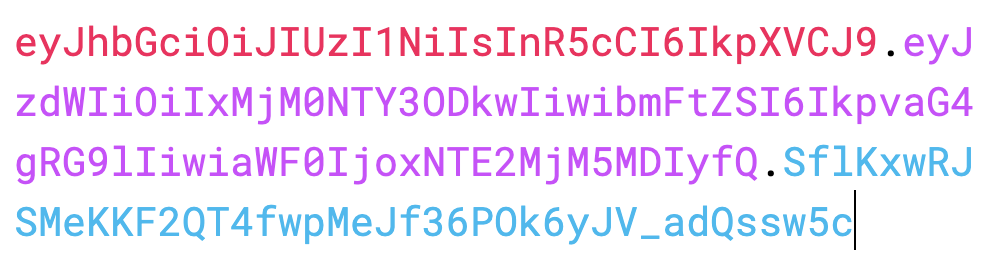
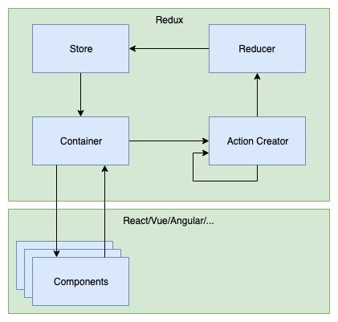
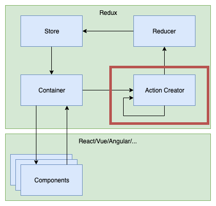

# Authentication in React/Redux

---

### Exam

- As of Covid-19 it's unclear if exam will happen
- if it happens then on 2.7.
- if it doesn't happen project will be your grade (for my part)

---

### Roadmap

- Today authentication
  - Afterwards project troubleshooting
- Tomorrow testing react components

---

### Authentication

- Verify identity of something
  - Who is somebody
- Identity can be
  - User
  - Different Service
  - Pets
  - ...
- Sometimes refered to as Authn

----

### Authentication

- identity is verified by credentials
- usually combination of username/password
- other data might be used for identification
  - IP Geolocation
  - 2 Factor Authentication
  - Security Keys

---

### Authorization

- what resources should somebody have access to
  - What am I allowed to do
    - eg. A person can only change its own password
    - eg. A person can only see his own depts/credits
- usually happens after authentication
  - Anonymous resources might be accessible without authz
  - eg.: reading news articles
- more to this topic from Brigitte


---

### Stateful Authentication

- Session data is stored in the backend



1. /money_transactions/ is called
2. the session for the user is fetched from a db
3. the session information is returned and verified
4. result of /money_transactions/ is returned to client

----

### Stateful Authentication

- Pros:
  - Revoke session anytime
  - Easy to implement
  - Session data can be changed anytime
- Cons:
  - Increasing server resources
  - Every session needs to hit db
  - hard to integrate 3rd party apps


---

### Stateless Authentication
- Session data is stored directly on the client
- Session data is signed and integrity can be verified
  - server only needs to verify validity
  - does not need to refetch data

----

### Stateless Authentication

- Pros:
  - Lower server overhead
  - Easy to scale and integrate with 3rd party
    - 3rd party can read session data
- Cons:
  - Session can't be revoked anytime
  - More complex to implement
  - Session data can't be changed until it expires

----
### Stateless Authentication



---

### JWT (JSON Web Token)

> JSON Web Token (JWT) is a compact, URL-safe means of representing claims to be transferred between two parties.

- A signed JSON whose validity can be verified by others

----

### Anatomy of JWT

- Header Algorithm & Token type (red)
- Payload (purple)
  - whatever data needed for identification
- signature (blue)
  - used



----

### Header

- declare type JWT
- declare hashing algorithm to use
  - there are many others (see <https://jwt.io/)>

```json
{
  "alg": "HS256",
  "typ": "JWT"
}
```

----

### Payload

- Carries the information which we want to transmit
- Also called JWT claims
- can be read without the secret
  - don't store sensitive data in here!!!

```json
{
  "id": "1234567890",
  "name": "John Doe",
  "roles": ["Admin"]
}
```

----

### Signature

- Hash of
  - header
  - payload
  - secret
- required for data verification

```json
{
  "id": "1234567890",
  "name": "John Doe",
  "roles": ["Admin"]
}
```

----

### Anatomy of JWT

```json
// Header
{ "alg": "HS256", "typ": "JWT" }

// Payload (any valid JSON can be added)
{ "id": "1234567890", "name": "John Doe" }

// verify signature
// ...
```

gets converted to:


----

### Pros

- Standard by IETF
- Scalable
  - no DB hit needed for subsequent requests
- Stateless
- Distributable
- Secure against CSRF

---

### JWT in React/Redux


----

### JWT in React/Redux

- Where would it fit best?



----

### JWT in React/Redux



----

### Receiving a JWT

```ts
const signIn = ({ email, password }) => async (dispatch) => {
    const response = await fetch("/sign_in", {
      "method": "POST",
      "headers": {
        "Accept": "application/json",
        "Content-Type": "application/json"
      },
      "body": JSON.stringify({ user: { email, password }})
    });
    const token = response.headers.get('authorization')
    dispatch({ type: 'auth/signed_in', payload: { token }}) // still needs to be written
})
```

----

### Sending JWT to backend

```ts
const getUsers = ({ email, password }) => async (dispatch, getState) => {
  const jwtToken = getState().auth.token
  //               ^^^^^^^^^^^^^^^^^^^^^
  // get JWT token from state
  if (!jwtToken) { redirect('/sign_in') }

  const response = await fetch("/users", {
    headers: {
      'Authorization': jwtToken
      // ^^^^^^^^^^^^^^
      // add JWT token to fetch call
    },
  });
  // ...
})
```

----

### Sign out

```ts
const signOut = ({ email, password }) => async (dispatch) => {
  // no http call required (token needs to be removed from state in reducer)
  dispatch({ type: 'auth/signed_out')
})
```

----

### Sign out caveats

- items in store need to be removed manually
  - eg. previous money transactions/users
  - otherwise there is a possible data leak

```ts
const initialState = {}
const userReducer = (previousState = initialState, action) => {
  switch(action.type) {
    // ...
    case 'auth/signed_out':
      return initialState
    // ...
  }
}
```

---

### Homework

- connect sign-in/sign-out screens to backend
  - either <https://gentle-depths-21909.herokuapp.com/>
  - or your own rails backend
  - API endpoints <https://gist.github.com/webpapaya/81bff490a7ed765167f2c404acc1ec36/edit>
  - make sure to clean data afterwards
- Code Review you'll receive in the coming days

---

### Feedback/Questions

- <https://de.surveymonkey.com/r/J6693VN>
- tmayrhofer.lba@fh-salzburg.ac.at
