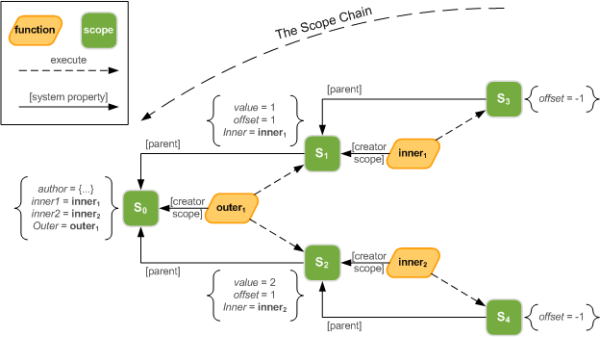
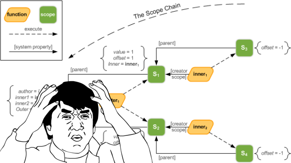
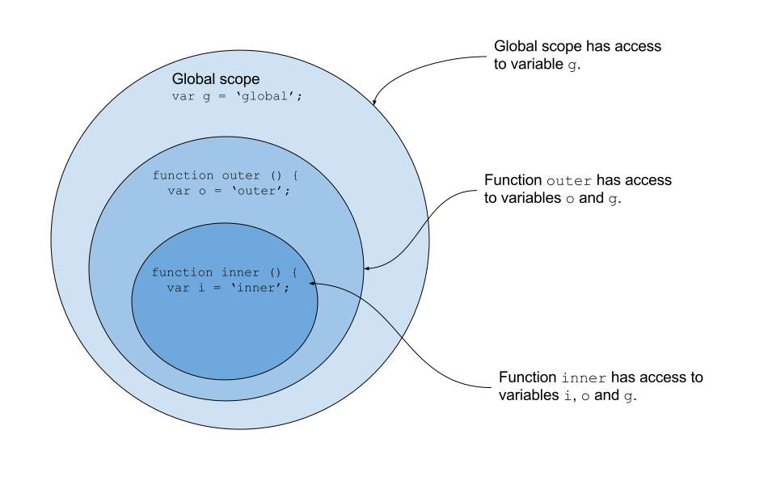
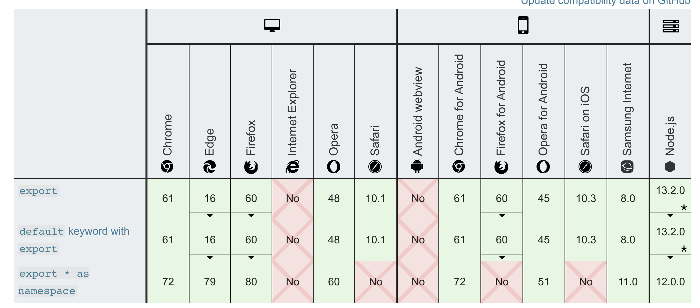

# Frontend Development

## Wintersemester 2020

---

# About/Contact

- Thomas Mayrhofer (@webpapaya)
- E-Mail: tmayrhofer.lba@fh-salzburg.ac.at

---

# Roadmap

- 5.11. 4 EH
  - JS History Intro etc.
  - Modules
  - build setup
- 11.11. 2EH
  - ES 6
- 24.11. 2EH
  - Asynchronous JS
- 3.12. 2EH
  - Single Page App Routing
- 17.12. 3EH
  -
- 22.12. 2EH
  - Recap
  - Gimme your questions!
- Date of Exam

---

# Grading

- 50% Homework
- 50% Exam
- Both positive

---

# Homework

- can be done in pairs
- hand-in via email tmayrhofer.lba@fh-salzburg.ac.at
  - email contains link to git reporitory
  - name of students who worked on the assignment

----

# Things I will look at

- functionality
- naming
- duplications
- code consistency (linting)
- function/component length
- commits + commit messages

---

# Feedback

- Questions: tmayrhofer.lba@fh-salzburg.ac.at
- <https://de.surveymonkey.com/r/XQ96YZX>


---

# [fit] Scopes and Closures



----


---



---

# [fit] Scope determines the accessibility (visibility) of variables.

---

# Scopes and Closures

In JavaScript there are 3 types of scope:

- Global scope
- Local scope or function scoped
- Block Scope

Define the visibility of a variable within a program.

---
# Local Scope

Variables declared within a JavaScript function, become **LOCAL** to the function.

```javascript
function myFunction() {
  var university = "FHS";

  // code here CAN use university
}

// code here CAN NOT use university
```

- Created when function execution starts
- Deleted when function execution completes


---

# Block Scope (before es6)

- A block statement is used to group zero or more statements.
- Used in loops, if/else statements
- Everything between curly brackets `{}`
- Before es6 all variables were function scoped

```javascript
function myFunction() {
  if (true) {
    var university = 'FHS'
    // code here CAN use university
  }
  // code here CAN use university as well
}
```

---

# [fit] What is the best university?

```javascript
function findBestUniversity() {
  var bestUniversity = 'FHS'
  if (true) {
    var bestUniversity = 'Hagenberg'
  }
  console.log(bestUniversity)
}
```


---

# [fit] What is the best university?

```javascript
function findBestUniversity() {
  var bestUniversity = 'FHS'
  if (true) {
    var bestUniversity = 'Hagenberg'
  }
  console.log(bestUniversity)
  // Hagenberg will be logged 🤮
}
```

---

# [fit] ES6 to rescue

---

# Block Scope with es6

- `let` and `const` introduced as new keywords
  - define variables in a block scope

```javascript
function myFunction() {
  let university = 'FHS'
  if (true) {
    let university = 'Hagenberg'
    // code here CAN use university
  }
  console.log(university)
  // FHS will be logged 🎉🎉🎉
}
```

---

# What will be the logged?

```javascript
function myFunction() {
  let university1 = 'FHS1'
  var university2 = 'FHS2'
  let university3 = 'FHS3'

  if (true) {
    let university1 = 'FHS1 overwritten'
    var university2 = 'FHS2 overwritten'
    university3 = 'FHS3 overwritten'
  }

  console.log(university1)
  console.log(university2)
  console.log(university3)
}
```

---

# What will be the result?

```javascript
function myFunction() {
  let university1 = 'FHS1'
  var university2 = 'FHS2'
  let university3 = 'FHS3'

  if (true) {
    let university1 = 'FHS1 overwritten'
    var university2 = 'FHS2 overwritten'
    university3 = 'FHS3 overwritten'
  }

  console.log(university1) // FHS1
  console.log(university2) // FHS2 overwritten
  console.log(university3) // FHS3 overwritten
}
```

---

# Global Scope

A variable declared outside a function, becomes **GLOBAL**.

```javascript
var university = "FHS";

function myFunction() {
  // code here CAN use university
}

// code here CAN use university as well

```

All scripts and functions can access this variable.

---

# Global Scope

- `window` is the global scope in the browser
- `global` it the global object in nodejs

```javascript
var university = "FHS";
window.university // "FHS"
```

---

# [fit] Global namespace pollution


---


---


---


---


---

# Closures

A closure is the combination of a function bundled together (enclosed) with references to its surrounding state (the lexical environment)

```javascript
const globalScope = `Global`

function outerFunction () {
  const outer = `I'm the outer function!`

  function innerFunction() {
    const inner = `I'm the inner function!`
    console.log(outer) // I'm the outer function!
  }

  console.log(inner) // Error, inner is not defined
}
```

---
# Closures



---

# Encapsulating State in Closures

```javascript
function counter(name) {
  let i = 0;
  return function () {
    i++;
    console.log(name + '; ' + i);
  }
}

const counter1 = counter('Counter1')
counter1(); // Counter1: 1
counter1(); // Counter1: 2
const counter2 = counter('Counter2')
counter2(); // Counter2: 1
counter2(); // Counter2: 2
```

---

# TODO: Small exercise


---

# [fit] JavaScript Modules

---

# JavaScript Modules

- A way to split applications into smaller pieces
- Similar to chapters/paragraphs in a book

---

# Why Modules [^1]

- Maintainability
- Namespacing
- Reusability

[^1]: https://www.freecodecamp.org/news/javascript-modules-a-beginner-s-guide-783f7d7a5fcc/

---
# Module Pattern
## Mimic objects with private variables

---


# Anonymous Closure

```javascript
(function () {
  var someVariable = 'irrelevant'

  console.log(someVariable);
}());
// `irrelevant` will be logged
```

---

# Anonymous Closure

```javascript
(function () { // create a new function
  var someVariable = 'irrelevant' // function

  console.log(someVariable);
}()); // immediately execute the newly created function
```

---

# Anonymous Closure

- Hides variables from global scope
- global variables can't be overwritten
  - var defined in new function scope
- no global namespace pollution


---

# Global Import

```javascript
var myGlobalModule = {}

(function (myModule) {
  myModule.value = 'some value'
}(myGlobalModule)); // "import" myGlobalModule into module

console.log(myGlobalModule.value) // 'some value'
```

---

# Global Import

- `myGlobalModule` is only global variable
- `myGlobalModule` is explicitly passed to module
- values will be assigned to myGlobalModule

---

# Object interface

```javascript
const myCalculator = (function () {
  let value = 0
  return {
    increment: function() {
      value += 1
    },
    getValue: function() {
      return value
    }
  }
}());

myCalculator.increment()
console.log(myCalculator.getValue()) // 1
myCalculator.increment()
console.log(myCalculator.getValue()) // 2
```

---

# [fit] CommonJS and AMD


---

# CommonJS and AMD

- Previous approaches encapsulate internals
- Make Applications Modular
- Define boundaries for functionality
  - Similar to chapters in books
- Scripts need to be loaded in correct order


---

# CommonJS and AMD
## Order of scripts

- finding the right order is tough
- eg: backbone requires underscore.js
    - underscore.js needs to be loaded before backbone
- complexity of finding right script order increases with amount of modules
- Naming clashes can still arise for same module in different versions


---

# CommonJS Module

- reusable piece of JavaScript
- used in node.js
- each file is own module with own context
- `module.exports` exposes contents of a modules
- prevents global namespace pollution
  - explicitly require module and assign to var
  - make dependencies explicit


---

# CommonJS Module

```javascript
// myCalculator.js
let value = 0

module.exports = {
  increment: function() {
    value += 1
  },
  getValue: function() {
    return value
  }
}

// -----
// app.js
const myCalculator = require('./myCalculator')

myCalculator.increment()
console.log(myCalculator.getValue()) // 1
myCalculator.increment()
console.log(myCalculator.getValue()) // 2
```

---

# AMD Module

- Asyncronous Module Definition
  - CommonJS loads all modules synchronous
  - Browser blocks other JS execution until everything is loaded
- modules can be loaded when needed
- used in browsers which don't support es6 modules

```javascript
define(
  ['myModule', 'myOtherModule'],       // define dependencies
  function(myModule, myOtherModule) {  // callback will be executed once myModule/myOtherModule was loaded
    console.log(myModule.hello());
  });
```

---

# UMD Module

- Combines CommonJS und AMD modules
- Sees which environment is available
  - loads modules by either CommonJS or AMD
- Work both on the server and on the client
  - When building a library use UMD as target


---

# UMD Module [^2]

```javascript
(function (root, factory) {
  if (typeof define === 'function' && define.amd) {
      // AMD
    define(['myModule', 'myOtherModule'], factory);
  } else if (typeof exports === 'object') {
      // CommonJS
    module.exports = factory(require('myModule'), require('myOtherModule'));
  } else {
    // Browser globals (Note: root is window)
    root.returnExports = factory(root.myModule, root.myOtherModule);
  }
}(this, function (myModule, myOtherModule) {
  let value = 0

  return {
    increment: function() {
      value += 1
    },
    getValue: function() {
      return value
    }
  }
}));
```

[^2]: Writing a UMD module won't be part of the exam.

---

# Native JS Modules


---

# ES6 Modules

- CommonJS and UMD are not standardized by ECMA
  - both standards emulate module pattern via JS
- Built in modules with ES6 [^4]
  - compact and declarative syntax
  - asynchronous loading
  - server and browser

[^4]: source: https://medium.freecodecamp.org/javascript-modules-a-beginner-s-guide-783f7d7a5fcc

---

# ES6 Modules [^3]



[^3]: https://developer.mozilla.org/en-US/docs/Web/JavaScript/Guide/Modules 01.11.2020


---

# ES6 Modules
## named exports

```javascript
// counter.js
let value = 0

export function increment () {
  value += 1
}
export function getValue () {
  return value
}

// app.js
import { increment, getValue } from './counter'

increment()
console.log(getValue()) // 1
increment()
console.log(getValue()) // 2
```

---

# ES6 Modules
## named exports, import entire module

```javascript
// counter.js
// ...

// app.js
import * as myCalculator from './counter'

myCalculator.increment()
console.log(myCalculator.getValue()) // 1
myCalculator.increment()
console.log(myCalculator.getValue()) // 2
```

---

# ES6 Modules
## default export

```javascript
// myModule.js
export default function myAmazingJSFunction () {
  console.log('FHS')
}

// app.js

import myAmazingJSFunction from './myModule'
import nameCanBeAnythingForDefaultExports from './myModule'

myAmazingJSFunction() // will log "FHS"
nameCanBeAnythingForDefaultExports() // will log "FHS"
```

---

# ES6 Modules
## dynamic import
- import statement can be used top level
- conditional loading of scripts is not possible
  - dynamic import to rescue

```js
if (loadCounter) {
  // counter won't be loaded when loadCounter === false
  const { increment, getValue } = await import('./counter')
  increment()
  console.log(getValue()) // 1
  increment()
  console.log(getValue()) // 2
}
```

---

# ES6 Modules
## importing styles

```js
// import a default export
import someModule from './my-module'

// import an entire module (excluding the default export)
import * as namedExports from './my-module'

// import an entire module (including the default export)
import defaultExport, * as namedExports from './my-module'

// import a named export
import { export1, export2 } from './my-module'

// alias a a named export
import { export1 as aliasedExport1 } from './my-module'

// dynamic import
const { default, export1, export2 } = await import('./my-module')
```
