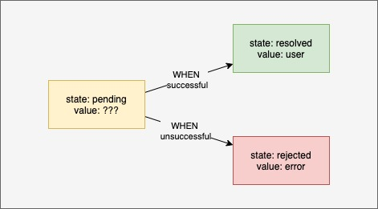
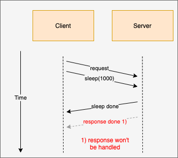

footer: FHS
slidenumbers: true

# Frontend Development

### Wintersemester 2020

---

## Asynchronous Javascript

---

# JS & Concurrency

- JS is single threaded
- eliminate lots of concurrency issues
- Only one thing can happen at a time
- long running operations block execution
  - eg. network requests

---

# JS & Concurrency

- Network requests would block main thread
  - no user interaction would be possible
    - button clicks wouldn't be registered
    - scrolling would not work anymore
    - ...

---

# TODO: maybe add event loop explanation

---

# Short declaimer
- TODO: better explanation

```javascript
function myFunction() {} // function
const myFunction = function () {} // anonymous function
const myFunction = () => {} // es6 arrow functions
```
---

# JS and Synchronous Code execution

```javascript
const second = () => {
  console.log('Hello there!');
}
const first = () => {
  console.log('Hi there!');
  second();
  console.log('The End');
}
```

```
http://latentflip.com/loupe/?code=ZnVuY3Rpb24gdGhpcmQoKSB7CiAgICBjb25zb2xlLmxvZygndGhpcmQnKQp9CgpmdW5jdGlvbiBzZWNvbmQoKSB7CiAgICB0aGlyZCgpCiAgICBjb25zb2xlLmxvZygnc2Vjb25kJykKfQoKZnVuY3Rpb24gZmlyc3QoKSB7CiAgICBzZWNvbmQoKQogICAgY29uc29sZS5sb2coJ2ZpcnN0IGZ1bmN0aW9uJykKfQoKZmlyc3QoKQ%3D%3D!!!PGJ1dHRvbj5DbGljayBtZSE8L2J1dHRvbj4%3D
```

---

# Async JS 

- In JS IO requests (eg. network requests) are done in the background
- UI is still responsive
- JS waits until IO finishes and continues from there

---

# Continuation Passing style
## No procedure is allowed to return to its caller--ever. [^1]

[^1]: pre es6

---

# Continuation Passing style

```js
function multiplyBy2(x, whenDone) {
  whenDone(x * 2)
}

function logResult(value) {
  console.log(value)
}

multiplyBy2(4, logResult) // 8 will be logged
```

---

# Continuation passing style in the browser

- `setTimeout` does not block js execution
- other scripts can still execute
- after ~1 second callback will be invoced

```js
setTimeout(() => {
  // will be called in the future
}, 1000)

// in node.js
fs.readFile('file.txt', (err, data) => {
  if (err) throw err; // throws on error (eg. file not found)
  console.log(data); // logs the contents of file.txt
})
```

---

# Usecase:
- fetch function which fetches data from an api
- does a simple HTTP GET request
- accepts URL and callback
- callback receives server response

```js
fetch(url, (err, response) => {})
```

---

# Usage:

```js
function myBestFriendsAddress() {
  fetch('/api/currentUser', (currentUser) => {
    // will be executed once we get a response from `currentUser`
    fetch(`/api/user/${currentUser.id}/bestFriend`, (bestFriend) => {
      // will be executed once we get a response from `bestFriend`
      fetch(`/api/user/${bestFriend.id}/address`, (bestFriendsAddress) => {
        // ...
      })
    })
  })
}
```

---

# Callback Hell:


---

# How could we flatten this tree?

---

# ES6 Promises to rescue

---

# Promises


---

# [fit] The Promise object represents the eventual completion (or failure) of an asynchronous operation and its resulting value.

---

# Promises

- A promise is in one of 3 states
 - pending
 - fulfilled
 - rejected
- Other languages call it `futures`



---

# Transform callbacks to promise

```js
function myBestFriendsAddress() {
  fetch('/api/currentUser', (currentUser) => {
    // will be executed once we get a response from `currentUser`
    fetch(`/api/user/${currentUser.id}/bestFriend`, (bestFriend) => {
      // will be executed once we get a response from `bestFriend`
      fetch(`/api/user/${bestFriend.id}/address`, (bestFriendsAddress) => {
        // ...
      })
    })
  })
}
```

---

# Transform callbacks to promise
## Wrap promise around fetch function

```javascript
const fetchAsPromise = (url) => {
  return new Promise((resolve) => { // create a new promise 
    // call the fetch function and *WHEN* the request is done, resolve the promise
    fetch(url, resolve) 
  }) 
}
```

---

# Transform callbacks to promise
## Use the wrapper


```javascript

const fetchAsPromise = (url) => new Promise((resolve) => {
  fetch(url, resolve)
})

fetchAsPromise('/api/currentUser')
  .then((currentUser) => fetchAsPromise(`/api/user/${currentUser.id}/bestFriend`))
  .then((bestFriend) => fetchAsPromise(`/api/user/${bestFriend.id}/address`))
  .then((bestFriendsAddress) => console.log(bestFriendsAddress))
```

---

# Promises error handling


```javascript
const fetchAsPromise = (url) => new Promise((resolve, reject) => {
  //                                                  ^^^^^^
  // enhance previous fetchAsPromise fn with reject param

  fetch(url, (data) => {
    if (data.status === 200) { resolve(data) } 
    else { reject(data) }
  })
})

fetchAsPromise('/api/currentUser')
  .then((currentUser) => fetchAsPromise(`/api/user/${currentUser.id}/bestFriend`))
  // ...
  .catch(() => alert('something went wrong 😥'))
```

---

# Promises error handling

- remember promise has 3 states (pending, resolved, rejected)
- `.catch` converts a rejected promise to a resolved one

```javascript
fetchAsPromise('/api/currentUser')
  // state: resolved
  .then(() => fetchAsPromise(`/api/someUnknownURL`))
  // state: rejected
  .catch(() => alert('something went wrong 😥'))
  // state: resolved
  .then(() => console.log('will be logged'))
```

---

# Creating promises out of static values

```javascript
Promise.resolve(1)
  .then((value) => { console.log(value) }) // 1 will be logged

Promise.reject(1)
  .catch((value) => { console.log(value) }) // 1 will be logged
```

---

# Waiting for multiple promises


---

# Waiting for multiple promises


---

# Waiting for multiple promises

- Waiting for promises might be slower
- If possible try to parallelize promises via `Promise.all`


---

# Waiting for multiple promises

```javascript
Promise.all([
  fetchAsPromise(`/api/currentUser`),
  fetchAsPromise(`/api/weather`)
]).then(([ currentUser, weather ]) => {
  console.log(currentUser)
  console.log(weather)
})
```

---

# Racing multiple promises

- `Promise.race` returns the fastest promise [^2]
- can be used to implement a timeout for slow requests

```javascript
const sleep = (timeout) => new Promise((resolve) => setTimeout(resolve, timeout))

Promise.race([
  fetchAsPromise(`/api/currentUser`),
  sleep(1000).then(() => ({ error: 'timeout' }))
]).then((result) => {
  if (result.error) {
    throw new Error('Timeout')
  }
  return result;
})
```

[^2]: I personally only used it once

---

# Racing multiple promises



---

# TODO: Promise Exercise 

---

# Promise in the wild
## fetch API
- Promise based Browser API for HTTP requests
- replaces/enhances XHR Request
- based on promises

```javascript
// Getting data via fetch

fetch('/api/users')
  .then((httpResult) => httpResult.json())
  //                               ^^^^^^
  // required as fetch resolves when HTTP headers are sent
  .then((data) => console.log(data))
```

---
# Promise in the wild
## posting data via fetch

```javascript
// Posting data via fetch

fetch('/api/users', {
  method: 'POST',                         // specify HTTP method
  headers: {
      'Content-Type': 'application/json'  // setting the content type
  },
  body: JSON.stringify({ my: 'payload' }) // adding payload
})
  .then((httpResult) => httpResult.json())
  .then((data) => console.log(data))
```
