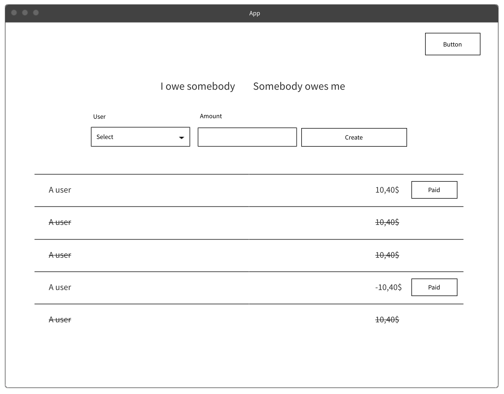

# React Introduction

## (MMT-M2019)

---

# About/Contact

- Thomas Mayrhofer (@webpapaya)
- E-Mail: tmayrhofer.lba@fh-salzburg.ac.at

---

## React

- Component based library to build composable UIs
- OpenSourced in 2013
- Implemented and Maintained by Facebook
- Learn once, write anywhere
  - React-Native
  - React-Native-Desktop
  - React-Native-Windows
  - React-VR

---

## Components

> Components let you split the UI into independent, reusable pieces.
[React Docs](https://reactjs.org/docs/components-and-props.html)

---

## React Components

- Main Building block of a React App
  - Describe the look and feel of one section in the UI

```js
const Button = () => {
  return (
    <button type='button'>
      A button
    </button>
  )
}

// Usage
React.renderComponent(<Button />, document.body)
```

----

## JSX

- JavaScript XML
  - extension to write XML in JS
- Allows to combine data preparation with render logic

```js
const Button = () => {
  return (
    <button type='button'>
      A button
    </button>
  )
}
```

----

## React without JSX

- React can be used without JSX

```js
const Button = () => {
  return React.createElement(
    'button',
    { type: 'button' },
    'A button'
  )
}
```

---

## Which components do you see


----



---

## Types of components

- Possible conceptual structure for components
  - `components/`
    - could be reused in other applications
    - don't have domain logic (eg. Button)
    - should not contain side effects (eg. API calls)
  - `container/<container_name>/organism/`
    - contain domain logic
    - can't be reused in a different application (eg. MoneyTransactionList/SignUp)
    - should not contain side effects (eg. API calls)

---

# Building the first react component  <!-- .element: class="color--white" -->

## Counter component  <!-- .element: class="color--white" -->

<!-- .slide: data-background="./assets/coding.gif" -->

---

### Embedding expressions

```js
const CurrentTime = () => {
  return (
    <h1>
      {(new Date()).toLocaleDateString()}
    </h1>
  )
}
```

----

### Embedding expressions

```js
const FagoMenu = () => {
  return (
    <a href={`/menu/${(new Date()).toLocaleDateString()}`}>
      Go to todays menu
    </a>
  )
}
```

----

## Conditional rendering

```js
const CurrentTime = () => {
  // ...
  return (
    <h1>
      {isToday
        ? 'Today'
        : 'Not Today' }
    </h1>
  )
}
```

----

## Conditional rendering

```js
const CurrentTime = () => {
  // ...
  return (
    <h1>
      {isToday && 'Today'}
      {!isToday && 'Not today'}
    </h1>
  )
}
```

----

### Loop over arrays

```js
const UserList = ({ users }) => {
  return (
    <ul>
      {users.map((user) => {
        return (<li key={user.id}>{user.name}</li>)
      })}
    </ul>
  )
}
```

----

### key property in loops

- Is required when interating over lists
- Helps react to decide if an element needs to be rerendered
- [Video explanation](https://www.youtube.com/watch?v=kFy5dpzdFsM)
- [Detailed explanation](https://dev.to/jtonzing/the-significance-of-react-keys---a-visual-explanation--56l7)

---

## Component composition

- Components can be nested and composed together


----

## React props

- Possibility to customize components
  - Can be seen as component configuration
- Props are passed to the component
  - A component at a lower level of the tree can't modify given props directly

```js
const Button = ({ children, disabled = false }) => {
  return (
    <button disabled={disabled} className='button'>
      {children}
    </button>
  )
}

const usage = <Button disabled>A button</Button>
```

---

# Unidirectional Dataflow
- Props only flow from parent to children
- Parent is responsible to update data
  - might provide callbacks to do so
- set state rerenders all children of component

----
# Unidirectional Dataflow


> [Source](https://medium.com/@alialhaddad/https-medium-com-alialhaddad-redux-vs-parent-to-child-2583c8e29509)

---

# Virtual DOM
- makes DOM updates faster
- after setState subtree is rerendered in memory
- compares DOM to in memory representation
- applies DOM changes when needed

----
# React.memo

> `Memoizing' a function makes it faster by trading space for time. It does this by caching the return values of the function in a table. (<https://metacpan.org/pod/Memoize)>

----
# React.memo


----

# React.memo
- Caches the rendered component
- Only rerenderes when one of the props changes
  - shallow comparison

```ts
const MyComponent = React.memo(function MyComponent(props) {
  /* render using props */
});
```

---

# React State (with Hooks)

- State allows components to by dynamic/interactive

```js
const ToggleButton = ({ onSubmit }) => {
  const [backgroundColor, setBackground] = useState('red')

  return (
    <button
      onClick={() => setBackground(backgroundColor === 'red' ? 'blue' : 'red') }
      style={{ backgroundColor }}
    >
      {children}
    </button>
  )
}
```

----

# React State (without hooks)

```js
class SimpleForm extends React.Component {
  state = { backgroundColor: 'red' };
  render() {
    return (
       <button
        onClick={() => this.setState({
          backgroundColor: backgroundColor === 'red' ? 'blue' : 'red')
        })}
        style={{ backgroundColor }}
      >
        {children}
      </button>
    );
  }
}
```

----

## State vs. Props

| _props_ | _state_ |
--- | --- | ---
Can get initial value from parent Component? | Yes | Yes
Can be changed by parent Component? | Yes | No
Can set default values inside Component?* | Yes | Yes
Can change inside Component? | No | Yes
Can set initial value for child Components? | Yes | Yes
Can change in child Components? | Yes | No

[source](https://github.com/uberVU/react-guide/blob/master/props-vs-state.md)

---

### Fragments

- Groups a list of children without adding a dom element

```js
const AComponent = () => {
  return (
    <>
      <label>An input</label>
      <input type="text" />
    </>
  )
}
```

----

## Keyed Fragments

- Same as fragment but a key can be provided (eg.: definition list)

```js
const AComponent = ({ items }) => {
  return (
    <dl>
      {items.map(item => (
        // Without the `key`, React will fire a key warning
        <React.Fragment key={item.id}>
          <dt>{item.term}</dt>
          <dd>{item.description}</dd>
        </React.Fragment>
      ))}
    </dl>
  )
}
```

---

# React Hooks

> Hooks allow you to reuse stateful logic without changing your component hierarchy. [React Docs](https://reactjs.org/docs/hooks-intro.html#its-hard-to-reuse-stateful-logic-between-components)

----

### React Hooks

- Introduced recently to reduce boilerplate
- Makes it possible to use state in functional components
  - Previously one had to convert between functional/class components when state introduced
- hooks are prefixed with `use`
- Can't be called inside loops, conditions or nested functions

----

### useState

```js
const App = () => {
  const [count, setCount] = useState(0);
  const handleIncrement = () => setCount(count + 1);

  return (
    <div>
      <div>{count}</div>
      <button onClick={handleIncrement}>Increment by 1</button>
    </div>
  );
}
```

----

### Extract into custom hook

```js
const useCounter = () => {
  const [count, setCount] => useState(0);
  const handleIncrement = () => setCount(count + 1);
  return { count, handleIncrement };
}

const App = () => {
  const {count,handleIncrement} => useCounter();

  return (
    <div>
      <div>{count}</div>
      <button onClick={handleIncrement}>Increment by 1</button>
    </div>
  );
}
```

---

### useEffect

```js
// Executed on every rerender
useEffect(() => {})

// Executed when component rendered initially
useEffect(() => {}, [])

// Executed when component rendered initially
// and when variable changes.
useEffect(() => {}, [variable])

// Cleanup when component unmounts (eg. eventHandlers, setInterval/setTimeout)
useEffect(() => {
  // do something fancy
  return () => { console.log('cleanup') }
}, [variable])
```

----

### Previous Example

```js
const useCounter = () => {
  const [count, setCount] => useState(0);
  const handleIncrement = () => setCount(count + 1);
  return { count, handleIncrement };
}

const App = () => {
  const {count,handleIncrement} => useCounter();

  return (
    <div>
      <div>{count}</div>
      <button onClick={handleIncrement}>Increment by 1</button>
    </div>
  );
}
```

----

### Update title with counter

```js
const useCounter = () => {
  const [count, setCount] => useState(0);
  const handleIncrement = () => setCount(count + 1);
  return { count, handleIncrement };
}

const App = () => {
  const {count,handleIncrement} => useCounter();

  // Is executed when component is rendered for the first time
  // And when the counter variable changes.
  useEffect(() => {
    document.title = `Counter clicked ${count} times`;
  }, [count]);

  return (
    <div>
      <div>{count}</div>
      <button onClick={handleIncrement}>Increment by 1</button>
    </div>
  );
}
```

----

### Extract to custom hook

```js
const useCounter = () => {
  const [count, setCount] => useState(0);
  const handleIncrement = () => setCount(count + 1);
  useEffect(() => {
    document.title = `Counter clicked ${count} times`;
  }, [count]);

  return { count, handleIncrement };
}

const App = () => {
  const {count,handleIncrement} => useCounter();

  return (
    <div>
      <div>{count}</div>
      <button onClick={handleIncrement}>Increment by 1</button>
    </div>
  );
}
```

---

### React Context API

- Available since the beginning of React
- Prevent "prop drilling"

----

### React Context API


----

### React Context API


----

### React Context API


----

### Creating a context

```js
const DEFAULT_VALUE = 1
const MyContext = React.createContext(DEFAULT_VALUE)

const RootComponent = () => {
  return (
    <MyContext.Provider value={2}>
      <ANestedComponent />
    </MyContext.Provider>
  )
}

const ANestedComponent = () => {
  const value = useContext(MyContext)
  return (
    <h1>The value from context is {value}</h1>
  )
}
```

----

### Pitfalls 1

- fine granular context


----

### Pitfalls/Tips

- Prefer passing props down to components
  - prefer explicit (pass down) vs implicit (context)
- only use when multiple components need to access same data
  - if possible pass data down
- don't overuse
- values from A context are globals
  - use only a hand full of Context.Providers
  - testing becomes trickier

----

### Other hooks

- [API Reference](https://reactjs.org/docs/hooks-reference.html)
  - useReducer
  - useCallback
  - useMemo
  - useRef
  - useImperativeHandle
  - useLayoutEffect
  - useDebugValue

---

### Task

- Fork/clone the following <https://github.com/webpapaya/fhs-react-redux-starter-kit>
- npm install
- npm run start:storybook
- build a clock component
  - component displays current time in seconds
  - automatically updates itself
  - remove setInterval when component unmounts

- You'll need
  - useEffect, useState
  - setInterval or setTimeout
  - (new Date()).toLocaleTimeString()

---

# Feedback

- Questions: tmayrhofer.lba@fh-salzburg.ac.at
- <https://de.surveymonkey.com/r/XQ96YZX>
