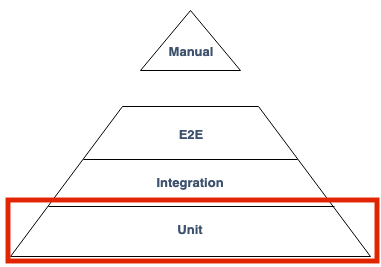
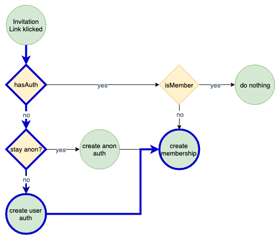

# Testing React Components

## (MMT-M2019)

---

### Testing Pyramid


----

### Testing Pyramid

- Unit tests
  - lots of small and isolated tests which are fast to execute
- Integration tests
  - some integration tests which test external systems like databases
- E2E
  - few tests which test the whole system

----

### Enterprise test pyramid


----

### We'll focus on



- Other parts in "Software Quality Assurance"

---

# Unit testing and TDD

- Test driven development (also known as TDD)
- Type of software development
- Introduced by Kent Beck
  - Author of [Extreme Programming](https://www.amazon.de/Extreme-Programming-Explained-Embrace-Change/dp/8131704513/ref=sr_1_1?__mk_de_DE=%C3%85M%C3%85%C5%BD%C3%95%C3%91&keywords=kent+beck+extreme+programming+englisch&qid=1557045753&s=books&sr=1-1-catcorr)

----

### Why TDD

- early/fast feedback during development
- Driving the design of our application
  - Testing is a side-effect
- Possibility to refactor
  - Confidence that app is still working
- Break down large problems into small problems
  - Think about edge cases
- executable documentation
  - Can't get out of sync
  - [Docs for pomeranian-durations](https://github.com/webpapaya/pomeranian-durations)

----

### TDD to me

> Getting confidence that refactoring doesn't break a feature.

----

### TDD

> TDD doesn't drive good design. TDD gives you immediate feedback about what is likely to be bad design. (Kent Beck)
> I want to go home on Friday and don't think I broke something. (Kent Beck)

----

### What is TDD not

- Silver bullet for clean code
  - it eventually leads to better code
- Replacement for other testing strategies
  - TDD doesn't catch all bugs
  - Helps adding regression tests

----

> The best TDD can do, is assure that the code does what the developer thinks it should do. (James Grenning)

---

# TDD Cycle


----

### TDD Cycle

- Red: Write a test and watch it fail
- Green: Write just as much code to make the test pass
- Refactor: Clean up

----

### Red

- Think about the test description
- Descriptions should reflect the behaviour of the program

```js
it('returns 3$, when product A given', () => {
  assert.equal(calculatePrice('productA'), '3$')
})
```

----

### Green

- Write just enough code to make the test pass
  - if there is only 1 product just return 3$

```js
function caluculatePrice () {
  return '3$'
};

it('returns 3$, when product A given', () => {
  assert.equal(calculatePrice('productA'), '3$')
})
```

----

### Refactor

- Change the code without changing any of the behaviour
- "Clean the kitchen"

```js
const caluculatePrice = () => '3$'

it('returns 3$, when product A given', () => {
  assert.equal(calculatePrice('productA'), '3$')
})
```

---

# Anatomy of a Test

- **A**rrange => test setup
- **A**act => call the unit to test
- **A**ssert => verify the result

----

### Anatomy of a Test

```js
it('returns a list of employees ordered by their name', () => {
  // Setup
  const employees = [
    { name: 'Sepp' },
    { name: 'Max' },
    { name: 'Anton' }
  ]

  // Act
  const result = employeeReport(employees)

  // Assert
  assertThat(result, orderedBy((a, b) => a.name < b.name))
})
```

---

# What makes a good test

- Deterministic
  - randomness hard to test
  - current date time hard to test
- Tests not affecting state of the system
  - changing global state (eg. database => without cleanup)
- no external systems
- little test setup
- behaviour is described and not implementation details

----

### TDD Trap

- Bad tests
- Endless discussions "How do good tests look like"
- Don't focus on implementation detail but behaviour
- Tests are getting in their way
- TDD is not easy to start
- Extremely hard to master
- Deleting tests is fine (if they're not required anymore)

---

### TDD React Components

---

### Tools

- Cypress (e2e testing "Software Quality Assurance")
- React Test Utils (Facebook, low level)
- Enzyme (AirBnB, more high level)
- React Testing Library (best of both worlds)

---

```js
import React from 'react'
import { render, cleanup, queryByText } from '@testing-library/react'
import Button from './Button'

afterEach(cleanup)
describe('Button', () => {
  it('renders given text', () => {
    // Arrange
    const givenText = 'A Button'

    // Act
    const { container } = render(<Button>{givenText}</Button>)

    // Assert
    expect(queryByText(container, givenText)).toBeTruthy()
  })
})
```

---

### Testing callbacks

```js
import React from 'react'
import { render, cleanup, queryByText, fireEvent } from '@testing-library/react'
import Button from './Button'

afterEach(cleanup)
describe('Button', () => {
  // ...
  it('onClick calls given function', () => {
    const onClick = jest.fn() // Create a function spy
    const { container } = render(<Button onClick={onClick}>A Button</Button>)
    fireEvent.click(container.querySelector('button'))
    expect(onClick).toHaveBeenCalledTimes(1)
  })
})
```

---

# Testing forms

```js
import React from 'react'
import { render, cleanup, queryByText, fireEvent } from '@testing-library/react'
import Button from './Button'

afterEach(cleanup)
it('submits username as form value', () => {
  const username = 'a value'
  const onSubmit = jest.fn()

  const { container } = render(<Form onSubmit={onSubmit} />)

  fireEvent.change(
    container.querySelector('[name="username"]'),
    { target: { value: username } }
  )
  fireEvent.submit(container.querySelector('form'))

  expect(onSubmit).toHaveBeenLastCalledWith({ username })
})
```

---

# Tools to test units under isolation

----

# Dummy objects

- Objects which aren't used
  - so that the compiler doesn't complain
  - used to fill parameter lists

----

# Fake objects

- Objects have a working implementation
  - but take some shortcuts
  - eg. inMemoryDatabases instead of persistent DB

----

# Stub objects

- Predefined return values for testing
- Instead of calling the real API we return a value for testing
- Useful when:
  - retrieving geolocation
  - testing edge cases (database throws OutOfMemory exception)

```js
const retrieveGPSPosition = () =>
  Promise.resolve({ lat: 12.12, lng: 14.15 })
```

----

# Spy objects

- Are stubs that also record the way they were called
- Useful when:
  - A hard to verify side effect is triggered (eg. E-Mail sending)

```js
it('sends an email on sign up', () => {
  const sendEmail = buildFunctionSpy()
  const signUp = signUp({ sendEmail }, username, password)
  assertThat(sendEmail, wasCalled())
})
```

---

# Integrated tests  <!-- .element: class="color--white" -->

<!-- .slide: data-background="https://media.giphy.com/media/l3JDFjQK5E3vr18T6/giphy.gif" -->

----

# What is an integrated test

> A test where the success or failure depends on many different bits of interesting behaviour at once. (@jbrains)

----

### What is an integrated test

> Any test where the reason of a failure is hard to track down. (@jbrains)

----

### How many code paths


----

### How many code paths



----

### has authentication

- auth given
  - but expired?
  - user was deleted?
  - user was disabled?
- not auth given?

----

### create user auth

- email already taken?
- password to short?
- db/auth service down?
- ...

----

### create membership

- group does not exist anymore?
- group was disabled?
- invitation got revoked?
- user was already added from other device?
- ...

----

### How many integration tests to write


----

### Integrated tests

- hasAuth (4 paths)
- create user auth (3 paths)
- create membership (4 paths)
- Exponential growth
  - `4 * 3 * 4 = 48 tests`

----

### Unit tests

- hasAuth (4 paths)
- create user auth (3 paths)
- create membership (4 paths)
- `4 + 3 + 4 = 11 tests + 2 contract tests`

----

# Unit tests only?  <!-- .element: class="color--white" -->

<!-- .slide: data-background="https://media.giphy.com/media/d5ut1zCCPGta0/giphy.gif" -->

----

### Happy path tests

- 1 integrated test per use-case
  - check if the communication between components work
  - run against
    - controller
    - main function
    - ...

---

### Exercise

- You're building an issue tracking system
- Build a component which displays the names of assignees
  - eg. `<Assignees assignees={['Mike', 'Sepp', 'David']} />`
  - build a simple ul
- WITH more than 3 assigness,
  - only display 3 assignees
  - display a show more button
  - AND the show more button was clicked
    - display all assignees
    - a show less button is displayed instead of a show more button
    - AND the show less button was clicked, only displays 3 assignees
- WITH less than 4 assignees,
  - don't display a "show more" button

---

# Possible Solution

- <https://gist.github.com/webpapaya/0532e52ba6f64db9ceb8500c0167c680>

---

# Feedback

- Questions: tmayrhofer.lba@fh-salzburg.ac.at
- <https://de.surveymonkey.com/r/XQ96YZX>
