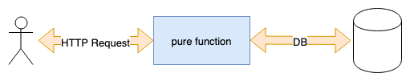

# Functional Programming

## (MMT-M2018)

---

## What is functional programming

> Applications developed in a functional style use side-effect free functions as their main building blocks. (Made up definition by myself)

----

## FP vs. OOP

> Object-oriented programming makes code understandable by encapsulating moving parts. Functional programming makes code understandable by minimizing moving parts. (Michael Feathers)

---

## Why functional programming

- More testable
  - pure functions simplify testing
- Declarative APIs which are easier to reason about
- Easy concurrency because of statelessness and immutability
  - State is pushed out of the application core to the boundaries
- Simple caching
  - pure functions easy to cache (we'll see this in an example)

---

## Immutability

> An immutable data structure is an object that doesn't allow us to change its value. (Remo H. Jansen)

----

## Immutable objects in JS

````js
const immutableObject = Object.freeze({ test: 1 })
immutableObject.test = 10
console.log(immutableObject) // => { test: 1 }
````

----

## Changing an immutable value

````js
const immutableObject = Object.freeze({ a: 1, b: 2 })
const updatedObject = Object.freeze({ ...immutableObject, a: 2 })
console.log(updatedObject) // => { a: 2, b: 2 }
````

----

## Unfreeze an object

````js
const immutableObject = Object.freeze({ test: 1 })
const unfrozenCopy = { ...immutableObject }
````

----

## Object.freeze is mutable

````js
const object = { test: 1 }
Object.freeze(object)
object.test = 10
console.log(object) // => { test: 1 }
````

----

## Why immutability

- race conditions impossible
- state of the application is easier to reason about
- easier to test

----

## Mutable bug

```js
const users = []
const loadUsers = async () => {
  const result = await fetchUsers('/users')
  users.push(...result)
  return users
}

loadUsers()
loadUsers()
```

----

## Immutable version

```js
const loadUsers = () => {
  return fetchUsers('/users');
}

const result1 = await loadUsers();
const result2 = await loadUsers();
```

---

## Side-Effects

> A side effect is a change of system state or observable interaction with the outside world that occurs during the calculation of a result. (Chris Barbour)

- Any function with a side effect is not pure
- Programms without side effects are useless

----

## Some side effects

- DB/HTTP calls
- changing the file system
- querying the DOM
- printing/logging
- accessing system state (eg. Clock, Geolocation,...)

----

## Where to deal with side effects

- Moved to the boundaries of the system
- Business logic stays pure functional



---

## First class functions

- Functions can be treated as any other datatype
  - Can be passed to a function as argument
  - Can be assigned a variable

----

## Function reassigned to variable

```js
const helloWorld = () => 'hello world!'
const main = helloWorld
```

----

## Function passed to another

```js
const helloWorld = (print) => log('hello world!')
const log = (value) => console.log(`${new Date()}: ${value}`)

helloWorld(log)
```

---

## Pure Functions

- A function is considered pure when:
  - for the same input it always returns the same output
  - it has no side effects
    - no mutation of non-local state,

```js
const add = (a, b) => a + b
```

----

## Attributes of pure functions

- They are idempotent
- They offer referential transparency
  - calls to this function can be replaced by the value without changing the programs behaviour
- They can be memoized (or cached)
- They can be lazy
- They can be tested more easy

----

## Pure or inpure? 1/3

```js
const array = [1, 2, 3, 4, 5, 6]
const fn1 = (array) => array.slice(0, 3)
const fn2 = (array) => array.splice(0, 3)
const fn3 = (array) => array.shift()
const fn4 = (array) => array.pop()
const fn5 = (array) => array.sort((a, b) => a - b)
const fn6 = (array) => [...array].sort((a, b) => a - b)
const fn7 = (array) => array.map((item) => item * 2)
const fn8 = (array) => array.forEach((item) => console.log(item))
```

----

## Pure or inpure? 2/3

```js
const config = { minimumAge: 18 }
const isAllowedToDrink = (age) => age >= config.minimumAge
```

```js
const config = { minimumAge: 18 }
const isAllowedToDrink = (age) => age >= config.minimumAge
```

----

## Pure or inpure? 3/3

```js
const isIndexPage = () => window.location.pathname === '/';
const isIndexPage = (pathname) => pathname === '/';
```

---

## Higher Order Functions

> A higher order function is a function that takes or returns a function.

----

```js
const buildCreateUser = (dbAdapter) => {
  return (user) => {
    if (!isValid(user)) { throw new Error('User Invalid') }
    return dbAdapter.create(user)
  }
}
const createUserInPG = buildCreateUser(postgresAdapter)
const createUserInMemory = buildCreateUser(inMemoryAdapter)
```

---

## Memoization

> `Memoizing' a function makes it faster by trading space for time. It does this by caching the return values of the function in a table. (<https://metacpan.org/pod/Memoize)>

----

## Pure functions recap

- A pure function returns for the same input the same output
- simple mapping from value a to value b


----

## React and Memoization


----

## Task

- Memoize the fibonacci sequence
- Compare results with and without memoize

```js
const memoize = () => {} // TODO: implement me
const fibonacci = memoize((num) => {
  if (num <= 1) return 1
  return fibonacci(num - 1) + fibonacci(num - 2)
})
```

- helper to measure time <https://bit.ly/2UOFgAE>

----

## Possible Implementation

- Will be added after the lecture
<!--
```js
const memoize = (fn) => {
  const cache = {}
  return (...args) => {
    const key = JSON.stringify(args)
    cache[key] = cache[key] || fn(...args)
    return cache[key]
  }
}
``` -->

---

## Arity of a function

> The arity of a function is the number of arguments it receives.

```js
const add = (a, b) => a + b
console.log(add.length) // => 2
```

---

## Currying

- Imagine a programming language where every function only accepts one argument.
- How would you add up 2 numbers with pure functions only?

----

## Currying

```js
const addLong = (a) => {
  return (b) => {
    return a + b
  }
}
const addShort = (a) => (b) => a + b

addShort(1)(2)
```

----

## Currying definition

> Currying is the process of translating a function with multiple arguments into a sequence of functions with single arguments.

----

## Currying

```js
import { curry } from 'ramda'

const whichAreGreaterThan = curry((boundary, value) => value > boundary)
const filterItems = curry((filterFn, array) => array.filter(filterFn))

filterItems(whichAreGreaterThan(5), [1, 2, 6, 3, 6, 7, 9, 6, 5])
```

----

## Task

Implement your own curry function

```js
const curry = () => { /* TODO implement me */ }

const add = curry((a, b) => a + b)
add(1)(2)
add(1, 2)
```

## Hints

- [MDN bind](https://developer.mozilla.org/de/docs/Web/JavaScript/Reference/Global_Objects/Function/bind)
- [MDN call](https://developer.mozilla.org/de/docs/Web/JavaScript/Reference/Global_Objects/Function/call)

----

## Possible solution

- Will be added after the lecture

<!-- ```js
const curry = (targetfn) => {
  const arity = targetfn.length
  const fn = (...args) => args.length < arity
    ? fn.bind(null, ...args)
    : targetfn.call(null, ...args)

  return fn
}
``` -->

---

## Functional composition

----


----

## Functional composition


----

## Functional composition


- You don't know if it was composed by smaller functions
- The strawberry disappeared
  - encapsulate internal representations

----

## Functional composition

```js
const add = curry((a, b) => a + b)
const multiply = curry((a, b) => a * b)
const isLte = curry((boundary, value) => value <= boundary)

const isApplicableForInsurance = pipe(
  add(5),
  multiply(4),
  isLte(60)
)

isApplicableForInsurance(5) // true
```

----
## Pipe operator

- TS39 proposal which would add the pipe functionality to JS directly:

```ts
const add = curry((a, b) => a + b)
const multiply = curry((a, b) => a * b)
const isLte = curry((boundary, value) => value <= boundary)

const isApplicableForInsurance = (value) => value
  |> add(5)
  |> multiply(4)
  |> isLte(60)

isApplicableForInsurance(5) // true
```

----

## pipe vs. compose

```js
// Left to right
pipe(first, second, third)
```

```js
// Right to left
compose(third, second, first)
```

----

## Task

- Build your own pipe and compose function
- Hintes:
  - [MDN Array.reduce](https://developer.mozilla.org/de/docs/Web/JavaScript/Reference/Global_Objects/Array/reduce)
  - [MDN Array.reduceRight](https://developer.mozilla.org/de/docs/Web/JavaScript/Reference/Global_Objects/Array/reduceRight)


----

## Possible solution

- Will be added after the lecture

<!--
```js
const pipe = (...fns) => (initialValue) =>
  fns.reduce((result, fn) => fn(result), initialValue)

const compose = (...fns) => (initialValue) =>
  fns.reduceRight((result, fn) => fn(result), initialValue)
``` -->

---

# Homework
- Decide for a state management solution
- eg. redux/apollo/hooks/...
  - describe your decision in an ADR
    - see: https://github.com/joelparkerhenderson/architecture_decision_record

---
# Ressources

----

## Books/Blogs

- [Domain Modeling Made Functional](https://www.amazon.com/Domain-Modeling-Made-Functional-Domain-Driven/dp/1680502549?tag=fsharpforfuna-20)
- [Hands-On Functional Programming with TypeScript](https://www.amazon.com/Hands-Functional-Programming-TypeScript-applications/dp/1788831438)
- [Mostly adequate guide to FP](https://github.com/MostlyAdequate/mostly-adequate-guide)
- [F# for fun and profit](https://fsharpforfunandprofit.com/)

----

## Talks

- [Functional Design Patterns](https://www.youtube.com/watch?v=srQt1NAHYC0)
- [Domain Modeling Made Functional](https://www.youtube.com/watch?v=Up7LcbGZFuo)
- [Hey Underscore, You're Doing It Wrong!](https://www.youtube.com/watch?v=m3svKOdZijA)

---

# Feedback

- Questions: tmayrhofer.lba@fh-salzburg.ac.at
- <https://de.surveymonkey.com/r/XQ96YZX>