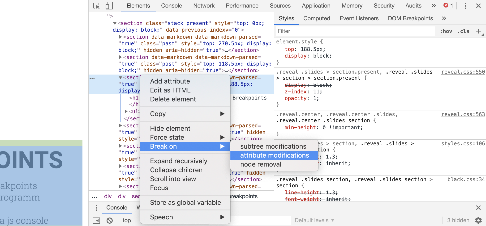
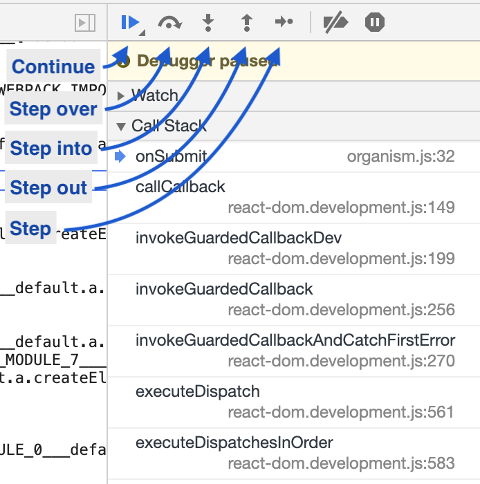
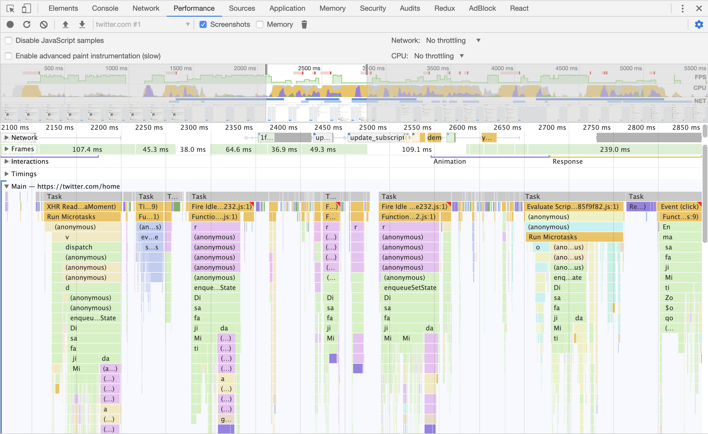
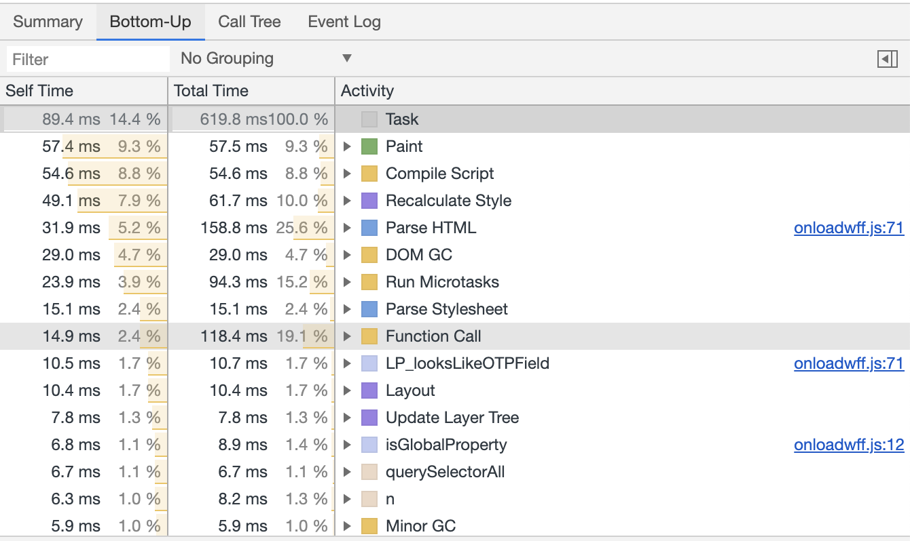
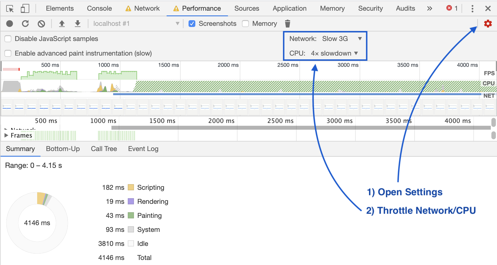
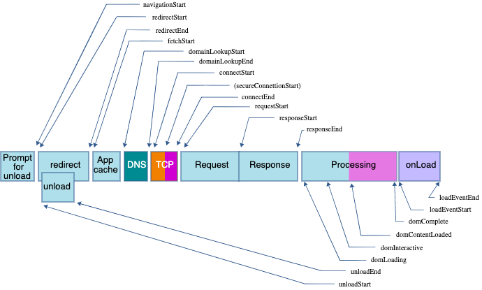

# Debugging JS

----

# console.log debugging

- Add console.log statements
- Click through the app
- See the log statements in chrome dev tools
  - easy to get started
  - some problems might be tough to track down

----

# Using Breakpoints

- Chrome/Firefox devtools allow breakpoints
- Breakpoints are a way to pause a programm
  - variables can be inspected
  - custom code can be executed via js console

----
# How to add breakpoints

- Via EventListeners
  - DevTools > Sources > EventListener Breakpoints
- Via DOM events
  - eg. element is removed/added to dom
- In DevTools
  - Sources > find line of code > click on line number
- Via Code
  - add debugger statement

----
# Via Debugger Statement

```js
export default isForm(({ form }) => {
	const { t } = useTranslation();
	return (
		<Form
			{...form}
			onSubmit={(evt) => {
				debugger; // <= this opens a new debugger session
				form.onSubmit(evt);
			}}
		>
			<TextInput name="email" label={t('email')} {...form} />
			<PasswordInput name="password" label={t('password')} {...form} />
      { /* ... */ }
		</Form>
	);
});
```

----
# DOM event breakpoints



----
# Breakpoint navigation



----

# Debugging NodeJS

- VS Code Setup
  - <https://dev.to/john_papa/debug-your-nodejs-app-in-60-seconds-5cni>
- Webstorm Setup
  - https://www.jetbrains.com/help/webstorm/run-debug-configuration-node-js-remote-debug.html
- Staring tests
  - JEST `node --inspect-brk node_modules/.bin/jest --runInBand --watch`
  - mocha `npm run test -- --inspect-brk --watch`

----
# Task

- Try to setup debugger for backend
- Start the backend and set breakpoint
  - make sure to start node with `--inspect-brk`
- Maybe you have a bug which you want to investigate
- Timebox: 15min

---

# Debugging performance issues

----

# Chrome performance tab

- Determine why CPU is busy
- Flame graph Visualisation of
  - call stack
  - duration of fn call



----

# Bottom up

- Which functions had the most impact on performance



----

# Measure CPU Performance

- Open dev tools
- Go to Performance > Record
  - Click stop

----

# Simulating slow devices/network



---

# Web Performance API
- Set of tools which expos information about
  - Performance of a Web Page
  - Network
  - Internal Browser operations

---

# window.performance.timing

- Performance information about current webpage
  - DNS/TCP timing
  - Request/Response timing
  - document ready timing
  - ...



---
# Measure time in JS code

```js
const t0 = performance.now();
doSomething();
const t1 = performance.now();
console.log(`Call to doSomething took ${t1 - t0} milliseconds.`);
```

----
# Why not use Date.now()
- Date.now() is based on system time
  - synchronized from time to time
    - might lead to wrong measurements
  - days with leap seconds
    - depending on implementation
      - 1 second !== 1 system second
  - max resolution: milliseconds

----
# performance.now()
- monotonic time between time origin/current time
  - uniformly increasing
  - time origin when document initiated
- max resolution: floating point milliseconds

---
# Performance Entry List

- Global Buffer:
  - stores performance relevant information

```ts
interface PerformanceObserverEntryList {
  PerformanceEntryList getEntries();
  PerformanceEntryList getEntriesByType (DOMString type);
  PerformanceEntryList getEntriesByName (DOMString name, optional DOMString type);
};
```

```js
window.performance.getEntries()
```

----
# PerformanceEntry

```ts
interface PerformanceEntry {
  readonly    attribute DOMString           name;
  readonly    attribute DOMString           entryType;
  readonly    attribute DOMHighResTimeStamp startTime;
  readonly    attribute DOMHighResTimeStamp duration;
  [Default] object toJSON();
  // + additional properties depending on entryType
};
```

---
## performance.mark()
- adds a PerformanceEntry to global buffer
- used to measure timings in distant parts of the app

```js
const START_MARK = 'before Math.random()'
const END_MARK = 'after Math.random()'

performance.mark(START_MARK);
Math.random()
// ... some other application logic
performance.mark(END_MARK);


performance.measure("measure a to b", START_MARK, END_MARK);
window.performance.getEntries().slice(-3) // returns the marks + the measure entry
```

---

# Task 2

- Go to your master project
- Open profiler
  - find the slowest function

---

# Feedback

- <https://de.surveymonkey.com/r/XQ96YZX>
