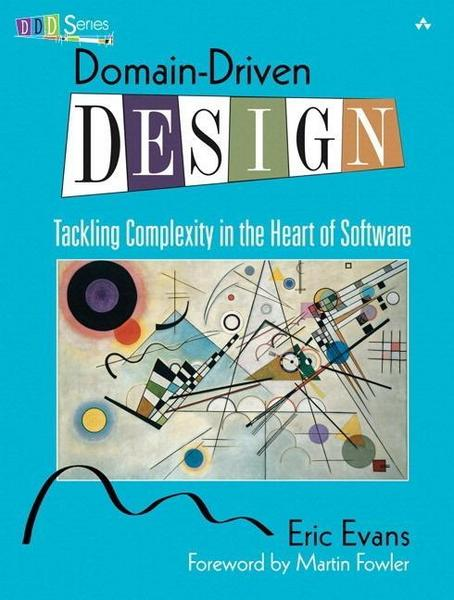

## Domain Modeling and TS

---

# What is DDD



> Domain Driven Design by Eric Evans

----

# What is DDD

> Approach to develop software where the application domain model reflects the real business model.

----

# Why


----

# Collaboration

- Developers + Domain Experts work together
  - try to agree on an unambiguous language
    - string, numbers, boolean are technical terms
    - an E-Mail is a string but not every string is an E-Mail address
- Information sharing
- Chaotic information is streamlined
- The model is constantly refined

----

# Technology as an afterthought

- Developers normally focus on the how
  - i need microservices for scalability
  - noSQL will solve all issues
  - Rails does not scale, lets rewrite in node/scala
  - have you heard of docker/kafka?
- DDD sharpens the focus on what

----

# One picture two meanings


---

- Requirements:
  - A user needs to have a first and last name
  - A user needs to have exactly one contact
    - a contact is either:
      - address (contains street/zip code/country)
      - phone (contains phone)
      - email (contains email)
    - a contact can be verified

----

## Resulting Type

```ts
type User = {
  firstName: string,
  lastName: string,
  street?: string,
  zipCode?: string,
  country?: string,
  email?: string,
  isEmailVerified?: bool,
  phone?: string,
  isPhoneVerified?: bool,
}
```

----

> Can you spot issues with this model?

----

```ts
type User = {
  firstName: string,
  lastName: string,
  street?: string,
  zipCode?: string,
  country?: string,
  email?: string,
  isEmailVerified?: bool,
  phone?: string,
  isPhoneVerified?: bool,
}
```

```ts
const user = {
  firstName: 'Sepp',
  lastName: 'Dupfinger',
  street: 'Hinterholz 8',
};
```

----

## Issues

- 1 correct state and 7 falsy states

```ts
type User = {
  // ...
  street?: string,
  zipCode?: string,
  country?: string,
  // ...
}
```

----

## Requirements

- A user needs to have a first and last name
- A user needs to have exactly one contact
  - a contact is either:
    - address (contains street/zip code/country)
    - phone (contains phone)
    - email (contains email)
  - a contact can be verified

----

## Classify the type

```ts
type User = {
  firstName: string,
  lastName: string,

  // via post
  street?: string,
  zipCode?: string,
  country?: string,
  isAddressVerified?: bool,

  // via email
  email?: string,
  isEmailVerified?: bool,

  // via phone
  phone?: string,
  isPhoneVerified?: bool,
}
```

----

## Extract smaller bits

```ts
type PostContact = { street: string, zipCode: string, country: string, isVerified: bool }
type EmailContact = { email: string, isVerified: bool }
type PhoneContact = { phone: string, isVerified: bool }
type Contact = PostContact | EmailContact | PhoneContact

type User = {
  firstName: string,
  lastName: string,
  contact: Contact,
}
```

----

## Extract common properties

```ts
type Verifiable<T> = T & { isVerified: boolean }

type PostContact = Verifiable<{ street: string, zipCode: string, country: string }>
type EmailContact = Verifiable<{ email: string }>
type PhoneContact = Verifiable<{ phone: string }>
type Contact = PostContact | EmailContact | PhoneContact

type User = {
  firstName: string,
  lastName: string,
  contact: Contact,
}
```

----

## Use it

```ts
const user:User = {
  firstName: 'Sepp',
  lastName: 'Dupfinger',
  contact: { email: 'sepp@hinterholz.at', isVerified: true },
}
```

----

> Can you still spot issues with this model?

----

```ts
const user:User = {
  firstName: '',
  lastName: '',
  contact: { email: '', isVerified: true },
}
```

----

## Type aliases

```ts
type Email = string
```

----

## Verifying type aliases

```ts
type Maybe<T> = T | null
type Email = string

const validateEmail = (maybeEmail: unknown): Maybe<Email> => {
    if (typeof maybeEmail === 'string' && maybeEmail.match(/.@./)) {
        return maybeEmail as Email;
    }
    return null;
}
```

---

# Runtime type checking in TS

- TypeScript compiles to JS
- No type information available during runtime
- Data needs to be verified on the client
  - data which was received from a backend
  - data which will be sent to the backend
  - otherwise runtime errors

---

# Where to validate TS types


---

# Tools

- [yup](https://github.com/jquense/yup)
  - sometimes types are wrong
  - focuses on JS
- [io-ts](https://github.com/gcanti/io-ts)
  - supports encoding/decoding
  - very expressive
  - complicated at first
- [validation.ts](https://github.com/AlexGalays/validation.ts)
  - lightweigt version of io-ts
  - only supports encoding
  - easier to get started
- many more

---

# Email validation

- It's possible to write all validations by hand
- gets cumbersome if one wants to compose validations

```ts
type Maybe<T> = T | null
type Email = string

const validateEmail = (maybeEmail: unknown): Maybe<Email> => {
    if (typeof maybeEmail === 'string' && maybeEmail.match(/.@./)) {
        return maybeEmail as Email;
    }
    return null;
}
```

---

# validation.ts

```ts
import { string } from 'validation.ts'

const emailValidator = string
  .filter(maybeEmail => !!maybeEmail.match(/.@./))

type Email = typeof emailValidator['T'] // string
```

----

# isVerified

```ts
import { string, Validator, object, boolean } from 'validation.ts'

const emailValidator = // ...

const isVerified = <Val extends Validator<any>>(key: string, validator: Val) => object({
  value: validator,
  isVerified: boolean
})

const validatedEmail = isVerified('email', emailValidator)
type ValidatedEmail = typeof validatedEmail['T'] // { value: string; isVerified: boolean; }
```

----

# Full example

```ts
import { string, object, boolean, union, intersection, ObjectValidator } from 'validation.ts'

const nonEmptyString = string
  .filter(string => string.length > 0)

const clampedString = (min: number, max: number) => string
  .filter(string => string.length >= min && string.length <= max)

const emailValidator = string
  .filter(maybeEmail => !!maybeEmail.match(/.@./))

const validated = <Val extends ObjectValidator<any>>(validator: Val) =>
  intersection(object({ isValidated: boolean }), validator)

const userValidator = object({
  firstName: nonEmptyString,
  lastName: nonEmptyString,
  contact: union(
    validated(object({ email: emailValidator })),
    validated(object({ phone: nonEmptyString })),
    validated(object({
      street: nonEmptyString,
      zipCode: clampedString(4, 5),
      country: clampedString(3, 3)
    })),
  )
})
```

---

# Homework

- Build the domain model for your application in TS
- Try to make invalid states impossible
- Try to think about possible edge cases and how to prevent them
