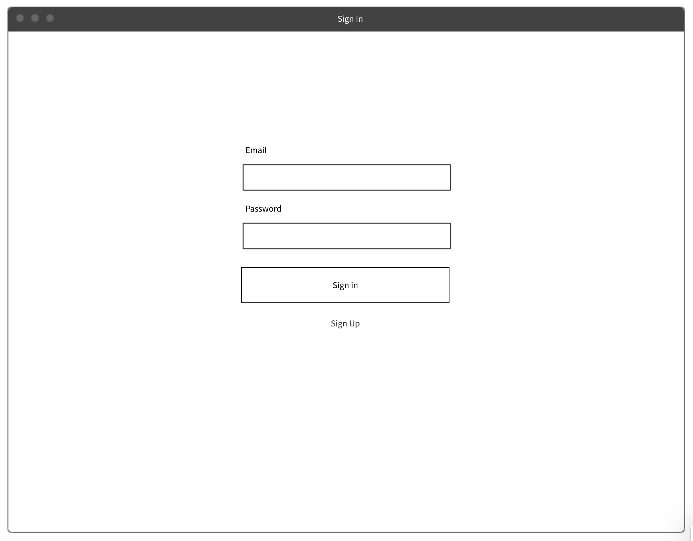
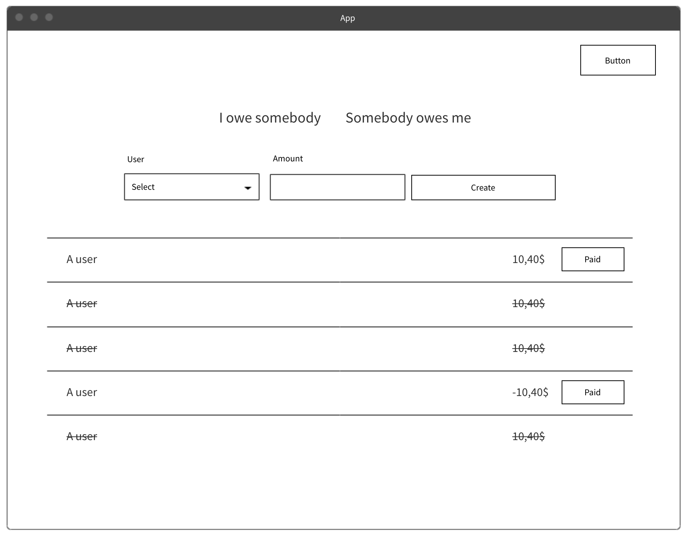
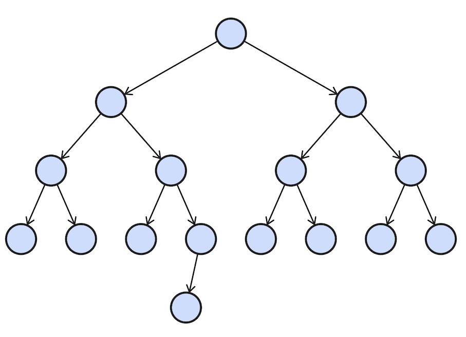
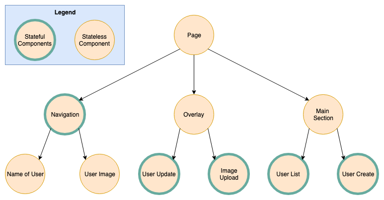
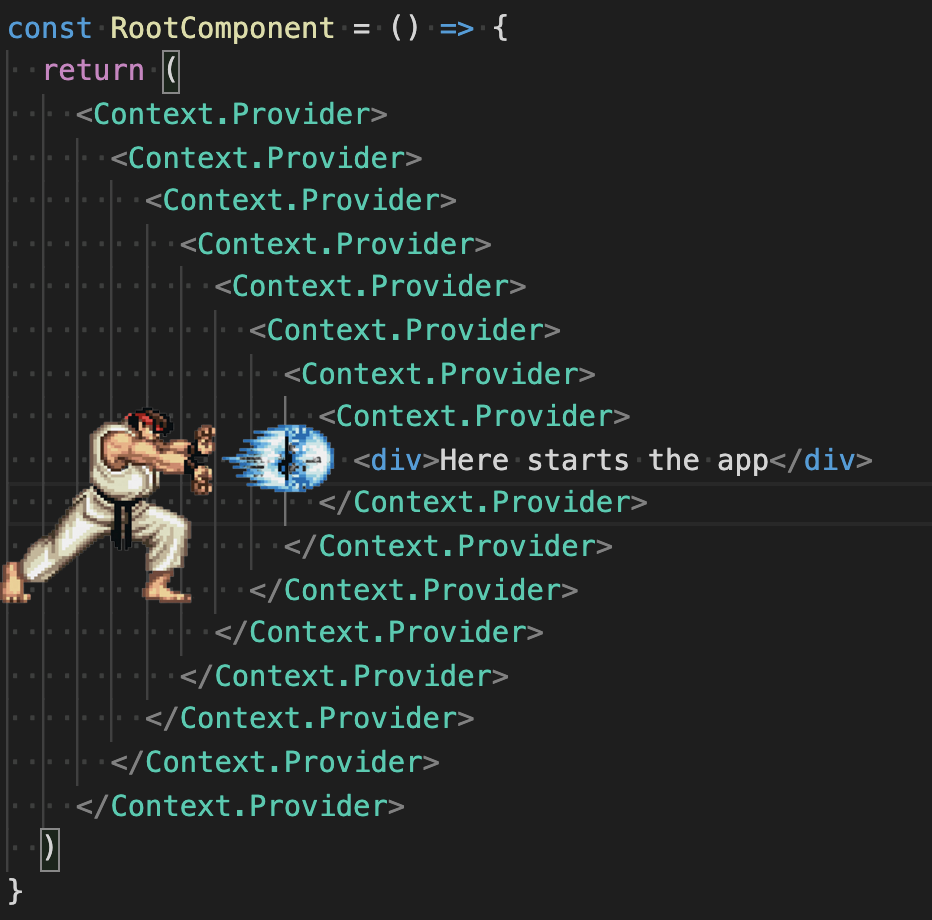

footer: FHS (tmayrhofer.lba@fh-salzburg.ac.at)
slidenumbers: true

# Fullstack Development

## React

---

# React

- Component based library to build composable UIs
- OpenSourced in 2013
- Implemented and Maintained by Facebook
- Learn once, write anywhere
  - React-Native
  - React-Native-Desktop
  - React-Native-Windows
  - React-VR


---

## Components

> Components let you split the UI into independent, reusable pieces.[^1]

- Main Building block of a React App
  - Describe the look and feel of one section in the UI


---

## React Components

```js
const Button = () => {
  return (
    <button type='button'>
      A button
    </button>
  )
}

// Usage
React.renderComponent(<Button />, document.body)
```

---

## React Class Components

- Alternative syntax for components

```js
class Button extends React.Component {
  render() {
    return (
      <button type='button'>
        A button
      </button>
    )
  }
}

// Usage
React.renderComponent(<Button />, document.body)
```

----

## JSX

- JavaScript XML
  - extension to write XML in JS
- Allows to combine data preparation with render logic

```js
const Button = () => {
  return (
    <button type='button'>
      A button
    </button>
  )
}
```

----

## React without JSX

- React can be used without JSX

```js
const Button = () => {
  return React.createElement(
    'button',
    { type: 'button' },
    'A button'
  )
}
```

---

## Which components do you see



----

## Which components do you see



---

# Building the first react component

---

### Embedding expressions

```js
const CurrentTime = () => {
  return (
    <h1>
      {(new Date()).toLocaleDateString()}
    </h1>
  )
}
```

----

### Embedding expressions

```js
const FagoMenu = () => {
  return (
    <a href={`/menu/${(new Date()).toLocaleDateString()}`}>
      Go to todays menu
    </a>
  )
}
```

----

## Conditional rendering

```js
const CurrentTime = () => {
  // ...
  return (
    <h1>
      {isToday
        ? 'Today'
        : 'Not Today'}
    </h1>
  )
}
```

----

## Conditional rendering

```js
const CurrentTime = () => {
  // ...
  return (
    <h1>
      {isToday && 'Today'}
      {!isToday && 'Not today'}
    </h1>
  )
}
```

----

### Loop over arrays

```js
const UserList = ({ users }) => {
  return (
    <ul>
      {users.map((user) => {
        return (<li key={user.id}>{user.name}</li>)
      })}
    </ul>
  )
}
```

---

### Fragments

- Groups a list of children without adding a dom element

```js
const AComponent = () => {
  return (
    <>
      <label>An input</label>
      <input type='text' />
    </>
  )
}
```

----

## Keyed Fragments

- Same as fragment but a key can be provided (eg.: definition list)

```js
const AComponent = ({ items }) => {
  return (
    <dl>
      {items.map(item => (
        // Without the `key`, React will fire a key warning
        <React.Fragment key={item.id}>
          <dt>{item.term}</dt>
          <dd>{item.description}</dd>
        </React.Fragment>
      ))}
    </dl>
  )
}
```

----

### key property in loops

- Is required when interating over lists
- Helps react to decide if an element needs to be rerendered
- [Video explanation](https://www.youtube.com/watch?v=kFy5dpzdFsM)
- [Detailed explanation](https://dev.to/jtonzing/the-significance-of-react-keys---a-visual-explanation--56l7)

---

## Component composition

- Components can be nested and composed together



----

## React props

- Possibility to customize components
  - Can be seen as component configuration
- Props are passed to the component
  - A component at a lower level of the tree can't modify given props directly

---

## React props

```js
const Button = ({ children, disabled = false }) => {
  //              ^^^^^^^^^^^^^^^^^^^^^^^^^^
  // props which are passed to the component

  return (
    <button disabled={disabled} className='button'>
      {children}
    </button>
  )
}

const usage = <Button disabled>A button</Button>
// 1)                 ^^^^^^^^
// 2)                         ^^^^^^^^^
// 1) shortcut for disabled={true}
// 2) child components/nodes passed to a component
```

---

# Exercise: 30min

- I'll create breakout rooms
- Fork/clone the following <https://github.com/webpapaya/fhs-react-redux-starter-kit>
- execute `npm run start:storybook`

---

# Exercise: 30min

- extend the sign in component to display
  - Input with username
  - Input with password
  - A Sign In Button (reuse existing button)
- Extract an Input Component
  - make it configurable via props

---

# State in react

- What we've seen so far:
  - Components can render chunks of UI
  - Components can be nested

---

# State in react

> How can we interact with components?

---

# State in react

> The State of a component is an object that holds some information that may change over the lifetime of the component [^5]

[^5]: [geeksforgeeks.com](https://www.geeksforgeeks.org/reactjs-state-react/#:~:text=What%20is%20State%3F,the%20lifetime%20of%20the%20component.)

---

# React State (without hooks)

```js
class ToggleButton extends React.Component {
  state = { backgroundColor: 'red' };
  // define a default value for background color

  toggleBackgroundColor = () => {
    const nextBackgroundColor = backgroundColor === 'red' ? 'blue' : 'red'
    this.setState({ backgroundColor: nextBackgroundColor })
    //   ^^^^^^^^^
    // setState calls render method with updated state
  }
  render() {
    return (
       <button
        onClick={() => this.toggleBackgroundColor() }
        style={{ backgroundColor: this.state.backgroundColor }}
      >
        {children}
      </button>
    );
  }
}
```

---

# React State (with Hooks)

- Alternative syntax with hooks

```js
const ToggleButton = () => {
  const [backgroundColor, setBackground] = useState('red')
  // 1)                                    ^^^^^^^^
  // 2) ^^^^^^^^^^^^^^^^
  // 3)                   ^^^^^^^^^^^^^^
  // 1) define a state with a default value "red"
  // 2) the current value of the state
  // 3) function to set the state to something else

  return (
    <button
      onClick={() => setBackground(backgroundColor === 'red' ? 'blue' : 'red')}
      style={{ backgroundColor }}
    >
      {children}
    </button>
  )
}
```

---

# React Hooks

> Hooks allow you to reuse stateful logic without changing your component hierarchy. [React Docs](https://reactjs.org/docs/hooks-intro.html#its-hard-to-reuse-stateful-logic-between-components)

----

### React Hooks

- Introduced recently to reduce boilerplate
- Makes it possible to use state in functional components
  - Previously one had to convert between functional/class components when state introduced
- hooks are prefixed with `use`
- Can't be called inside loops, conditions or nested functions

----

### useState

```js
const App = () => {
  const [count, setCount] = useState(0)
  const handleIncrement = () => setCount(count + 1)

  return (
    <div>
      <div>{count}</div>
      <button onClick={handleIncrement}>Increment by 1</button>
    </div>
  )
}
```

----

### Extract into custom hook

```js
const useCounter = () => {
  const [count, setCount] = useState(0);
  const handleIncrement = () => setCount(count + 1);
  return { count, handleIncrement };
}

const App = () => {
  const {count,handleIncrement} = useCounter();

  return (
    <div>
      <div>{count}</div>
      <button onClick={handleIncrement}>Increment by 1</button>
    </div>
  );
}
```

----

## State vs. Props

| _props_ | _state_ |
--- | --- | ---
Can get initial value from parent Component? | Yes | Yes
Can be changed by parent Component? | Yes | No
Can set default values inside Component?* | Yes | Yes
Can change inside Component? | No | Yes
Can set initial value for child Components? | Yes | Yes
Can change in child Components? | Yes | No

[source](https://github.com/uberVU/react-guide/blob/master/props-vs-state.md)

---

# Unidirectional Dataflow

- Props only flow from parent to children
- Parent is responsible to update data
  - might provide callbacks to do so
- set state rerenders all children of component

----

# Unidirectional Dataflow


> [Source](https://medium.com/@alialhaddad/https-medium-com-alialhaddad-redux-vs-parent-to-child-2583c8e29509)

---

# Virtual DOM

- makes DOM updates faster
- after setState subtree is rerendered in memory
- compares DOM to in memory representation
- applies DOM changes when needed

---

### Forms with react hooks

```js
const App = () => {
  const [username, setUsername] = useState('');
  //                               ^^^^^^^^^^^^
  // define a new state with an initial value of empty string

  return (
    <div>
      <input onChange={(evt) => setUsername(evt.target.value)} value={username}>
      { /*                                 ^^^^^^^^^^^^^^^^^^ */}
      { /* set the state of the username */}
      <button onClick={() => console.log({ username })}>Submit form</button>
    </div>
  );
}
```

# Exercise: 30min

- I'll create breakout rooms
- Fork/clone the following <https://github.com/webpapaya/fhs-react-redux-starter-kit>
- execute `npm run start:storybook`

---

# Exercise

- extend the sign in component to display
  - Input with username
  - Input with password
  - A Sign In Button (reuse existing button)
- Extract an Input Component
  - make it configurable via props

- Enhance the SignIn form
  - store username/password in a component state
- once the submit button is clicked log all values to the console


- Bonus: extract a `useForm` hook

  ```js
    const [values, setValue] = useForm({
      username: '',
      password: ''
    })
    return <Input onChange={setValue('username')} />
  ```


---

## Other hooks


---

### useEffect [^4]

```js
// Executed on every rerender
useEffect(() => {})

// Executed when component rendered initially
useEffect(() => {}, [])

// Executed when component rendered initially
// and when variable changes.
useEffect(() => {}, [variable])

// Cleanup when component unmounts (eg. eventHandlers, setInterval/setTimeout)
useEffect(() => {
  // do something fancy
  return () => { console.log('cleanup') }
}, [variable])
```

[^4]: this will be covered in more detail in the side effect lecture

----

### Previous Example

```js
const useCounter = () => {
  const [count, setCount] = useState(0);
  const handleIncrement = () => setCount(count + 1);
  return { count, handleIncrement };
}

const App = () => {
  const {count,handleIncrement} = useCounter();

  return (
    <div>
      <div>{count}</div>
      <button onClick={handleIncrement}>Increment by 1</button>
    </div>
  );
}
```

----

### Update title with counter

```js
const useCounter = () => {
  const [count, setCount] = useState(0);
  const handleIncrement = () => setCount(count + 1);
  return { count, handleIncrement };
}

const App = () => {
  const {count,handleIncrement} = useCounter();

  // Is executed when component is rendered for the first time
  // And when the counter variable changes.
  useEffect(() => {
    document.title = `Counter clicked ${count} times`;
  }, [count]);

  return (
    <div>
      <div>{count}</div>
      <button onClick={handleIncrement}>Increment by 1</button>
    </div>
  );
}
```

----

### Extract to custom hook

```js
const useCounter = () => {
  const [count, setCount] = useState(0);
  const handleIncrement = () => setCount(count + 1);
  useEffect(() => {
    document.title = `Counter clicked ${count} times`;
  }, [count]);
  // ^^^^^^ moved to hook

  return { count, handleIncrement };
}

const App = () => {
  const {count,handleIncrement} = useCounter();

  return (
    <div>
      <div>{count}</div>
      <button onClick={handleIncrement}>Increment by 1</button>
    </div>
  );
}
```

----

# React.memo

> `Memoizing` a function makes it faster by trading space for time. It does this by caching the return values of the function in a table. [^7]

[^7]: https://metacpan.org/pod/Memoize

----

# React.memo


----

# React.memo

- Caches the rendered component
- Only rerenderes when one of the props changes
  - shallow comparison

```ts
const MyComponent = React.memo(function MyComponent(props) {
  /* render using props */
});
```

---

### React Context API

- Available since the beginning of React
- Prevent "prop drilling"

----

### React Context API


----

### React Context API


----

### React Context API



----

### Creating a context

```js
const DEFAULT_VALUE = 1
const MyContext = React.createContext(DEFAULT_VALUE)

const RootComponent = () => {
  return (
    <MyContext.Provider value={2}>
      <ANestedComponent />
    </MyContext.Provider>
  )
}

const ANestedComponent = () => {
  const value = useContext(MyContext)
  return (
    <h1>The value from context is {value}</h1>
  )
}
```

----

### Pitfalls 1

- fine granular context



----

### Pitfalls/Tips

- Prefer passing props down to components
  - prefer explicit (pass down) vs implicit (context)
- only use when multiple components need to access same data
  - if possible pass data down
- don't overuse
- values from A context are globals
  - use only a hand full of Context.Providers
  - testing becomes trickier

----

### Other hooks

- [API Reference](https://reactjs.org/docs/hooks-reference.html)
  - useReducer
  - useCallback
  - useMemo
  - useRef
  - useImperativeHandle
  - useLayoutEffect
  - useDebugValue

---

### Task advanced hooks task

- build a clock component
  - component displays current time in seconds
  - automatically updates itself
  - remove setInterval when component unmounts

- You'll need
  - useEffect, useState
  - setInterval or setTimeout
  - (new Date()).toLocaleTimeString()

---

# Feedback

- Questions: tmayrhofer.lba@fh-salzburg.ac.at
- <https://de.surveymonkey.com/r/8TW92LL>

[^1]: https://reactjs.org/docs/components-and-props.html
