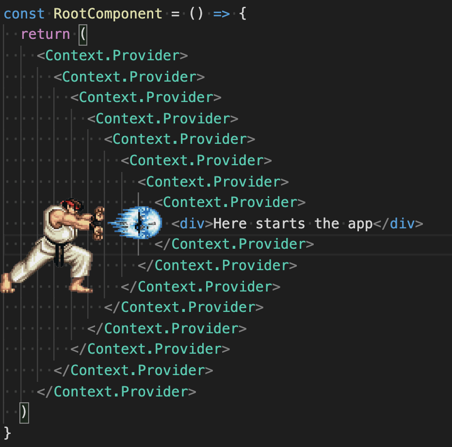

footer: FHS (tmayrhofer.lba@fh-salzburg.ac.at)
slidenumbers: true

# Fullstack Development

## (MMT-B2018)

---

# Code solution to yesterdays exercise together

---

## Forms in React

---

## Controlled vs uncontrolled components

---

## Controlled Components

- HTML form elements maintain own state
  - eg. input, textarea, ...
- React usually keeps state in their own components
  - component state/HTML state can get out of sync
- in controlled components react is the single source of truth

---

## Controlled Components

- React has ownership of state
  - result: typing in the component does not have any effect

```js
const Input = () => {
  return <input name="username" value="" />
  //                            ^^^^^^^^
  // if value is defined input becomes controlled
}
```

---

## Controlled Components

```js
const Input = () => {
  const [username, setUsername] = useState('')
  return <input
    name="username"
    onChange={(evt) => setUsername(evt.target.value)}
    //                 ^^^^^^^^^^^
    // 1) whenever onChange setUsername is called with new value
    value={ username }
    // 2) setUsername triggers a rerender with the new username
  />
}
```

---

## Uncontrolled components

- the browser keeps ownership of form state

```js
const Input = () => {
  return <input name="username" />
  //            ^^^^^^^^
  // if no value attribute is defined on an input
  // the state is uncontrolled and managed by the
  // browser
}
```

---

## Handle errors in components

```js
const SignUpForm = ({ onSubmit }) => {
  const [username, setUsername] = useState('')

  return (
    <form>
      <input
        name="username"
        onChange={(evt) => setUsername(evt.target.value)}
        value={ username }
      />
      { username.length === 0 && ( // when username is 0 display error
        <span>Username can't be blank</span>
      )}
      <button type="submit">Sign up</button>
    <form/>
  )
}
```

---

## Task (15 minutes)

- adapt your sign-up form
  - convert your components to controlled components
  - display error messages when username or password is blank
- Do you find any issues in your code?

---

## Do you see any issues with the code

```js
const SignUpForm = ({ onSubmit }) => {
  const [username, setUsername] = useState('')

  return (
    <form>
      <input
        name="username"
        onChange={(evt) => setUsername(evt.target.value)}
        value={ username }
      />
      { username.length === 0 && (
        <span>Username can't be blank</span>
      )}
      <button type="submit">Sign up</button>
    <form/>
  )
}
```

---

## Do you see any issues with the code

### 🚨 Don't spoil yourself and look at the next slides 🚨

---

## Do you see any issues with the code

### I mean really, stop here 😄

---

## Do you see any issues with the code

### 🚨 Seriously 🚨

---

## Do you see any issues with the code

- errors are shown even if a user didn't focus the input
- form can be submitted even if it contains errors
  - sign-in button is not disabled
- adding complex validations is tedious

---

## Form libraries which make your life easier

- there are multiple libraries which help with validation
  - [formik](https://formik.org/)
  - [react-hook-form](https://react-hook-form.com/)
  - [react final form](https://final-form.org/react)

---

## formik

- Form library which can be used with hooks
- uses controlled components
- `npm install formik yup`

---

## Formik

### Example

```js
import { useFormik } from "react-hook-form";

const SignInForm = () => {
  const formik = useFormik({
    initialValues: { username: '' },
    onSubmit: values => console.log(values),
  });

  return (
    <form onSubmit={formik.handleSubmit}>
      <input
        name="username"
        onChange={formik.handleChange}
        value={formik.values.username}
      />
      {/* ... */}
    </form>
  )
}
```

---

## Formik

### With errors

```js
import { useFormik } from "react-hook-form";
import {object, string} from 'yup'

const validationSchema = object({
  username: string().min(3)
})

const SignInForm = () => {
  const formik = useFormik({
    initialValues: { username: '' },
    validationSchema: validationSchema,
    // verify form with schema  ^^^^^^^^^^^

  });

  return (
    <form onSubmit={formik.handleSubmit}>
      <input
        name="username"
        onChange={formik.handleChange}
        value={formik.values.username}
      />
      { formik.errors.username }
      {/* display the error */}
    </form>
  )
}
```

---

# Task 20 minutes

- convert your Sign Up form to use react hooked forms

---

## Other hooks


---

### useEffect [^4]

```js
// Executed on every rerender
useEffect(() => {})

// Executed when component rendered initially
useEffect(() => {}, [])

// Executed when component rendered initially
// and when variable changes.
useEffect(() => {}, [variable])

// Cleanup when component unmounts (eg. eventHandlers, setInterval/setTimeout)
useEffect(() => {
  // do something fancy
  return () => { console.log('cleanup') }
}, [variable])
```

[^4]: this will be covered in more detail in the side effect lecture

----

### Previous Example

```js
const useCounter = () => {
  const [count, setCount] = useState(0);
  const handleIncrement = () => setCount(count + 1);
  return { count, handleIncrement };
}

const App = () => {
  const {count,handleIncrement} = useCounter();

  return (
    <div>
      <div>{count}</div>
      <button onClick={handleIncrement}>Increment by 1</button>
    </div>
  );
}
```

----

### Update title with counter

```js
const useCounter = () => {
  const [count, setCount] = useState(0);
  const handleIncrement = () => setCount(count + 1);
  return { count, handleIncrement };
}

const App = () => {
  const {count,handleIncrement} = useCounter();

  // Is executed when component is rendered for the first time
  // And when the counter variable changes.
  useEffect(() => {
    document.title = `Counter clicked ${count} times`;
  }, [count]);

  return (
    <div>
      <div>{count}</div>
      <button onClick={handleIncrement}>Increment by 1</button>
    </div>
  );
}
```

----

### Extract to custom hook

```js
const useCounter = () => {
  const [count, setCount] = useState(0);
  const handleIncrement = () => setCount(count + 1);
  useEffect(() => {
    document.title = `Counter clicked ${count} times`;
  }, [count]);
  // ^^^^^^ moved to hook

  return { count, handleIncrement };
}

const App = () => {
  const {count,handleIncrement} = useCounter();

  return (
    <div>
      <div>{count}</div>
      <button onClick={handleIncrement}>Increment by 1</button>
    </div>
  );
}
```

----

# React.memo

> `Memoizing` a function makes it faster by trading space for time. It does this by caching the return values of the function in a table. [^7]

[^7]: https://metacpan.org/pod/Memoize

----

# React.memo


----

# React.memo

- Caches the rendered component
- Only rerenderes when one of the props changes
  - shallow comparison

```ts
const MyComponent = React.memo(function MyComponent(props) {
  /* render using props */
});
```

---

### React Context API

- Available since the beginning of React
- Prevent "prop drilling"

----

### React Context API


----

### React Context API


----

### React Context API


----

### Creating a context

```js
const DEFAULT_VALUE = 1
const MyContext = React.createContext(DEFAULT_VALUE)

const RootComponent = () => {
  return (
    <MyContext.Provider value={2}>
      <ANestedComponent />
    </MyContext.Provider>
  )
}

const ANestedComponent = () => {
  const value = useContext(MyContext)
  return (
    <h1>The value from context is {value}</h1>
  )
}
```

----

### Pitfalls 1

- fine granular context



----

### Pitfalls/Tips

- Prefer passing props down to components
  - prefer explicit (pass down) vs implicit (context)
- only use when multiple components need to access same data
  - if possible pass data down
- don't overuse
- values from A context are globals
  - use only a hand full of Context.Providers
  - testing becomes trickier

----

### Other hooks

- [API Reference](https://reactjs.org/docs/hooks-reference.html)
  - useReducer
  - useCallback
  - useMemo
  - useRef
  - useImperativeHandle
  - useLayoutEffect
  - useDebugValue

---

### Task advanced hooks task

- build a clock component
  - component displays current time in seconds
  - automatically updates itself
  - remove setInterval when component unmounts

- You'll need
  - useEffect, useState
  - setInterval or setTimeout
  - (new Date()).toLocaleTimeString()

---

# Routing

---

### React Router

- dynamic routing library for
- react native
- react web
- [Documentation](https://reacttraining.com/react-router/web/guides/quick-start)

----

### Installation

 ```txt
npm install react-router-dom --save
```

----

### Usage

 ```js
import { BrowserRouter as Router, Route, Switch, Redirect } from "react-router-dom";
import Homepage from './components/homepage'
import SignIn from './components/sign-in'

const App = () => {
  return (
    <Router> { /* creates a new routing context */ }
      <Switch> { /* render only one route */ }
        { /* define routes and pass component as prop to the route */ }
        <Route path="/sign-in" component={SignIn}>
        <Route path="/" component={Homepage}>
        { /* if no route matches redirect to 'Homepage' */ }
        <Redirect to='/'>
      </Switch>
    </Router>
  );
}
```

----

### Route priority (without exact)

 ```js
// path === "/" => renderes Homepage
// path === "/sign-in" => renderes Homepage
const Routes = () => (
   <Switch>
     <Route path='/' component={Homepage} />
     <Route path='/sign-in' component={SignIn} />
   </Switch>
)
```

----

### Route priority (without exact)

 ```js
// path === "/" => renderes Homepage
// path === "/sign-in" => renderes SignIn
const Routes = () => (
   <Switch>
     <Route path='/sign-in' component={SignIn} />
     <Route path='/' component={Homepage} />
   </Switch>
)
```

----

### Route priority (with exact)

 ```js
// path === "/" => renderes Homepage
// path === "/sign-in" => renderes sign-in
const Routes = () => (
   <Switch>
     <Route exact path='/' component={Homepage} />
     <Route exact path='/sign-in' component={SignIn} />
   </Switch>
)
```

----

### Add Links from html

 ```js
 import { Link } from 'react-router-dom'

 const Routes = () => (
   <nav>
     <Link to='/'>Home</Link>
     <Link to='/sign-in'>Sign in</Link>
   </nav>
)
```

----

### Add redirects from JS

 ```js
 import { withRouter } from 'react-router-dom'

 const SignIn = withRouter(({ history }) => {
   const onSubmit = (evt) => {
     evt.preventDefault()
     history.push('/')
   }

   return (
     <form onSubmit={onSubmit}>
       {/* ... */}
     </form>
   )
})
```

---

## Task 20 minutes

- Start the application `npm run start`
  - `npm install react-router-dom`
  - add 2 routes
    - sign-up/
      - renders the SignUp component
    - sign-in/
      - renders a SignIn component (needs to be built)

---

## Homework

---

## Homework 1

- Build the following components in Storybook
  - UserSignIn -> onSubmit => { username, password }
  - UserSignUp -> onSubmit => { username, password }
  - MoneyTransactionCreate
    - users => { id, name }
    - onSubmit => { debitorId, creditorId, amount }

  - MoneyTransactionList (Lists all Money Transactions)
    - moneyTransactions
    - onMoneyTransactionPaid => { id, paidAt: (new Date()).toISOSTring() }

----

## Homework 2

- You probably need the following core components
  - `<TextInput {...} />`
  - `<DecimalInput {...} />`
  - `<SelectInput {...} />`
  - `<Button {...} />`
  - ...

----

## Homework 3

- Allowed to use CSS Frameworks
- Not allowed to use Component Libraries
- You can use as a starting point <https://github.com/webpapaya/fhs-react-redux-starter-kit>
- Mock Data for the API <https://gist.github.com/webpapaya/ba25ac39138b6f6a50a04f2b0820cf65>

----

## Homework 4

- Add the following routes
  - /sign-in
    - Sign-In component is rendered
  - /sign-up
    - Sign-Up component is rendered
  - /money-transactions
    - money-transactions-create component is rendered
    - money-transaction-list component is rendered

----

## Homework 5

- No need to connect to the backend
- Form submissions (just log to the screen or alert them)
- Don't update UI on form submissions
  - eg.: when creating a transaction the list doesn't need to update
  - we'll do this together next time

---

# Feedback

- Questions: tmayrhofer.lba@fh-salzburg.ac.at
- <https://de.surveymonkey.com/r/8TW92LL>

[^1]: whole code <https://gist.github.com/webpapaya/2a751dd740ee932bd9f348d780edc518>
