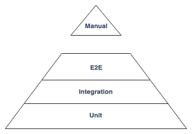

footer: FHS (tmayrhofer.lba@fh-salzburg.ac.at)
slidenumbers: true

# Testing React Components

## (MMT-M2020)

---

# Testing React Components


---
# Testing React Components
## Tools

- Cypress (e2e testing "Software Quality Assurance")
- React Test Utils (Facebook, low level)
- Enzyme (AirBnB, more high level)
- React Testing Library (best of both worlds)

---
# Testing React Components

## Testing Pyramid



---
# Testing React Components
## Testing Pyramid


---

# Testing components
## Verify that some text is rendered

```js
// button.spec.js
import React from 'react'
import { render, cleanup, queryByText } from '@testing-library/react'
import { Button } from './Button'

afterEach(cleanup)
describe('Button', () => {
  it('renders given text', () => {
    // Arrange
    const givenText = 'A Button'

    // Act
    const { container } = render(<Button>{givenText}</Button>)

    // Assert
    expect(queryByText(container, givenText)).toBeTruthy()
  })
})
```

---

# Testing components
## Verify that some text is rendered

- Run the test and watch it fail
- The test will guide you towards the implementation

---

# Testing components
## Verify that some text is rendered

```js
// button.js
import React from 'react'

const Button = ({ children }) => {
  return <>{children}</>
}
```

---

# Testing components
## verify that an HTML tag is rendered

```js
// button.spec.js
import React from 'react'
import { render, cleanup, queryByText } from '@testing-library/react'
import { Button } from './Button'

afterEach(cleanup)
describe('Button', () => {
  // ... other tests

  it('renders a button html tag', () => {
    const givenText = 'A Button'
    const { container } = render(<Button>{givenText}</Button>)

    expect(container.querySelectorAll('button'))
// 1)                ^^^^^^^^^^^^^^^^^
      .toHaveProperty("length", 1)
// 2)  ^^^^^^^^^^^^^^

// 1) get all button HTML tags from the rendered container
// 2) verify that there is exactly one button HTML tag
  })
})
```

---

# Testing components
## verify that an HTML tag is rendered

```js
import React from 'react'

export const Button = ({ children }) => (
  <button> { /* render a Button instead of a fragment */ }
    {children}
  </button>
)
```
---

# Testing user interactions


---

# Testing user interactions

- How can we test user interactions?
  - eg. when the button was clicked?

```js
import React from 'react'

const Button = ({ onClick, children }) => {
  //              ^^^^^^^
  // How can we verify that the onClick handler is
  // called when the button is clicked?
  return <button>{children}</button>
}
```

----

# Testing user interactions
## Spy objects

- Spy objects are stubs that also record the way they were called
- Useful when:
  - A hard to verify side effect is triggered (eg. E-Mail sending)

```js
it('sends an email on sign up', () => {
  const sendEmail = jest.fn()
  const signUp = signUp({ sendEmail }, username, password)
  expect(sendEmail).toHaveBeenLastCalledWith({ username, password })
})
```

----
# Testing user interactions
## Spy objects

- Spy objects can be used to verify user interactions in react components

```js
// button.spec.js

  it('when button was clicked, calls given onClick handler', () => {
    const onClick = jest.fn() // create function spy
    const { container } = render(<Button onClick={onClick}>My Button</Button>)
    fireEvent.click(container.querySelector('button'))
// 1)               ^^^^^^^^^^^^^^^^^^^^^^^^^^^^^^^^^
// 2)         ^^^^^
// 1) select the DOM element to be clicked
// 2) fire the click event

    expect(onClick).toHaveBeenCalled()
//  verify that the onClick spy has been called at least once
  })
```

---
# Testing user interactions
## Spy objects

```js
import React from 'react'

const Button = ({ onClick, children }) => (
  <button onClick={onClick}>
{/* 1)             ^^^^^^^   */}
    {children}
  </button>
)
// 1) set click handler on the button DOM element
```


---

## Exercise 1

- You're building an issue tracking system
- Build a component which displays the names of assignees
  - eg. `<Assignees assignees={['Mike', 'Sepp', 'David']} />`
  - build a simple ul


---
## Exercise 2

- WITH more than 3 assigness,
  - only display 3 assignees
  - display a show more button


----
## Exercise 3

- WHEN the show more button was clicked
  - display all assignees
  - a show less button is displayed instead of a show more button
  - AND the show less button was clicked, only displays 3 assignees


----

## Exercise 4

- WITH less than 4 assignees,
  - don't display a "show more" button


---
# Feedback

- Questions: tmayrhofer.lba@fh-salzburg.ac.at
- <https://de.surveymonkey.com/r/8TW92LL>
