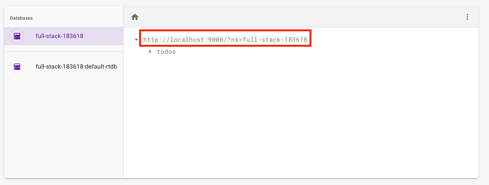

# Firebase


---

# Firebase
## What is firebase [^5]

> Firebase is a platform developed by Google for creating mobile and web applications.

---

# Firebase
## What is firebase

- set of tools to develop applications
- apps can be created without server side code
- "Backend as a service"


---

# Firebase
## Tools

- Analytics
- Authentication
- Database
- Messaging
- Hosting
- File Storage
- ...


---

# Deploying applications


---

# Deploying applications

- Firebase hosting makes it easy to deploy web-apps
- execute `firebase deploy`
- or add deploy script to `package.json`

```js
{
  "scripts": {
    // ... other scripts
    "deploy": "npm run build:app && firebase deploy"
  }
}
```
---

# Firebase Realtime Database

- NoSQL store
- can sync data with devices automatically
- supports authorization via database rules
- ...

---

# Firebase and Redux


---
# Firebase and Redux

- `React-Redux-Firebase` library
- reduces boilerplate when working with firebase
  - provides automatic reducers
  - provides watch query capabilities
  - ...

```
npm install --save react-redux-firebase
```

---
# Setup local database

```js
// firebase.js

import firebase from 'firebase'
import 'firebase/auth'
import 'firebase/database'
//      ^^^^^^^^^^^^^^^^^^
// add firebase database
// ...
```

---

# Setup local database

- Goto http://localhost:4000
- Select Realtime Database emulator
- Copy Database URL



---

# Setup local database

- Paste URL in ./firebase.json
- Please see firebase.js [^6]

---

# Setup redux firebase

```js
// index.js

import App from './App'
import { ReactReduxFirebaseProvider } from 'react-redux-firebase'
import { firebase } from './firebase'
// import firebase and the ReactReduxFirebaseProvided

const rrfProps = {
  firebase,
  config: { userProfile: 'users' },
  dispatch: store.dispatch
}
// setup config
```

---

# Use ReactReduxFirebaseProvider [^1]

```js
// index.js
const rrfProps = { /* ... config*/ }

ReactDOM.render(
  <Provider store={store}>
    <ReactReduxFirebaseProvider {...rrfProps}>
      <!-- use the firebase provider -->
      <App />
    </ReactReduxFirebaseProvider>
  </Provider>,
  document.getElementById('root')
)
```

---

# Add the firebase reducer [^2]

```js
// reducers/index.js
import { firebaseReducer } from 'react-redux-firebase'

const rootReducer = combineReducers({
  firebase: firebaseReducer,
  // ... other reducers
})
```

---

# Add firebase to action creators [^3]

```js
import { getFirebase } from 'react-redux-firebase'

const store = createStore(
  rootReducer,
  compose(
    applyMiddleware(thunk.withExtraArgument({ getFirebase })),
    //                                        ^^^^^^^^^^^
    // each action creator can access firebase now
    // ...
```

---

# Adapting action creators
## fetching data once [^4]

```js
export const fetchUsersActionCreator = () => async (dispatch, _, { getFirebase }) => {
  //                                                              ^^^^^^^^^^^^
  // firebase can be used in any action creator now
  await getFirebase().promiseEvents([
    { path: 'users' }
  ])
  // no actions need to be dispatched as firebase automatically dispatches actions
}
```

---

# Adapting action creators
## fetching data once

```js
export const createUsersActionCreator = ({ username }) => async (dispatch, _, { getFirebase }) => {
  await getFirebase()
    .ref('users')
    //   ^^^^^^^
    // the path under which the record should be stored
    .push({ username })
    //      ^^^^^^^^
    // the payload to be persisted in firebase
}
```

---

# Adapting action creators
## subscribe to live data

```js
import { compose } from 'redux'
import { connect } from 'react-redux'
import { firebaseConnect } from 'react-redux-firebase'
const mapStateToProps = (state, props) => {
  return {
    moneyTransactions: state.firebase.ordered.moneyTransactions
//                     ^^^^^^^^^^^^^^^^^^^^^^^^^^^^^^^^^^^^^^^^
// access locally cached money transactions from firebase
  }
}

export default compose(
  firebaseConnect([ 'moneyTransactions' ]),
// ^^^^^^^^^^^^^
// automatically receive live updates
  connect(mapStateToProps)
)(MoneyTransaction)
```

---

# Firebase

- there are lots of other things to discover in firebase
  - authorization of data (via database rules)
  - ...
- we'll look into necessary features for your MMP when required


---

# Final Task of the semester 😢

- fetch money-transactions via firebase
  - adapt action creator
  - adapt mapStateToProps
- create money-transactions via firebase
- afterwards we'll discuss the MMP

---

# Feedback

- Questions: tmayrhofer.lba@fh-salzburg.ac.at
- <https://de.surveymonkey.com/r/8TW92LL>


[^1]: full example https://gist.github.com/webpapaya/91fd607872e10b3f0a854e95582dfc76#file-index-js

[^2]: full example https://gist.github.com/webpapaya/91fd607872e10b3f0a854e95582dfc76#file-reducer-js

[^3]: full example https://gist.github.com/webpapaya/91fd607872e10b3f0a854e95582dfc76#file-store-js

[^4]: we'll se an alternative approach later

[^5]: https://en.wikipedia.org/wiki/Firebase

[^6]: full example https://gist.github.com/webpapaya/91fd607872e10b3f0a854e95582dfc76
