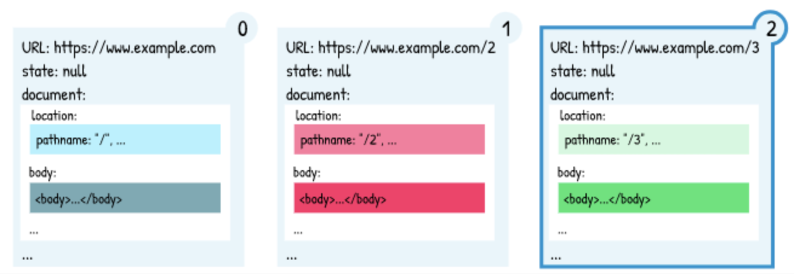

footer: FHS
slidenumbers: true

# Frontend Development

### Wintersemester 2021

---

# Persisting data in the Browser


---

# Agenda

- History State
- Session Storage
- Local Storage
- Indexed DB


---

# History State


---

# History State
## Recap

> Each browser tab has a “browsing context”. The browsing context maintains a “session history”, which is essentially an array of location entries. [^2]



---

# History State
## recap pushState

```js
// history.pushState(<state>, <title>, <url>)

history.pushState(null, 'page 1', '/page1')
history.pushState({ page: 2 }, 'page 2', '/page2')
// 1)             ^^^^^^^^^^^
// 1) add some state to the session history

history.state // => { page: 2 }
history.back(-1)
history.state // => null
```

---

# History State
## when to use push state [^4]

- data can be added to the current session history entry
- data does not need to be synced between tabs
- data will get lost when page session ends
  - data will get lost when tab was closed [^3]
- size is limited to 2MiB
- data is not shared between tabs

---

# History State
# Can I Use [^6]


---

# Session Storage


---

# Session Storage [^5]

- temporary storage which expires when the page session ends
- session storage is only available to the current origin and tab
  - 2 tabs don't share the same session storage
- when tab gets duplicated
  - session storage gets copied
- can store strings only
  - other types need to be serialized

---

# Session Storage
## Persisting values

```js
window.sessionStorage.setItem('someKey1', 'some important value')
//                         1) ^^^^^^^^^
//                                     2) ^^^^^^^^^^^^^^^^^^^^^^
// 1) the key where the value is stored
// 2) the value to be stored

window.sessionStorage.setItem('someKey2', JSON.stringify({ test: 1 }))
//                                     3) ^^^^^^^^^^^^^^^
// 3) stringify the object
```

---

# Session Storage
## Reading values

```js
window.sessionStorage.setItem('someKey1', 'some value')
window.sessionStorage.getItem('someKey1') // => 'some value'


window.sessionStorage.setItem('someKey2', JSON.stringify({ test: 1 }))
window.sessionStorage.getItem('someKey1') // => '{ "test": 1 }'
//                                              ^^^^^^^^^^^^^^^
// this is returned as string and needs to be serialized again
```

---

# Session Storage
## in Chrome Dev Tools


---

# Session Storage
# Can I Use [^6]


---

# SessionStorage
## Exercise time (15 minutes)

- Open your quiz application on a new branch
  - try to store the selected answer in the sessionStorage

---

# Local Storage


---

# Local Storage

- persistent storage which does not expire
- key/values can be stored
  - only supports strings as data types
- max size roughly 5MB (depending on the browser)
- blocks the event loop (for read and writes)
  - should be avoided for large datasets

---

# Local Storage
## Persisting values

```js
window.localStorage.setItem('someKey1', 'some important value')
//                         1) ^^^^^^^^^
//                                     2) ^^^^^^^^^^^^^^^^^^^^^^
// 1) the key where the value is stored
// 2) the value to be stored

window.localStorage.setItem('someKey2', JSON.stringify({ test: 1 }))
//                                     3) ^^^^^^^^^^^^^^^
// 3) stringify the object
```

---

# Local Storage
## Reading values

```js
window.localStorage.setItem('someKey1', 'some value')
window.localStorage.getItem('someKey1') // => 'some value'


window.localStorage.setItem('someKey2', JSON.stringify({ test: 1 }))
window.localStorage.getItem('someKey1') // => '{ "test": 1 }'
//                                              ^^^^^^^^^^^^^^^
// this is returned as string and needs to be serialized again
```

---

# Session Storage
# Can I Use [^6]


---

# IndexedDB


---

# IndexedDB

- Adds possibility to store data
- non-relational database
  - does not use SQL
- supported in many browsers
---

# What is IndexedDB

IndexedDB provides an object store in the browser

- non relational database
- Stores: JS objects, files, blobs, ...
- Supports: basic searching, sorting and transactions

---

# IndexedDB Structure 
## Can I Use [^6]


---

# IndexedDB Structure

- Database (a group of related data)
  - each database can have multiple object stores
- Object Store
  - similar to a table in relational DBs
  - contains data 
    - eg. user profile object store 
  - contains index
    - eg. index by email address


---

# Usage with IDB
## installation

- IDB is a small wrapper around indexedDB
  - original implementation was not promise based
- helps with data migration
- installation via NPM
  `npm i idb`
- via CDN
  `import idb from 'https://cdn.jsdelivr.net/npm/idb@7/+esm';`

---

# Usage with IDB
## creating a database

```js
const db = await openDB('test-db', 1, {
//            1) ^^^^^^
//                   2) ^^^^^^^^
//                              3) ^
// 1) open/connect to the database
// 2) name of the database
// 3) version number

    upgrade(db, currentVersion) {
//  ^^^^^^^^^^^^^^ define database migrations

        if (currentVersion === 0) {
            db.createObjectStore('users', { keyPath: 'email' })
//       4) ^^^^^^^^^^^^^^^^^^^^
//                            5) ^^^^^^
//                                       6) ^^^^^^
// 4) create an objectStore
// 5) the name of the ObjectStore
// 6) define the path to the key (value should be unique)
        }
    },
})
```

---

# Usage with IDB
## inserting/updating data

```js
await db.put('users', { name: 'Mike', email: 'mike@test.com', age: 14 })
//        1) ^^^^^^^
//        2)          ^^^^^^^
// 1) the name of the ObjectStore
// 2) the value to persist
```

---

# Usage with IDB
## deleting data

```js
await db.delete('users', 'mike@test.com')
//        1)    ^^^^^^^
//        2)             ^^^^^^^^^^^^^^
// 1) the name of the ObjectStore
// 2) the key to delete from the ObjectStore
```

---

# Usage with IDB
## remove all entries

```js
await db.clear('users')
//        1)    ^^^^^^^
// 1) the name of the ObjectStore to be cleared
```

---

# Usage with IDB
## creating an index

```js
const db = await openDB('test-db', 2, {
//                              1) ^
    upgrade(db, currentVersion) {
        if (currentVersion === 0) {
            // ... don't touch existing migrations
        }
            
        if (currentVersion === 1) {
          store.createIndex('nameIdx', 'name');
          //             2) ^^^^^^
          //             3)             ^^^^^
        }
    },
})

// 1) increase the version number
// 2) define a name for the index
// 3) define the property to be indexed
```

---

# Usage with IDB
## multiple version issue

- indexedDBs might not be up to date with your code
  - data migrations need to be written
- a user might be behind several db versions

---

# Usage with IDB
## migrate several versions


```js
const db = await openDB('test-db', 10, {
    upgrade(db, currentVersion, nextVersion) {
      for (let version = currentVersion; version <= nextVersion; version++) {
      //  ^^^^^^^^^^^^^^^^^^^^^^^^^^^^^^^^^^^^^^^^^^^^^^^^^^^^^^^^^^^^^^^^^
      // iterate through all versions which hadn't been executed yet
        if (currentVersion === 0) {
          // first migration
        }    
        if (currentVersion === 1) {
          // second migration
        }
        // ...
      }
    },
})
```


---

# IndexedDB [^6]


---

# IndexedDB
## Exercise time

- Open your quiz application on a new branch
  - try to store your questions in the indexed db
- try to read the questions from there


---

# Feedback

- Questions: tmayrhofer.lba@fh-salzburg.ac.at
- [Feedback Link](https://s.surveyplanet.com/jbqem2o2)


[^1]: https://www.youtube.com/watch?v=vCumk1sXHcY
[^2]: https://developer.mozilla.org/en-US/docs/Web/API/History/state
[^3]: some browsers (eg. firefox) persist the state object to disk. When the browser restarts the state is kept until the browser tab was closed
[^4]: https://developer.mozilla.org/en-US/docs/Web/API/History/pushState
[^5]: https://developer.mozilla.org/en-US/docs/Web/API/Window/sessionStorage
[^6]: https://caniuse.com/ as of 2021-12-20