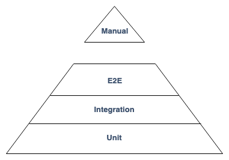
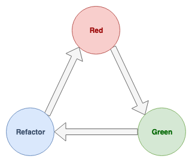

footer: FHS (tmayrhofer.lba@fh-salzburg.ac.at)
slidenumbers: true

# Client Side Web Engineering

## Client Side Testing

---

# Why automated testing

- manual testing is expensive
  - long feedback loop between developer/testers
- helps to find and prevent defects
- allow to change a systems behavior predictably
- find/prevent defects
- gain confidence about quality of the software

---

### Testing Pyramid



---

### Testing Pyramid

- Unit tests
  - lots of small and isolated tests which are fast to execute
- Integration tests
  - some integration tests which test external systems like databases
- E2E
  - few tests which test the whole system

---

# Unit testing and TDD

- Test driven development (also known as TDD)
- Type of software development
- Introduced by Kent Beck
  - Author of [Extreme Programming](https://www.amazon.de/Extreme-Programming-Explained-Embrace-Change/dp/8131704513/ref=sr_1_1?__mk_de_DE=%C3%85M%C3%85%C5%BD%C3%95%C3%91&keywords=kent+beck+extreme+programming+englisch&qid=1557045753&s=books&sr=1-1-catcorr)

---

### Why TDD

- early/fast feedback during development
- Driving the design of our application
  - Testing is a side-effect
- Possibility to refactor
  - Confidence that app is still working
- Break down large problems into small problems
  - Think about edge cases
- executable documentation
  - Can't get out of sync
  - [Docs for pomeranian-durations](https://github.com/webpapaya/pomeranian-durations)

---

### TDD to me

> Helps me to break down bigger tasks into small steps I can keep in my head

---

### TDD

> TDD doesn't drive good design. TDD gives you immediate feedback about what is likely to be bad design. (Kent Beck)
> I want to go home on Friday and don't think I broke something. (Kent Beck)

---

### What is TDD not

- Silver bullet for clean code
  - it eventually leads to better code
- Replacement for other testing strategies
  - TDD doesn't catch all bugs
  - Helps adding regression tests

---

> The best TDD can do, is assure that the code does what the developer thinks it should do. (James Grenning)

---

### TDD intro in 7:26 minutes

<https://www.youtube.com/watch?v=WSes_PexXcA>

---

### Essential vs. accidental complication

- Essential complication
  - The problem is hard
    - eg. Tax return Software
  - nothing we can do about
- Accidental complication
  - We are not so good in our job
  - eg. future proofing code
    - (it might be useful in the future)
  - we can try to improve ourselves

---

### Accidental complication

- future proofing code
- cutting corners
  - to get stuff out of the door
  - we're not going to change this anyways
- drives up the cost/development time of a feature
  - mostly the feature isn't complex
  - the way the app is built drives the cost of a feature
- big refactoring is hard to sell

---

### Avoid accidental complication

- Baby steps and TDD
- Refactor a little after every feature/green test
  - clean the kitchen
  - prevents big bang refactoring
    - which are hard to sell to business
- Without refactoring features will take longer

---

# TDD Cycle



---

### TDD Cycle

- Red: Write a test and watch it fail
- Green: Write just as much code to make the test pass
- Refactor: Clean up

---

### Red

- Think about the test description
- Descriptions should reflect the behaviour of the program

```js
it('when product A given, price is 3$', () => {
  expect(calculatePrice('productA')).toEqual('3$')
})
```

---

### Green

- Write just enough code to make the test pass
  - if there is only 1 product just return 3$

```js
function caluculatePrice () {
  return '3$'
};

it('when product A given, price is 3$', () => {
  expect(calculatePrice('productA')).toEqual('3$')
})
```

---

### Refactor

- Change the code without changing any of the behaviour
- "Clean the kitchen"

```js
const caluculatePrice = () => '3$'

it('when product A given, price is 3$', () => {
  expect(calculatePrice('productA')).toEqual('3$')
})
```

---

### Red (repeat)

- start with the next test-case

```js
const caluculatePrice = () => '3$'

it('when product A given, price is 3$', () => {
  expect(calculatePrice('productA')).toEqual('3$')
})

it('when product b given, price is 10$', () => {
  expect(calculatePrice('productB')).toEqual('10$')
})
```

---

### Green

- start with the next test-case

```js
const caluculatePrice = (product) => {
  if (product === 'productA') { return '3$' }
  if (product === 'productB') { return '10$' }
}

it('when product A given, price is 3$', () => {
  expect(calculatePrice('productA')).toEqual('3$')
})

it('when product B given, price is 10$', () => {
  expect(calculatePrice('productB')).toEqual('10$')
})
```

---

### Red

```js
const caluculatePrice = (product) => {
  if (product === 'productA') { return '3$' }
  if (product === 'productB') { return '10$' }
}

it('when product A given, price is 3$', () => {
  expect(calculatePrice('productA')).toEqual('3$')
})

it('when product B given, price is 10$', () => {
  expect(calculatePrice('productB')).toEqual('10$')
})

it('when unknown product is given, throws UnknownProductError', () => {
  expect(() => calculatePrice('productB')).toThrow(UnknownProductError)
})
```

---

### Green

```js
class UnknownProductError extends Error {}

const caluculatePrice = (product) => {
  if (product === 'productA') { return '3$' }
  if (product === 'productB') { return '10$' }
  throw new UnknownProductError();
}

it('when product A given, price is 3$', () => {
  expect(calculatePrice('productA')).toEqual('3$')
})

it('when product B given, price is 10$', () => {
  expect(calculatePrice('productB')).toEqual('10$')
})

it('when unknown product is given, throws UnknownProductError', () => {
  expect(() => calculatePrice('productB')).toThrow(UnknownProductError)
})
```

---

# Anatomy of a Test

- **A**rrange => test setup
- **A**act => call the unit to test
- **A**ssert => verify the result

---

### Anatomy of a Test

```js
it('employeeReport: returns a list of employees ordered by their name', () => {
  // Arrange
  const employees = [
    { name: 'Sepp' },
    { name: 'Max' },
    { name: 'Anton' }
  ]

  // Act
  const result = employeeReport(employees)

  // Assert
  assertThat(result, orderedBy((a, b) => a.name < b.name))
})
```

---

# What makes a good unit test

- Deterministic
  - randomness hard to test
  - current date or time is hard to test
- Tests should not have any effect on the system
  - changing global state (eg. database)
- no external systems are called
- little test setup
- behavior is described and not implementation details

---

# Code Kata

- Small exercise
  - to improve programming skills
  - by challenging your abilities
  - and encouraging you to find multiple approaches

---

# Steps

- Step 1: Think
- Step 2: Write a test
- Step 3: How much does this test suck?
- Step 4: Run the test and watch it fail
- Step 5: Write just enough code to make it pass
- Step 6: Cleanup

---

### Fizz Buzz (20 minutes)

- go to <http://tddbin.com/>
- or `git clone git@github.com:webpapaya/fhs-tdd-starter.git`
- <https://codingdojo.org/kata/FizzBuzz/>

---

# Isolating units under test

---

# Recap: What makes a good unit test

- Deterministic
  - randomness hard to test
  - current date or time is hard to test
- Tests should not have any effect on the system
  - changing global state (eg. database)
- no external systems are called
- little test setup
- behavior is described and not implementation details

---

# Dummy objects

- Objects which aren't used
  - so that the compiler doesn't complain
  - used to fill parameter lists
    - not relevant for JS but if you're using TS you might need these

```js
class Person {
  constructor(public firstName: string, public age: number) {}
  isOfLegalAge(): boolean { return this.age >= 18 }
}

it('when age is 18, Person is of legal age', () => {
  const person = new Person("Max", 18)
  //                        ^^^^
  // this parameter would be a dummy object as it's
  // not relevant for the test

  // ...
})
```

---

# Fake objects

- Objects have a working implementation
  - but take some shortcuts
  - eg. inMemoryDatabases instead of persistent DB
- example [fake-local-storage](https://github.com/stpettersens/node-fake-storage)

---

# Stub objects

- Predefined return values for testing
- Instead of calling the real API we return a value for testing
- Examples:
  - retrieving geolocation in tests
  - testing edge cases (eg.: database throws OutOfMemory exception)

```js
const retrieveGPSPosition = () =>
  Promise.resolve({ lat: 12.12, lng: 14.15 })
```

---

# Spy objects

- Are stubs that also record the way they were called
- Used to verify side effects (eg. E-Mail sending)

```js
it('sends an email on sign up', () => {
  const username = 'username'
  const password = 'password'

  const sendEmail = jest.fn() // create a spy
  const signUp = signUp(username, password, { sendEmail })

  expect(sendEmail).toHaveBeenCalledWith(username, password);
  //                ^^^^^^^^^^^^^^^^^^^^^
  // verify that the spy has been called
})
```

---

### Clock in kata (rest of the lecture)

- go to <http://tddbin.com/>
- <http://kata-log.rocks/clock-in-kata>

---

# Remember steps

- Step 1: Think
- Step 2: Write a test
- Step 3: How much does this test suck?
- Step 4: Run the test and watch it fail
- Step 5: Write just enough code to make it pass
- Step 6: Cleanup

---


---

### Homework

- Homework:
  - can be done in pairs
  - implement <https://codingdojo.org/kata/Bowling/>
  - Work in a strict TDD loop
    - commit before every new test
    - write descriptive commit messages
  - try to implement as little as possible in one iteration

---

# Resources

- [Integrated Tests are a Scam](https://vimeo.com/80533536)
- [Is TDD Dead](https://www.youtube.com/watch?v=z9quxZsLcfo&list=PLJb2p0qX8R_qSRhs14CiwKuDuzERXSU8m)
- [Mocks,Stubs,Spys](https://martinfowler.com/bliki/TestDouble.html)
- [Extreme Programming](https://www.amazon.de/Extreme-Programming-Manifest-Kent-Beck/dp/3827317096)
- [TDD](https://www.amazon.de/Test-Driven-Development-Example-Signature/dp/0321146530/ref=pd_lpo_sbs_14_img_2?_encoding=UTF8&psc=1&refRID=KGXDT4ZNWGXMT5Y96H3F)
