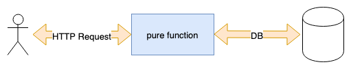
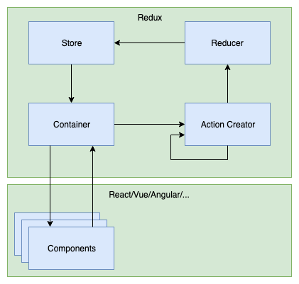

footer: FHS (tmayrhofer.lba@fh-salzburg.ac.at)
slidenumbers: true
### State Management with Redux

## (MMT-M2019)


---

### Roadmap

- Functional Programming 101
- Side Effects with React
- State Management with Redux

---
# Functional Programming 101


---

### Functional Programming 101

- Immutability
- Pure functions
- Side Effect

---
## Functional Programming 101
### What is functional programming

> Applications developed in a functional style use side-effect free functions as their main building blocks. (Made up definition by myself)

---
## Functional Programming 101
### Why functional programming

- More testable
  - pure functions simplify testing
- Declarative APIs which are easier to reason about
- Easy concurrency because of statelessness and immutability
  - State is pushed out of the application core to the boundaries
- Simple caching
  - pure functions easy to cache

---
## Functional Programming - Immutability

> An immutable data structure is an object that doesn't allow us to change its value. (Remo H. Jansen)

---
## Functional Programming - Immutability
### Immutable objects in JS

````js
const immutableObject = Object.freeze({ test: 1 })
immutableObject.test = 10
console.log(immutableObject) // => { test: 1 }
````

---
## Functional Programming - Immutability
### Changing an immutable value

````js
const immutableObject = Object.freeze({ a: 1, b: 2 })
const updatedObject = Object.freeze({ ...immutableObject, a: 2 })
console.log(updatedObject) // => { a: 2, b: 2 }
````

---
## Functional Programming - Immutability
### Unfreeze an object

````js
const immutableObject = Object.freeze({ test: 1 })
const unfrozenCopy = { ...immutableObject }
````

---
## Functional Programming - Immutability
### Why immutability

- race conditions impossible
- state of the application is easier to reason about
- easier to test

---
## Functional Programming - Side Effects

> A side effect is a change of system state or observable interaction with the outside world that occurs during the calculation of a result. (Chris Barbour)

---
## Functional Programming - Side Effects
### Some side effects

- DB/HTTP calls
- changing the file system
- querying the DOM
- printing/logging
- accessing system state (eg. Clock, Geolocation,...)

---
## Functional Programming - Side Effects
### Where to deal with side effects

- Moved to the boundaries of the system
- Business logic stays pure functional



---
## Functional Programming - Pure Functions


- A function is considered pure when:
  - for the same input it always returns the same output
  - it has no side effects
    - no mutation of non-local state

```js
const add = (a, b) => a + b
```

---
## Functional Programming - Pure Functions
### Pure or in-pure

```js
const array = [1, 2, 3, 4, 5, 6]
const fn1 = (array) => array.slice(0, 3)
const fn2 = (array) => array.splice(0, 3)
const fn3 = (array) => array.shift()
const fn4 = (array) => array.pop()
const fn5 = (array) => array.sort((a, b) => a - b)
const fn6 = (array) => [...array].sort((a, b) => a - b)
const fn7 = (array) => array.map((item) => item * 2)
const fn8 = (array) => array.forEach((item) => console.log(item))
```

---
## Functional Programming - Pure Functions
### Pure or in-pure

```js
const array = [1, 2, 3, 4, 5, 6]
const fn1 = (array) => array.slice(0, 3) // ✅
const fn2 = (array) => array.splice(0, 3) // 🚫
const fn3 = (array) => array.shift() // 🚫
const fn4 = (array) => array.pop() // 🚫
const fn5 = (array) => array.sort((a, b) => a - b) // 🚫
const fn6 = (array) => [...array].sort((a, b) => a - b) // ✅
const fn7 = (array) => array.map((item) => item * 2) // ✅
const fn8 = (array) => array.forEach((item) => console.log(item)) // 🚫
```

---
## Functional Programming - Pure Functions
### Pure or in-pure

```js
const config = { minimumAge: 18 }
const isAllowedToDrink = (age) => age >= config.minimumAge
```

```js
const config = { minimumAge: 18 }
const isAllowedToDrink = (age) => age >= config.minimumAge
```

---
## Functional Programming - Pure Functions
### Pure or in-pure

```js
const config = { minimumAge: 18 }
const isAllowedToDrink = (age) => age >= config.minimumAge
```

```js
const config = { minimumAge: 18 }
const isAllowedToDrink = (age) => age >= config.minimumAge
```

```js
// both are not pure. const saves the pointer. config is still mutable
isAllowedToDrink(18) // true
config.minimumAge = 19
isAllowedToDrink(18) // false
```

---
## Functional Programming - Pure Functions
### Pure or inpure? 2/2

```js
const config = Object.freeze({ minimumAge: 18 })
const isAllowedToDrink = (age) => age >= config.minimumAge
```

```js
// freezing the config makes the function pure
isAllowedToDrink(18) // true
config.minimumAge = 19
isAllowedToDrink(18) // true
```

---
## Functional Programming - Summary

- Immutability
  - Object can't be changed after its creation
- Side-Effects
  - Communication with the outside world (eg. db, http, ...)
- Pure-Functions
  - returns the same output for the same input
  - simple mapping from a to b

---

# Side Effects with React


---

# Side Effects with React
## Recap useEffect

> The Effect Hook lets you perform side effects in function components

---
# Side Effects with React
## Recap useEffect

```js
// Executed on every rerender
useEffect(() => {})

// Executed when component rendered initially
useEffect(() => {}, [])

// Executed when component rendered initially
// and when variable changes.
useEffect(() => {}, [variable])

// Cleanup when component unmounts (eg. eventHandlers, setInterval/setTimeout)
useEffect(() => {
  // do something fancy
  return () => { console.log('cleanup') }
}, [variable])
```

---

# Side Effects with React
## Recap useEffect

```js
export const MoneyTransactions = () => {
  const [moneyTransactions, setMoneyTransactions] = useState([])
  useEffect(() => {                                  // 1)
    fetch("http://localhost:3001/money-transaction") // 2)
      .then((response) => response.json())           // 3)
      .then((json) => setMoneyTransactions(json))    // 4)
  }, [])                                             // 5)

  // 1) define the useEffect hook
  // 2) make the HTTP request to the backend
  // 3) get the JSON from the response
  // 4) set the response as state
  // 5) call the effect when the component is mounted

  // ... remaining component
}
```

---

# Side Effects with React
## extract into custom hook

```js
const useHTTPEffect = (endpoint) => {
  const [response, setResponse] = useState([])
  useEffect(() => {
    fetch(endpoint)
      .then((response) => response.json())
      .then((json) => setResponse(json))
  }, [])

  return response;
}

export const MoneyTransactions = () => {
  const moneyTransactions = useHttpEffect("http://localhost:3001/money-transaction")
  const users = useHttpEffect("http://localhost:3001/user")

  // ...
}
```

---

# State Management with Redux


---
## Redux - State
### What is application state

> An application's state is roughly the entire contents of its memory. ([sarnold](https://stackoverflow.com/a/8102731))

---
## Redux - State
### State in Redux terms

> Every bit of information the application needs in order to render.

---
## Redux - State
### What information do we need to render this page


---
## Redux - State
### What information do we need to render this page

| Question?                                  | State Name           |
|--------------------------------------------|----------------------|
| Is the user authenticated?                 | authenticationStatus |
| Is a form already filled with values?      | formValues           |
| Is the input field hovered/focused/filled? | inputStatus          |
| Am I owning money to somebody?             | moneyTransactions    |
| Is somebody owning me some money?          | moneyTransactions    |
| Which users can I owe some money?          | users                |
| Which components should be rendered?       | url                  |

---
## Redux - State
### Categorising different types

- Relevant for other parts of the application?
  - add to global state
- Irrelevant for other parts of the application?
  - use component state (useState or setState)
  - also known as UI State

---
## Redux - State
### Global/Local/URL

| State Name           | State Type |
|----------------------|------------|
| authenticationStatus |            |
| moneyTransactions    |            |
| users                |            |
| formValues           |            |
| inputStatus          |            |
| url                  |            |

---
## Redux - State
### Global/Local/URL

| State Name           | State Type |
|----------------------|------------|
| authenticationStatus | global     |
| moneyTransactions    | global     |
| users                | global     |
| formValues           | local      |
| inputStatus          | local      |
| url                  | url        |

---
## Redux - State
### Global State

- relevant for other components
- could be seen as a client side database
  - or a cached version of the server data
- domain object should be stored here
  - eg. users, money transactions, authentication token

---
## Redux - State
### UI State

- irrelevant for other parts of the application
  - or state which shouldn't be shared with others
- What to store in UI state?
  - Form states
  - visual enhancements

---
## Redux - State
### URL State

- defines which set of components should be rendered
- persists on page reloads
- What to store in URL state?
  - the current route
  - the current page of a paginated list

---
## Redux - State
### React component tree


---
## Redux - State
### Storing state in components


---
## Redux - State
### Storing state in components

- Pros
  - Components are independent
    - eg. "Navigation" doesn't know about "User Update"
- Cons
  - User data needs to be fetched multiple times
  - If UserUpdate component changes name of user
    - Navigation needs to refetch user data

---
## Redux - State
### Storing state in the root component


---
## Redux - State
### Storing state in the root component

- Pros
  - User data could be fetched only once
  - If UserUpdate component changes name of user
    - navigation component is automatically updated
- Cons
  - State needs to be passed down to every component
  - (Root component contains all state logic)

---
## Redux - State
### Storing state in the root component


---
## Redux - State
### Storing state in redux


---
## Redux - State
### Storing state in redux

- Global state which acts like local state
- Pros:
  - Components are independent
    - eg. Navigation doesn't know about UserUpdate
  - State changes are synchronised with the whole app
  - State doesn't need to be passed down the tree
- Cons:
  - "Complex" architecture for small apps

---

## Redux



---

## Why Redux

- Managing state in react can be challenging
  - How to synchronize state between distant UI parts
- Redux provides a predictable way to manage state
- State can only be changed by dispatching an action
- Each action might change the previous state to a new updated state
- Works with react, vue, angular, ...

---

## Redux - Actions


---

## Redux - Actions

> Something happened in the app which might be interesting.

---

## Redux - Actions

- An action is data from the application which might be relevant for the store
- Information is sent to the store via store.dispatch

```js
const signInAction = {
  type: 'signIn',
  payload: {
    username: 'peter',
    password: 'the clam'
  }
}

store.dispatch(signInAction)
```

---

## Redux - Action Creators

- A functions which creates actions
- With redux-thunk action creators can dispatch itself
  - This is where side effects are handled

```js
const actionCreator = () => (dispatch) => {
  dispatch({ type: 'action1', payload: {} })
  dispatch({ type: 'action2', payload: { something: 'random' } })
  dispatch({ type: 'action3', payload: { something: 'random' } })
  // ...
}

store.dispatch(actionCreator())
```

---

## Redux - Action Creators
### Async action creators
```js
const actionCreatorWithData = ({ username, password }) => (dispatch) => {
  dispatch({ type: 'action1', payload: { username, password } })
  dispatch({ type: 'action2/success', payload: { something: 'random' } })
}

store.dispatch(signInAction({ username: 'Mike', password: '1234' }))
```

---
## Redux - Action Creators
### Async action creators

```js
const createMoneyTransaction = ({ creditorId, debitorId, amount }) =>
  async (dispatch) => {
    dispatch({ type: 'createMoneyTransaction/initiated', payload: {} })
    try {
      const moneyTransaction = await fetch('/money-transaction/', {
        creditorId,
        debitorId,
        amount
      })
      dispatch({
        type: 'createMoneyTransaction/success',
        payload: moneyTransaction
      })
    } catch (e) {
      dispatch({ type: 'createMoneyTransaction/error', payload: e })
    };
  }

store.dispatch(createMoneyTransaction({ creditorId: 1, debitorId: 2, amount: 10.3 }))
```

---
## Task 1 - Redux Setup

- Download
  - [React dev tools](https://chrome.google.com/webstore/detail/react-developer-tools/fmkadmapgofadopljbjfkapdkoienihi?hl=de)
  - [Redux dev tools](https://chrome.google.com/webstore/detail/redux-devtools/lmhkpmbekcpmknklioeibfkpmmfibljd?hl=de)
- in src/store.js
  - add `window.store = store`;

---
## Task 2 - Actions

- `npm run start:app`
- go to localhost:3000
- open dev tools/redux tab
- `store.dispatch({ type: 'signIn', payload: { name: 'name', password: 'password' } })`

---
## Task 3 - Async Action creator

- Create an action creator which calls `/user` and `/money-transaction`
  - dispatch result of http call

---
### Reducers


---

### Reducers

> Reducers specify how the application's state changes in response to actions sent to the store. ([Source](https://redux.js.org/basics/reducers))

---

### Reducers

- Specify how state changes in response to actions.
- Pure function
  - input appState and action
  - output next application state

```js
const initialState = {}
const reducer = (previousState = initialState, action) => {
  // do something with the state
  return nextState
}
```

---

### Reducers

```js
const initialState = []
const moneyTransactionReducer = (previousState = initialState, action) => {
  switch (action.type) {
    case 'createMoneyTransaction/success':
      return [...previousState, action.payload]
    case 'reset':
      return initialState
    default:
      return previousState
  };
}
```

---

## Task 1 (Reducer)

- Add a userReducer reducer
  - entry point: `src/reducer/index.js`
  - listen to 'fetchUser/success'
    - try to populate the redux store with a new user

---

### Container components


---

### Container components

- Glue between react and redux
- Provides data from the global store to the components
- Provides "callbacks" to trigger actions

---

### Container Components

```js
import { createMoneyTransaction } from '../action-creators/money-transactions'
const mapStateToProps = (state, props) => {
  return {
    moneyTransactions: state.moneyTransactions
  }
}

const mapDispatchToProps = (dispatch, props) => {
  return {
    createMoneyTransaction: (payload) =>
      dispatch(createMoneyTransaction(payload))
  }
}

export default connect(
  mapStateToProps,
  mapDispatchToProps
)(MoneyTransactionList)
```

---

### mapStateToProps

- extract data from the store and provides it to a component
- data filtering can be done here
- `function mapStateToProps(state, ownProps?)`
  - state -> the entire application state
  - ownProps -> properties which are passed from other components
- [Docs](https://react-redux.js.org/using-react-redux/connect-mapstate)

---

### mapDispatchToProps

- binds actions with the store and provides those actions to a component
- `function mapStateToProps(dispatch, ownProps?)`
  - dispatch -> the stores dispatch function
  - ownProps -> properties which are passed from other components
- [Docs](https://react-redux.js.org/using-react-redux/connect-mapdispatch)

---

## Task 1 (Container)

- Try to connect your moneyTransactionCreate dropdown with users from the store

---

## Task 2 (connect to backend)

- Try to connect fetchUsers action creator

---

# Further Links

- [Redux Tutorial](https://redux.js.org/basics/basic-tutorial)
- [Mostly adequate guide to FP](https://github.com/MostlyAdequate/)
- [Hands-On Functional Programming with TypeScript](https://www.amazon.com/Hands-Functional-Programming-TypeScript-applications/dp/1788831438)
- [Immutable Data Structures](https://hackernoon.com/how-immutable-data-structures-e-g-immutable-js-are-optimized-using-structural-sharing-e4424a866d56)

---

# Feedback

- Questions: tmayrhofer.lba@fh-salzburg.ac.at
- <https://de.surveymonkey.com/r/8TW92LL>
