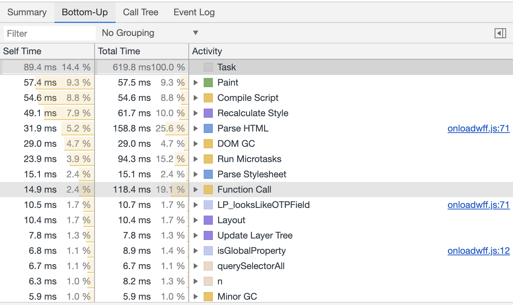

# Debugging JS

----

# Roadmap for today

- Debugging JS
- I18N

----

# Exam
## Example questions

- Write a react component which renders the names of the given users
- Which performance optimizations can you spot in the following code
- Name challenges when translating a web application
- How do you debug performance issues within your application
- ...

----

# console.log debugging

- Add console.log statements
- Click through the app
- See the log statements in chrome dev tools
  - easy to get started
  - some problems might be tough to track down

----

# Using Breakpoints

- Chrome/Firefox devtools allow breakpoints
- Breakpoints are a way to pause a programm
  - variables can be inspected
  - custom code can be executed

----

# Using Breakpoints

- Chrome/Firefox devtools allow breakpoints
- Breakpoints are a way to pause a programm
  - variables can be inspected
  - custom code can be executed

----

# How to add breakpoints

- Via EventListeners
  - DevTools > Sources > EventListener Breakpoints
- Via DOM events
  - eg. element is removed/added to dom
- In DevTools
  - Sources > find line of code > click on line number
- Via Code -> add debugger statement

----

# Debugging NodeJS

- <https://dev.to/john_papa/debug-your-nodejs-app-in-60-seconds-5cni>

---

# Debugging performance issues

----

# Chrome performance tab

----

# Chrome performance tab

- Determine why CPU is busy
- Flame graph Visualisation of
  - call stack
  - duration of fn call

----

# Bottom up

- Which functions had took the longest to run

----

# CPU Performance

- Open dev tools
- Go to Performance > Record
  - Click stop

----

# Task

- clone: <https://github.com/webpapaya/compup>
- npm i && npm run start:development
- Users complain that some button clicks take very long
  - Don't look on commit history =)

---

# Feedback

- Questions: tmayrhofer.lba@fh-salzburg.ac.at
- <https://s.surveyplanet.com/x1ibwm85>