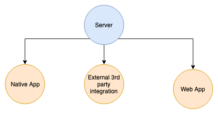

## i18n/l10n


---

# Numeronym

- Number based word
- mostly used as a shortened form of a word
- eg.
  - W3C (World Wide Web Consortium)
  - k8s (kubernetes)
  - g11n (globalization)
  - i18n (internationalisation)
  - l10n (localisation)
  - a11y (accessibility)

----

# i18n definition

> Internationalisation is the design and development of a product, application or document content that enables easy localisation for target audiences that vary in culture, region, or language. **(W3C)**

----

# i18n

- Process of designing apps which can be localised later
  - use UTF-8 as encoding instead of latin-1
  - handling timestamps across different timezones

----

# l10n definition

> Localisation refers to the adaptation of a product, application or document content to meet the language, cultural and other requirements of a specific target market (a locale). **(W3C)**

----

# l10n

- Localisation might contain:
  - Formatting (datetime/numeric/... values)
  - Graphics which might be inappropriate in a given culture
  - Changes due to legal requirements
    - eg. a VAT-ID is required in certain countries on purchase

---

# Challenges

- Text size differences
  - eg. bezahlen -> pay
- RTL vs. LTR
- Different formatting rules
- Country specific requirements
- Pluralisation

---

# i18n why

> Adding i18n early to a project is much easier than afterwards.

- Finding all strings afterwards is a huge task
  - wrap all hardcoded text with t function
    - `const t = (text) => text;`
  - use IDE to find all references afterwards

---

# CLDR

- Common locale data repository
- Most extensive repository for locale-specific data
- Developed/Maintained by the Unicode consortium
- Pretty big 72mb of JSON (xml is bigger)

----

# CLDR

- certain translations
  - language names
  - territory country names
  - calendric names (weekdays, months,...)
- formatting/parsing numbers, dates
- conversion rules
  - numeral systems (eg. roman -> arabic numbers)
  - calendar systems (eg. julian -> gregorian calendar)
  - spelling numbers as words
- country infos
  - which day does a week start
  - ...

---

# ICU

- International Components for Unicode
- OpenSource Project for internationalisation
- Uses CLDR internally
- Ported to many environments
  - JS [formatjs](https://formatjs.io)
  - Java
  - C++
  - ...

----

# ICU

- Simple string translations: 'Hello everybody'
- Simple string with placeholder: 'Hello {name}'
- Formatters
  - Number
  - Date
  - Time
  - Select
  - Plural
  - Custom formats eg. currencies

----

# ICU Basic Numbers

- `{ count, number }`
  - en: 21,629,693
  - ca: 21.629.693
  - de: 21629693

----

# ICU Currency Numbers

- `{ count, number, currency }`
  - en: $1,693.10
  - ca: 1.693,10 USD
  - de: 1.693,10 $

- `{ count, number, currency:EUR }`
  - en: €1.693,10
  - ca: 1.693,10 €
  - de: 1.693,10 €

----

# ICU Date

- `{ count, date }`
  - en: May 1, 2019
  - ca: 1 de maig de 2019
  - de: 1. Mai 2019

----

# ICU Date modifiers

- `{ count, date, short }`
  - en: 5/1/19
  - ca: 1/5/19
  - de: 1.5.19

----

# ICU Plural

```txt
{ count, plural,
    =0    {Zero}
    =1    {One}
    other {Many} }
```

----

# ICU Plural

```txt
{ count, plural,
    zero { Zero items }
    one { One item }
    two { Two items }
    few { A couple of items }
    many { Many items }
    other { # items }
}
```

----

# ICU Select

```txt
{ gender, select,
    male {He avoids bugs}
  female {She avoids bugs}
   other {They avoid bugs} }
```

---

# Locale

- Dependent on language AND region
- Language code + country code
  - 'de-AT' === 'deu-AT'
  - 'de-DE' === 'deu-DE'
  - 'en-US'

----

# Why language and region

- Austria vs. Germany
  - Jänner => Januar
  - Erdapfel => Kartoffel
  - Kassa => Kasse
  - <https://de.wikipedia.org/wiki/Liste_von_Austriazismen>
- England vs. America vs. Canada
  - 01/05/19 => 5/1/19 => 19-05-01

----

# ISO-639 (language codes)

- character code to represent a language
- ISO 639-1
  - two character code, most major languages spoken today
  - more restrictive, not every language is added
- ISO 639-2
  - ISO 639-1 still valid (with exceptions)
  - three character code
  - includes ancient/constructed/historical languages
    - eg. tlh (klingon)
  - more than 4000 languages

----

# ISO-3166 (country codes)

- character code to represent countries
- ISO-3166-1
  - two character code
  - used for country top level domains
  - this should be used
- ISO 3166-3
  - Used for ancient countries (eg. DDR/UDSSR)

---

# Which locale

- use system settings
- (use custom user settings)
  - when many people share the same device
- use url parameter (mostly for debugging)

---

### Where to add translations

----

### Dependencies



----

### Use case

- A new server validation is added
  - eg. email already taken
  - all clients need to update locales
- Recommendation:
  - Add localisation as local as possible

----

# Select system locale

- on the client
  - `navigator.language || navigator.userLanguage`
  - 'de-AT' or 'de-DE'
- on the server
  - via HTTP Accept-Language header
    - Accept-Language: en;q=0.8,es;q=0.6,fr;q=0.4

---

# Task

- Add to project:
  - Simple translation
  - Pluralised translation
    - eg. No member in group/many members in group
    - <https://angular.io/guide/i18n>

---

# Time, Timezones, Durations

----

## Falsehoods about time

- There are always 24h a day
- The system clock will be set to the correct time
- A minute is always 60 seconds
- A timestamp is unique
- Weeks start on Monday
- Time always goes forwards
- Timezone offsets are always 1h
- There are 24 timezones
- [all falsehoods](https://gist.github.com/timvisee/fcda9bbdff88d45cc9061606b4b923ca)

----

# UTC

- Coordinated Universal Time
- Time standard how clocks are coordinated
- Not adjusted by daylight saving
- UTC has timezone offset +00:00

----

# Timezone vs. Timezone offset

- Offset
  - difference between UTC and a place with time
  - mostly written as +00:30, +14:00
- Timezone
  - a region which use the same time
  - might add daylight saving time

----

# TZ Entry from Austria


----

# ISO-8601

- Standard for representing times and durations
- First published 1988
- Dates `2000-02-01`
- Times `10:11:05`
- Datetime `2000-02-01T10:11:05+06:45`
- Durations `P1DT10M` => 1 Day and 10 Minutes

----

# Why use Dates

```js
const validityStart = new Date('2016-10-01') // Converts date to datetime
const validityEnd = new Date('2016-11-08')
const isWithinValidity = aDate => (aDate >= validityStart && aDate <= validityEnd)
const applicationTime = new Date('2016-11-08 08:00')
```

[Source](https://martinfowler.com/bliki/HiddenPrecision.html)

----

# Why own duration format

- Add one week to a date?
  - Adding (60 *60 * 24* 7) might be wrong
  - Time of the day might change
- How many hours does a week have?
  - Duration depends on the start/end date?
- How to represent half days with time?
  - Not every day has 24 hours

----

# Shameless self promotion

[Pomeranian Durations](https://github.com/webpapaya/pomeranian-durations)

----

# Some advice from my side

- Don't use JS Date object
  - <https://github.com/tc39/proposal-temporal> will come
- Store dates in UTC
- Store in appropriate data type
  - Date for birthdates, etc.
  - Datetime where the time is relevant
    - eg. created_at, updated_at
  - Duration
    - eg. half day of vacation
- use ISO-8601
  - for durations
  - for dates
  - for datetimes

---

# Feedback

- Questions: tmayrhofer.lba@fh-salzburg.ac.at
- <https://s.surveyplanet.com/x1ibwm85>