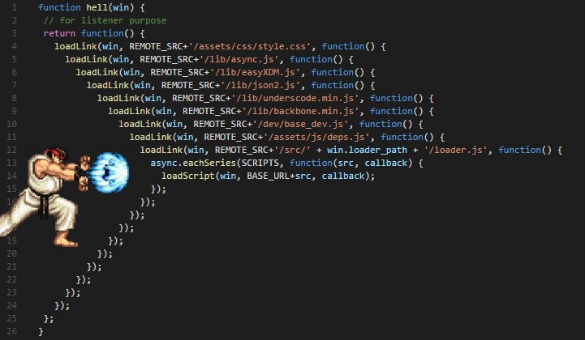
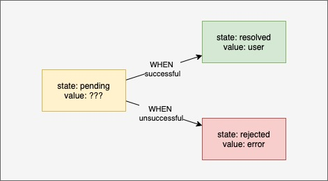
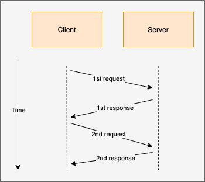
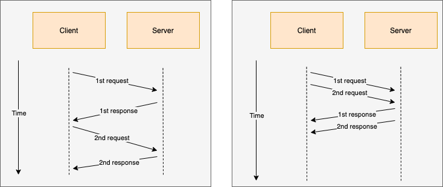
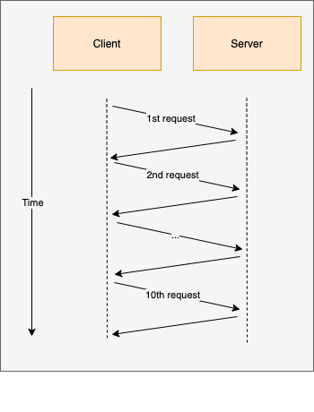
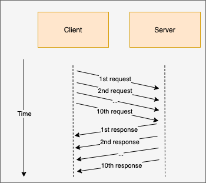

footer: FHS
slidenumbers: true

# Frontend Development

### Wintersemester 2022

---

## Homework recap

- Please hand in the assignment as Merge/Pull Request
  - There will be a point deduction this time
- Use `const` / `let` instead of `var`
- `delete myObject.property` might have unwanted side effect

---

## [fit] Asynchronous Javascript


---

# Short disclaimer

- You'll see es6 arrow functions in the slides
- For now:
  - all 4 variants can be seen as equal
  - we'll look at the difference in the next lecture

```javascript
function myFunction() { return 'some value' } // function
const myFunction = function () { return 'some value' } // anonymous function
const myFunction = () => { return 'some value' } // es6 arrow functions
const myFunction = () => 'some value' // es6 arrow functions with implicit return
```

---

## [fit] Asynchronous Javascript


---

# JS & Concurrency

- JS is single threaded
- eliminate lots of concurrency issues
- Only one thing can happen at a time
  - long running operations would block execution
    - eg. network requests


---

# JS & Concurrency

- Network requests would block main thread
  - no user interaction would be possible
    - button clicks wouldn't be registered
    - scrolling would not work
    - ...


---

# [fit] Synchronous Code


---

> In a synchronous programming model, things happen one at a time. [^5]

[^5]: https://eloquentjavascript.net/11_async.html

---

# JS and Synchronous Code execution [^3]

```javascript
const second = () => {
  console.log('Hello there!');
}
const first = () => {
  console.log('Hi there!');
  second();
  console.log('The End');
}
```

[^3]: [Visualisation of code execution](http://latentflip.com/loupe/?code=ZnVuY3Rpb24gdGhpcmQoKSB7CiAgICBjb25zb2xlLmxvZygndGhpcmQnKQp9CgpmdW5jdGlvbiBzZWNvbmQoKSB7CiAgICB0aGlyZCgpCiAgICBjb25zb2xlLmxvZygnc2Vjb25kJykKfQoKZnVuY3Rpb24gZmlyc3QoKSB7CiAgICBzZWNvbmQoKQogICAgY29uc29sZS5sb2coJ2ZpcnN0IGZ1bmN0aW9uJykKfQoKZmlyc3QoKQ%3D%3D!!!PGJ1dHRvbj5DbGljayBtZSE8L2J1dHRvbj4%3D)

---

# [fit] Asynchronous code execution


---

> An asynchronous model allows multiple things to happen at the same time. [^5]

[^5]: https://eloquentjavascript.net/11_async.html

---

# Async JS

- multiple non-cpu bound computationscan happen at the same time
  - network requests
  - reading files from disk
  - waiting for a `setTimeout`


---

# Async JS

- when waiting for network response
  - js continues doing other tasks
  - once the response is there
  - and js has nothing else to do
  - js continues processes network response

---

# [fit] Continuation Passing style


---

## [fit] No procedure is allowed to return to its caller--ever. [^1]


[^1]: pre es6

---

## Continuation Passing style

- or programming with `callbacks`
- a callback is a function which is called when something happened


---

## Continuation Passing style

- real world example:
  - you wait for a package and call the delivery service
  - the delivery service notes your "contact details" (callback)
  - and he'll call you back once he has additional information

---

# Continuation Passing style

```js
function multiplyBy2(x, whenDone) {
  //                    ^^^^^^^
  // callback is defined which will receive the result
  whenDone(x * 2)
}

function logResult(value) {
  console.log(value)
}

multiplyBy2(4, logResult) // 8 will be logged
```

---

# Continuation passing style in the browser

- `setTimeout` does not block js execution
- other scripts can still execute
- after ~1 second callback will be invoced

```js
setTimeout(() => {
  // will be called in the future
}, 1000)
```

---

# Continuation passing style in node.js

- `fs.readFile` does not return to it's caller
- accepts a `callback` which is invoket once the file was read

```js
// in node.js
fs.readFile('file.txt', (err, data) => {
  if (err) throw err; // throws on error (eg. file not found)
  console.log(data); // logs the contents of file.txt
})
```

---

# Usecase

- fetch function which fetches data from an api
- does a HTTP GET request
- accepts URL and callback
- callback receives server response

```js
fetch(url, (err, response) => {})
```

---

# Usecase

```js
function logCurrentUser() {
  fetch('/api/currentUser', (currentUser) => {
    console.log(currentUser)
  })
}
```

---

# [fit] What if additional data needs to be fetched


---

# Callbacks

```js
function myBestFriendsAddress() {
  fetch('/api/currentUser', (currentUser) => {
    // will be executed once we get a response from `currentUser`
    fetch(`/api/user/${currentUser.id}/bestFriend`, (bestFriend) => {
      // will be executed once we get a response from `bestFriend`
      fetch(`/api/user/${bestFriend.id}/address`, (bestFriendsAddress) => {
        // ...
      })
    })
  })
}
```

---

# Callback Hell



---

# [fit] How could we flatten this tree

---

# ES6 Promises to rescue

---


---

# Promises

The Promise object represents the eventual completion (or failure) of an asynchronous operation and its resulting value.


---

# Promises

- A promise is in one of 3 states
- pending
- fulfilled
- rejected
- Other languages call it `futures`

---

# Promises



---

# Transform callbacks to promises

```js
function myBestFriendsAddress() {
  fetch('/api/currentUser', (currentUser) => {
    // will be executed once we get a response from `currentUser`
    fetch(`/api/user/${currentUser.id}/bestFriend`, (bestFriend) => {
      // will be executed once we get a response from `bestFriend`
      fetch(`/api/user/${bestFriend.id}/address`, (bestFriendsAddress) => {
        // ...
      })
    })
  })
}
```

---

# Transform callbacks to promise

## Wrap fetch function in promise

```javascript
const fetchAsPromise = (url) => {
  return new Promise((resolve) => { // create a new promise
    // call the fetch function and *WHEN* the request is done, resolve the promise
    fetch(url, resolve)
  })
}
```

---

# Transform callbacks to promise

## use fetchAsPromise

```javascript
const fetchAsPromise = (url) => new Promise((resolve) => {
  fetch(url, resolve)
})

fetchAsPromise('/api/currentUser')
  .then((currentUser) => fetchAsPromise(`/api/user/${currentUser.id}/bestFriend`))
  .then((bestFriend) => fetchAsPromise(`/api/user/${bestFriend.id}/address`))
  .then((bestFriendsAddress) => console.log(bestFriendsAddress))
```

----

# Transform callbacks to promise

## use fetchAsPromise

```javascript
const fetchAsPromise = (url) => new Promise((resolve) => {
  fetch(url, resolve)
})

fetchAsPromise('/api/currentUser')
  .then((currentUser) => fetchAsPromise(`/api/user/${currentUser.id}/bestFriend`))
  .then((bestFriend) => fetchAsPromise(`/api/user/${bestFriend.id}/address`))
  //     ^^^^^^^^^^
  // value of previous result is the first argument
  .then((bestFriendsAddress) => console.log(bestFriendsAddress))
```

---

# Promises error handling

```javascript
const fetchAsPromise = (url) => new Promise((resolve, reject) => {
  //                                                  ^^^^^^
  // enhance previous fetchAsPromise with reject param

  fetch(url, (data) => {
    if (data.status === 200) { resolve(data) }
    else { reject(data) }
  })
})
```

---

# Promises error handling

```javascript
const fetchAsPromise = (url) => new Promise((resolve, reject) => {
  fetch(url, (data) => {
    if (data.status === 200) { resolve(data) }
    else { reject(data) }
  })
})

fetchAsPromise('/api/currentUser')
  .then((currentUser) => fetchAsPromise(`/api/user/${currentUser.id}/bestFriend`))
  // ...
  .catch(() => alert('something went wrong 😥'))
// ^^^^^
// catch all promise rejections
```

---

# Promises error handling

- remember promise has 3 states (pending, resolved, rejected)
- `.catch` converts a rejected promise to a resolved one

```javascript
fetchAsPromise('/api/currentUser')
  // state: resolved
  .then(() => fetchAsPromise(`/api/someUnknownURL`))
  // state: rejected
  .catch(() => alert('something went wrong 😥'))
  // state: resolved
  .then(() => console.log('will be logged'))
```

---

# Creating promises out of static values

```javascript
Promise.resolve(1)
  .then((value) => { console.log(value) }) // 1 will be logged

Promise.reject(1)
  .catch((value) => { console.log(value) }) // 1 will be logged
```

---

# Waiting for multiple promises



---

## Didn't you say network requests can be done concurrently

---

# Waiting for multiple promises



---

# Waiting for multiple promises

- waiting for each request before doing the next one is slow
- `Promise.all` makes it possible to run and wait for multiple promises concurrently
  - if possible try to parallelize promises via `Promise.all`

---

# Waiting for multiple promises

```javascript
Promise.all([
  fetchAsPromise(`/api/currentUser`),
  fetchAsPromise(`/api/weather`)
]).then(([ currentUser, weather ]) => {
  console.log(currentUser)
  console.log(weather)
})
```

---

# Racing multiple promises

- `Promise.race` returns the fastest promise [^2]
- can be used to implement a timeout for slow requests

```javascript
const sleep = (timeout) => new Promise((resolve) => setTimeout(resolve, timeout))

Promise.race([
  fetchAsPromise(`/api/currentUser`),
  sleep(1000).then(() => ({ error: 'timeout' }))
]).then((result) => {
  if (result.error) {
    throw new Error('Timeout')
  }
  return result;
})
```

[^2]: I personally only used it once

---

# Racing multiple promises


---

# Promise in the wild

## fetch API

- Promise based Browser API for HTTP requests
- replaces/enhances XHR Request
- based on promises

```javascript
// Getting data via fetch

fetch('/api/users')
  .then((httpResult) => httpResult.json())
  //                               ^^^^^^
  // required as fetch resolves when HTTP headers are sent
  .then((data) => console.log(data))
```

---

# Promise in the wild

## posting data via fetch

```javascript
// Posting data via fetch

fetch('/api/users', {
  method: 'POST',                         // specify HTTP method
  headers: {
      'Content-Type': 'application/json'  // setting the content type
  },
  body: JSON.stringify({ my: 'payload' }) // adding payload
})
  .then((httpResult) => httpResult.json())
  .then((data) => console.log(data))
```

---

# [fit] Async/Await

---

# Async/Await

- Syntactic Sugar for Promises
- 2 new keywords
  - `async` marks a function to be async
  - `await` pauses execution inside an async function
- `await` can't be used outside an async function


---

# Async/Await

```javascript
async function someAsyncFunction () {
// ^^
// async keyword defines an async function
// in here we can use await

  const response = await myHTTPRequest()
  //               ^^^^^
  // wait until the http request is done and the promise resolves/rejects
  console.log(response)
}
```

---

# Async/Await

## Promise example

```javascript
const fetchAsPromise = (url) => new Promise((resolve) => {
  fetch(url, resolve)
})

function bestFriendsAddress() {
  return fetchAsPromise('/api/currentUser')
    .then((currentUser) => fetchAsPromise(`/api/user/${currentUser.id}/bestFriend`))
    .then((bestFriend) => fetchAsPromise(`/api/user/${bestFriend.id}/address`))
    .then((bestFriendsAddress) => console.log(bestFriendsAddress))
}
```

---

# Async/Await

## Promise example

```javascript
const fetchAsPromise = (url) => new Promise((resolve) => {
  fetch(url, resolve)
})

async function bestFriendsAddress() {
  const currentUser = await fetchAsPromise('/api/currentUser')
  const bestFriend = await fetchAsPromise(`/api/user/${currentUser.id}/bestFriend`)
  const bestFriendsAddress = await fetchAsPromise(`/api/user/${bestFriend.id}/address`)
  console.log(bestFriendsAddress)
}
```

---

# Async/Await

## Promise example

```javascript
const fetchAsPromise = (url) => new Promise((resolve) => {
  fetch(url, resolve)
})

// define an async function
async function bestFriendsAddress() {
  const currentUser = await fetchAsPromise('/api/currentUser')
  //                  ^^^^^
  // wait until the promise is resolved and continue once it is done
  const bestFriend = await fetchAsPromise(`/api/user/${currentUser.id}/bestFriend`)
  const bestFriendsAddress = await fetchAsPromise(`/api/user/${bestFriend.id}/address`)
  console.log(bestFriendsAddress)
}
```

---

# Async/Await

## Error handling promises

```javascript
const fetchAsPromise = (url) => new Promise((resolve) => {
  fetch(url, resolve)
})

async function bestFriendsAddress() {
  try {
    const currentUser = await fetchAsPromise('/api/currentUser')
    const bestFriend = await fetchAsPromise(`/api/user/${currentUser.id}/bestFriend`)
    const bestFriendsAddress = await fetchAsPromise(`/api/user/${bestFriend.id}/address`)
    console.log(bestFriendsAddress)
  } catch (e) {
    console.error('something went wrong')
  }
}
```

---

# [fit] Async/Await Pitfalls

---

# Async/Await Pitfalls

## `await` in loops

- API is called sequentially
- waits until promise is resolved before continuing
- each iteration waits until the promise is done
- user needs to wait longer until all data is present

---

# Async/Await Pitfalls

## `await` in loops

```javascript
async function awaitInLoops() {
  for (let userId; userId < 10; userId++) {
    const user = await fetchAsPromise(`/api/user/${userId}`)
    //           ^^^^^
    // for each user we have to wait until http request is done
    console.log(user)
  }
}
```

---

# Async/Await Pitfalls

## `await` in loops



---

# Async/Await Pitfalls

## `await` in loops

- `Promise.all` can fix this
- requests to the backend are executed in parallel
- client waits until all promises resolve



---

# Async/Await Pitfalls

## `await` in loops

```javascript
async function awaitInLoops() {
  const promises = [] // declare a list of promises
  
  for (let userId; userId < 10; userId++) {
    promises.push(fetchAsPromise(`/api/user/${userId}`))
    // ^^^^^^^^^
    // start the promise and add it to the promises
  }

  await Promise.all(promises)
  // wait for all promises to finish
}
```

---

# Async/Await Pitfalls

## error handling without await

```javascript
async function fetchBestFriend(id) {
  try {
    return fetchAsPromise(`/api/user/${id}/bestFriend`)
    // ^^^^^
    // return promise without awaiting its result
  } catch (e) {
    console.error('something went wrong')
    // ^^^^^
    // when promise fails this error handler won't be called
  }
}
```

---

# Async/Await Pitfalls

## error handling without await

- Remember:
  - A promise is a value which might be available in the future
  
```javascript
async function fetchBestFriend(id) {
  try {
    return fetchAsPromise(`/api/user/${id}/bestFriend`)
    // ^^^^^
    // returning without an await makes the function return
    // without waiting for the response and a possible error
    // when the promise gets rejected the JS engine already
    // went into a different execution context
  } catch (e) {
    console.error('something went wrong')
    // ^^^^^
    // when promise fails this error handler won't be called
  }
}
```

---

# Async/Await Pitfalls

## error handling without await
  
```javascript
async function fetchBestFriend(id) {
  try {
    return await fetchAsPromise(`/api/user/${id}/bestFriend`)
    //     ^^^^^
    // we wait for the promise to be resolved inside the function
    // and handle the error internally => catch block will be called
  } catch (e) {
    console.error('something went wrong')
  }
}
```

---

# Async/Await Pitfalls

## error handling without await
  
```javascript
async function fetchBestFriend(id) {
  try {
    return await fetchAsPromise(`/api/user/${id}/bestFriend`)
    //     ^^^^^
    // we wait for the promise to be resolved inside the function
    // and handle the error internally => catch block will be called
  } catch (e) {
    console.error('something went wrong')
  }
}
```

---

# Async Exercise

- open the dev tools
- create function which accepts a timeout in ms
  - create a promise which resolves after the given timeout
  - you'll need `setTimeout`
- call this function and log something to the console

```js
const createTimeout = (timeout) => {
  // TODO: implement me
}

createTimeout(2000)
  .then(() => console.log("Timeout awaited"))
```

---

# Feedback

- Questions: tmayrhofer.lba@fh-salzburg.ac.at
- [Feedback Link](https://s.surveyplanet.com/x1ibwm85)
