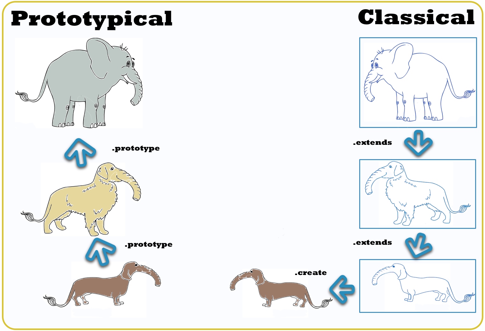
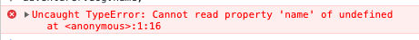

footer: FHS
slidenumbers: true

# Frontend Development

### Wintersemester 2021

---

## [fit] ES Next


---

# [fit] Destructuring


---


---

# Destructuring

## array destructuring assignment

- makes it possible to unpack values from arrays

```js
const [a, b] = [1, 2]
console.log(a) // 1
console.log(b) // 2
```

---

# Destructuring

## Object destructuring assignment

- makes it possible to unpack values from arrays

```js
const { a, b } = { a: 1, b: 2 }
console.log(a) // 1
console.log(b) // 2
```

---

# Destructuring

## Object destructuring renaming

```js
const { a: otherA, b: otherB } = { a: 1, b: 2 }
//      ^^^^^^^^^
// rename value a to otherA

console.log(otherA) // 1
console.log(otherB) // 2
```

---

# Spread operator

- adds the rest syntax to destructuring

```js
const [a, b, ...rest] = [1, 2, 3, 4]
console.log(rest) // [3, 4]

const { a, b, ...rest } = { a: 1, b: 2, c: 3, d: 4 }
console.log(rest) // { c: 3, d: 4 }
```

---

# Spread operator composition

```js
const [, { b: otherB }, ...rest] = [{ a: 1 }, { b: 2 }, { c: 3 }]
// 1) ^^
// 2)     ^^^^^^^^^^
// 2)                   ^^^^^^^^

// 1) ignore the first value
// 2) extract value b and rename to otherB
// 3) get all other elements
// recommendation don't overuse nested destructuring

console.log(otherB) // 2
console.log(rest) // [{ c: 3 }]
```

---

# [fit] Destructuring and functions


---

# Destructuring as named arguments

- can be used in functions for named arguments

```js
const myFunction = ({ a, b }) => {
  //                ^^^^^^^^
  // destructure the parameters
  return a + b
}

myFunction({ a: 1, b: 2 })
myFunction({ b: 2, a: 1 })
//           ^^^^^^^^^^
// order of arguments does not matter anymore
```

---

# Destructuring of tuples

- can be used to destructure tuples as well

```javascript
const myFunction = ([ a, b ]) => {
  //                ^^^^^^^^
  // assign variable names to each value
  return a + b
}

myFunction([ 1, 2 ])
//         ^^^^^^^
// order of arguments matters
```

---

# Destructuring of tuples

- I only use tuple destructuring with `Promise.all` [^6]

```js
Promise.all([
  fetchAsPromise(`/api/currentUser`),
  fetchAsPromise(`/api/weather`)
]).then(([ currentUser, weather ]) =>
//       ^^^^^^^^^^^^^^^^^^^^^^^^
// destructure each value of the promise
  console.log(currentUser)
  console.log(weather)
})
```

[^6]: personal tip

---

# Destructuring of tuples

```js
const [ currentUser, weather ] = await Promise.all([
// 1)                            ^^^^^
// 2)   ^^^^^^^^^^^^^^^^^^^^
  fetchAsPromise(`/api/currentUser`),
  fetchAsPromise(`/api/weather`)
])

// 1) await the promise
// 2) assign result to variables
```

---

# [fit] OOP and JS


---

# OOP and JS

# class based OOP

- A class is like a blueprint — a description of the object to be created.
  - class: plan for a house
  - object: the actual house

---

# OOP and JS

- JS has a simple object based paradigm
- An object is a collection of properties
- A property is an association between a name and a value
- Objects can be linked together, via prototypes

---

# OOP and JS

# Prototypal Inheritance

> A prototype is a working object instance. Objects inherit directly from objects

---

# OOP and JS

# Prototypal Inheritance

- Prototypal inheritance is delegation
  - You ask a friend for a pen
  - Your friend does not have a pen but asks his neighbor
  - This chain goes on until you either have a pen or non of your related friends have a pen
- This is could be seen as the prototype chain

---

# OOP and JS [^5]



[^5]: image from [medium](https://medium.com/@Gaurav.Chaudhary/decoding-the-prototypal-inheritance-in-javascript-everything-you-need-to-know-9c56bfc32129)

---

# OOP and JS

# create object instances

```javascript
function University(name) {
  this.name = name
//^^^^
// define an instance variable
}

University.prototype.isBestUniversity = function() {
//                                      ^^^^^^^^
// you need to use function here, as () -> {} don't support `this`
  return this.name === 'FHS'
//       ^^^^
// prototype is able to access instance variables
}

const fhs = new University('FHS')
fhs.isBestUniversity() // true
```

---

# OOP and JS

# with class syntax

- Emulates class based oop with prototypes

```javascript
class University {
  constructor(name) {
    this.name = name
    //^^^^
    // define an instance variable
  }

  isBestUniversity() {
    return this.name === 'FHS'
  }
}

const fhs = new University('FHS')
fhs.isBestUniversity() // true
```

---

# OOP and JS

# extending classes

- Emulates class based oop with prototypes

```javascript
class FHS extends University {
  isBestUniversity() {
    return true
  }
}

const fhs = new University('FHS')
fhs.isBestUniversity() // true
```

---

# [fit] Arrow functions


---

# functions declaration vs. function expressions

- functions in JavaScript are values
- can be passed to other functions [^1]

```javascript
function myFunction() { console.log('Hallo') }

setTimeout(myFunction, 200)
//         ^^^^^^^^^^
// pass my function to setTimeout
// myFunction will be called after 200ms
```

[^1]: see callbacks from previous lecture

---

# functions declaration vs. function expressions

- functions can be defined like other values in JS

```javascript
const myFunction1 = function myFunction1 () { console.log('Hallo') }
// ^^^^^^^^^^^^^^
// functions can be assigned to a variable

const myFunction2 = function () { console.log('Hallo') }
//                          ^^^
// name can be omitted here

setTimeout(myFunction1, 200)
```

---

# functions declaration vs. function expressions

```javascript
// function declaration
function myFunction1 () { console.log('Hallo') }

// function expression
const myFunction2 = function () { console.log('Hallo') }
```

---

# arrow function vs. function declaration

- compact alternative to function expressions
  - can't be used in all situations
    - no binding to `this`
    - no arguments keyword
    - can't be used as constructor

```javascript
const myArrowFunction = () => { console.log('hallo') }
```

---

# arrow function

- arrow functions can have an implicit return value
  
```javascript
const myFunction = () => 1 // returns 1
const myFunction = () => { 1 } // returns undefined
const myFunction = () => ({ test: 1 }) // returns { test: 1 }
```

---

# function declarations and this

- JavaScript functions bind this when the `new` keyword is used

```javascript
function Person() {
  this.age = 0
  setInterval(function() {
    this.age++
  //^^^^ references to window as the function was not created via `new`
  }, 1000)
}
const myPerson = new Person()

// wait a couple of seconds
myPerson.age === 0
window.age === NaN
```

---

# function declarations and this

```javascript
function Person() {
  const that = this  // save this as a variable so it can be used in setInterval
  this.age = 0
  setInterval(function() {
    that.age++
  }, 1000)
}
const myPerson = new Person()

// wait a couple of seconds
myPerson.age === 3
window.age === undefined
```

---

# function declarations and this

```javascript
function Person() {
  this.age = 0
  setInterval(() => {
    this.age++ // no need to use that hack
  }, 1000)
}
const myPerson = new Person()

// wait a couple of seconds
myPerson.age === 3
window.age === undefined
```

---

# functions in js

```javascript
// function declaration
function myFunction { console.log('hallo') }

// function expression
const myArrowFunction = function () { console.log('hallo') }

// arrow function
const myFunction = () => { console.log('hallo') }
```

---

# function default values

- since es6 functions accept default values

```javascript
function myFunction (a = 1) {
  //                   ^^^
  // define a default value for your function
  console.log(a)
}
myFunction() // 1
myFunction(2) // 2
```

---

# function default with named arguments

```javascript
function myFunction ({ a = 1, b = 2}) {
  //                   ^^^
  // define a default value for your function
  console.log(a + b)
}
myFunction() // 3
myFunction({ a: 2 }) // 4
myFunction({ b: 3 }) // 4
myFunction({ a: 2, b: 3 }) // 5
```

---

# rest parameters

- The rest parameter syntax allows us to represent an indefinite number of arguments as an array.

```javascript
function myFunction (...values) {
  //                 ^^^
  // all arguments will be available as values
  console.log(values)
}
myFunction() // []
myFunction(1) // [1]
myFunction(1, 2, 3, 4, 5, 6) // [1, 2, 3, 4, 5, 6]
```

---

# [fit] Template literals


---

# Template literals

- es6 enhances strings with a completely new syntax
  - called template literals
- they make it possible to
  - interpolate strings
  - multiline strings
  - embed expressions
  - string formatting [^2]
  - string tagging [^2]

[^2]: see <https://developers.google.com/web/updates/2015/01/ES6-Template-Strings> for more info
  
---

# Template literals

## String interpolation

```javascript
const university = 'FHS'
const myString = `My University is ${university}`
//               ^                              ^
// template literals are using back-ticks ``
```

---

# Template literals

## Embedded expressions

```javascript
const myUniversity = () => 'FHS'
const myString = `My University is ${myUniversity()}`
//               ^                              ^
// functions and methods can be called ``
```

---

# Template literals

```javascript
const myUniversity = () => 'FHS'
const myString = `My University is ${myUniversity()}`
//               ^                              ^
// functions and methods can be called ``
```

---

# Template literals

## Multi line strings

```javascript
const greeting1 = "Hello \
World";
//                       ^
// use backslash \ to start a new line

const greeting2 = "Hello " +
"World";
//                       ^
// use backslash + to concat 2 strings

const greeting3 = `Hello
World`;
//                       ^
// with template literals new lines
// will be put into one line
```

---

# [fit] Optional Chaining


---

# Optional Chaining



---

# Optional Chaining

# object values [^3]

- Allows to read values deep within an object chain
- When value is null or undefined returns null

```javascript
const adventurer = {
  cat: { name: 'Dinah' }
}

const dogName = adventurer.dog?.name;
//                        ^^^^^
// dogName will be undefined and no error

const catName = adventurer.cat?.name;
//                        ^^^^^
// catName will be 'Dinah' as cat is defined
```

[^3]: [Compiled Source](https://babeljs.io/repl#?browsers=defaults%2C%20ie%2011&build=&builtIns=false&spec=false&loose=false&code_lz=MYewdgzgLgBAhgEwG4FMxQK4CcVZgXhgG8AoGGMOAWxQC4YByAQQBsBLYFBgGjJmDhR6pcuUo16DACJtKACwZ8AviRUlQkWAhABzAHLUUBeMjSYcWAHTadAfkviUAbiA&debug=false&forceAllTransforms=false&shippedProposals=false&circleciRepo=&evaluate=false&fileSize=false&timeTravel=false&sourceType=module&lineWrap=true&presets=env%2Creact%2Cstage-2&prettier=false&targets=&version=7.12.7&externalPlugins=)

---

# Optional Chaining

# nested functions [^4]

```javascript
const adventurer = {
  name: 'Alice',
  dogName: () => 'Dinah'
}
adventurer.dogName.?() // undefined
adventurer.catName.?() // 'Dinah'

```

[^4]: [Compiled Source](https://babeljs.io/repl#?browsers=defaults%2C%20ie%2011&build=&builtIns=false&spec=false&loose=false&code_lz=MYewdgzgLgBAhgEwG4FMxQK4CcVZgXhgG8AoGGMOAWxQC4YByAQQBsBLYFBgGjJmDhQActTowAFAEoCAPkYARNpQAWDEgF8SiVOmy4AdAOGiA_PqkkgA&debug=false&forceAllTransforms=false&shippedProposals=false&circleciRepo=&evaluate=false&fileSize=false&timeTravel=false&sourceType=module&lineWrap=true&presets=env%2Creact%2Cstage-2&prettier=false&targets=&version=7.12.7&externalPlugins=)


---

# [fit] Array methods


---

# Array methods

## Array.prototype.forEach

- calls given callback for each element inside the array

```javascript
const myArray = [1, 2, 3, 4, 5]
const result = myArray.forEach((item) => { console.log(item * 2) })
// logs 1
// logs 2
// ...
// result === undefined
```

---

# Array methods

## Array.prototype.map

- creates a new array populated with the result of the provided function

```javascript
const myArray = [1,2,3,4,5]
const result = myArray.map((item) => item * 2)
// result will be [2, 4, 6, 8, 10]
```

---

# Array methods

## Array.prototype.filter

- creates a new array with all elements that pass the given function

```javascript
const myArray = [1,2,3,4,5]
const result = myArray.filter((item) => (item % 2) === 0)
// result will be [2, 4]
```

---

# Array methods

## Array.prototype.reduce

- executes a reducer function on each element of the array
- results in a single value

```javascript
const myArray = [1,2,3,4,5]
const sumOfArray = myArray.reduce((result, item) => {
  return result + item
}, 0)
// sum of array 15
```

---

# Array methods

# Array.prototype.reduce

```javascript
const myArray = [1,2,3,4,5]
const sumOfArray = myArray.reduce((accumulator, item) => {
  //                            1) ^^^^^^^^^^^^^^^^^
  //                            2) ^^^^^^
  //                            3)              ^^^^
  // 1) reducer function
  // 2) accumulated value of previous iterations
  // 3) the current value of the iteration (1, 2, 3, ...)

  return accumulator + item
  // 4)  ^^^^^^^^^^^^^^^^^^
  // 4) return the result for the next iteration
}, 0)
// ^
// define initial value
```

---

# Array methods

## Array methods can be combined

```javascript
const makeSmoothie = (ingredients) => {
  return ingredients
    .filter((ingredient) => ingredient.rotten === false)
    .map((ingredient) => ingredient.slice())
    .reduce((smoothie, ingredient) => smoothie.add(ingredient), new Smoothie())
}
```

---

# Array methods

## Array.prototype.find

- finds the first matching element in an array

```javascript
const myArray = [1,2,3,4,5]
const result = myArray.find(((item) => (item % 2) === 0)
// result will be 2
```

---

# Array methods

## Array.prototype.flat

- The flat() method converts nested objects into a flat list

```javascript
const myArray = [1,[2,[3],4],5]
myArray.flat() // [1, 2, [3], 4, 5]
myArray.flat(2) // [1, 2, 3, 4, 5]
//          ^^^
// amount of levels to flatten
```

---

# Exercise time

- You have a list of students:
  - create a function `countStudentLength` which
    - gets a string as argument
    - filter students by given string
    - sum the length of the students names  

---

# Exercise time

```javascript
const students = [
  { name: "Hans" },
  { name: "Mike" },
  { name: "Fabian" },
  { name: "Anna" }
]
// todo: implement me
```

---

# Feedback

- Questions: tmayrhofer.lba@fh-salzburg.ac.at
- [Feedback Link](https://s.surveyplanet.com/x1ibwm85)
