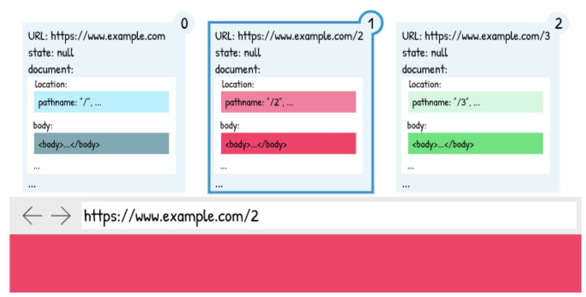
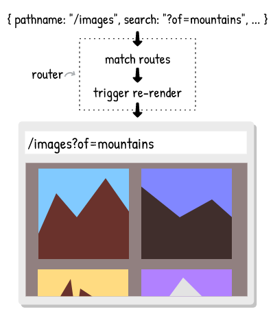

footer: FHS
slidenumbers: true

# Frontend Development

### Wintersemester 2022

---

# [fit] SPA vs Traditional apps


---

# Traditional Web Applications


---

# Traditional Web Applications


---

# Traditional Web Applications

- client `/quiz`
- server gets request
  - fetches player info
  - fetches question
  - fetches score
- when all data fetched returns rendered HTML

---

# Traditional Web Applications

- [Video](https://media.giphy.com/media/Xpj7yINzSulzLa8Oq7/giphy.gif)

---

# Single page applications


---

# Single page applications

> A single-page application (SPA) is a web application or web site that fits on a single web page with the goal of providing a user experience similar to that of a desktop application.

---

# Single page applications


---

# Single Page Applications

- client requests /quiz
- client requests in parallel
  - player-info
  - question
  - score
- when one of these requests return
  - client displays data immediately

---

# Single Page Applications

- [video](https://media.giphy.com/media/KWQVAfIlg5LXQm87cg/giphy.gif)

---

# Single page applications

## Advantages [^2]

- No redundant Queries to Server
- Fast and Responsive Front-end Built
- Enhanced User Experiences

---

# Single page applications

## No redundant queries [^2]

- client requests data which he needs
- no need for a full rerender of app
  - removes unnecessary/expensive DB queries

---

# [fit] Single page applications

## Fast and Responsive Front-end Built


---

# Single page applications

## Fast and Responsive Front-end Built [^2]


---

# Single page applications

## Fast and Responsive Front-end Built [^2]

- many clients can be built with same backend
- one client could be composed of different backends
  - blog served from own backend
  - comments served from third party service (eg. facebook/disqus)

---

# Single page applications

## Enhanced user experience

- no full page refresh required
- dynamic content loading possible
- faster page transitions
  - HTML/CSS already loaded

---

# [fit] Building an SPA


---

# Building an SPA

- An SPA consists of the following:
  - Data (see Async JS slides)
  - Routing
  - Templates

---

## Routing

> A location-based SPA render can immediately render the desired content [^1]


---

# Routing

## Location

> The window.location properties map directly from the URL [^1]


---

# Routing

## Location

```javascript
window.location // returns information about the current location

// {
//   "ancestorOrigins": {},
//   "href": "https://www.fh-salzburg.ac.at/studium/dmk/multimediatechnology-bachelor",
//   "origin": "https://www.fh-salzburg.ac.at",
//   "protocol": "https:",
//   "host": "www.fh-salzburg.ac.at",
//   "hostname": "www.fh-salzburg.ac.at",
//   "port": "",
//   "pathname": "/studium/dmk/multimediatechnology-bachelor",
//   "search": "",
//   "hash": ""
// }
```

---

# [fit] Browser Session


---

# Browser Session

## Links


---

# Browser Session

## Links


---

# Browser Session

## Links


---

# Browser Session

## Back button


---

# Browser Session

## Back button



---

# Routing

## Location

> Each browser tab has a “browsing context”. The browsing context maintains a “session history”, which is essentially an array of location entries.


---

# Browser History

The History API has three core functions:

- pushState()
- replaceState()
- go()

---

# Browser History

## pushState

```js
// history.pushState(<state>, <title>, <url>)

history.pushState({}, 'page 1', '/page1')
// `pushState` adds a new entry to the history
// current history object ['/page1']

history.pushState({}, 'page 2', '/page2')
// current history object ['/page1', '/page2']
//                                    ^^^^^^^
// adds /page2 to the history
```

---

# Browser History

## history.prototype.replaceState

```js
// history.replaceState(<state>, <title>, <url>)

history.pushState({}, 'page 1', '/page1')
// current history object ['/page1']

history.replaceState({}, 'page 2', '/page2')
// current history object ['/page2']
//                          ^^^^^^^
// replaces /page1 with /page2
```

---

# Browser History

## history.prototype.back

```js
history.pushState({}, 'page 1', '/page1')
// current history object ['/page1']

history.pushState({}, 'page 2', '/page2')
// current history object ['/page1', '/page2']

history.back()
// history ['/page1', '/page2']
//          ^^^^^^^
```

---

# Browser history exercise

- Go to any webpage (e.g. medium.com) and navigate around
- Then open the console and type history or window.history
- Type history.go(-1) or history.back()

---

# Browser history exercise

- Push a new state: history.pushState({ name: 'FHS' } , '', '/user')
  - Check the bar on top and see how it changes the path
  - Check the history object again with history
- Replace the current state with replaceState(), see how the length of the history doesn't change
- Check the history state with history.state

---

# Browser history exercise

- Assign window.location = "/someroute" in comparison and look at the window.location

---

# [fit] Routing in SPA


---

# Links & Navigation

- Classic Website
  - Click on a link
  - Browser send request
  - Presents document

---

# Links & Navigation

- Single Page Application
  - Click on a link
  - Browser might do something (e.g. fetch data)
  - A certain area or complete page gets replaced within the current document

---

# Single page applications

## Routing

- Single-page application generally rely on a router.
- Routers are made up of routes, which describe the location that they should match.

```javascript
const routes = [
 { path: '/' },
 { path: '/about' }, // static
 { path: '/album/:id' } // dynamic
 //             ^^^^
 // dynamic part
];
```

---

# Single Page Applications

## Route Matching

- The application renders based on the route that matches the location



---

# Navigating in SPAs

## Link handling

- add click handler to link
  - call `event.preventDefault()`
  - removes native behavior
- call `history.pushState` / `history.replaceState`

---

# Navigating in SPAs

## Link handling

```js
const link = document.querySelector('#my-link')

link.addEventListener('click', (evt) => {
// ^^^^^^^^^^^^^^^^^^^^^^^^^^^
// attach event listener on click

    evt.preventDefault()
    // removes default behaviour (no navigation will take place)

    history.pushState(null, "My new page", evt.target.href)
    // navigate to URL from link
})
```

---

# Navigating in SPAs

## Attach to all links

```js
const allLinks = document.querySelectorAll('a')
//               ^^^^^^^^^^^^^^^^^^^^^^^^^^^^^^
// find all links in the document

Array.from(allLinks).forEach((link) => {
// ^^^^^^^^^^^^^^^^^
// convert NodeList to Array

  link.addEventListener('click', (evt) => {
    evt.preventDefault() // remove default behaviour from link
    history.pushState(null, "My new page", evt.target.href)
  })
})
```

---

# Navigating in SPAs

## Reading the current URL

```javascript
const url = new URL(window.location);
//                  ^^^^^^^^^^^^^^^
// reads the current URL as string

url.host // "website.com"
url.hostname // "website.com"
url.href // "https://website.com/homepage"
url.origin // "https://website.com"
url.pathname // "/homepage"
url.protocol // "https:"
```

---

# Navigating in SPAs

## Render some content

```javascript
const onRouteChange = () => {
  const pathname = new URL(window.location).pathname;
  const domElement = document.querySelector('#content')
  //    ^^^^^^^^^
  // the element to render our content

  if (pathname === '/test1') {
    domElement.innerHTML = 'test1'
  } else if (pathname === '/test2') {
    domElement.innerHTML = 'test1'
  } else {
    domElement.innerHTML = 'not found =('
  }
}
```

---

# Full Example

- <https://gist.github.com/webpapaya/f97f430b7c4f2c894f68644d2cd5ced5>

---

# Homework

- see [wiki](https://wiki.mediacube.at/wiki/index.php?title=Frontend_Development_-_WS_2022#Montag_31._Oktober_2022_-_Thomas_Mayrhofer)

---

# Feedback

- Questions: tmayrhofer.lba@fh-salzburg.ac.at
- [Feedback Link](https://s.surveyplanet.com/x1ibwm85)

[^1]: https://blog.pshrmn.com/how-single-page-applications-work/

[^2]: https://www.bloomreach.com/en/blog/2018/07/what-is-a-single-page-application.html#whatssingle-page-application

[^3]: html and render are non-standard function and needs to be added to your code
