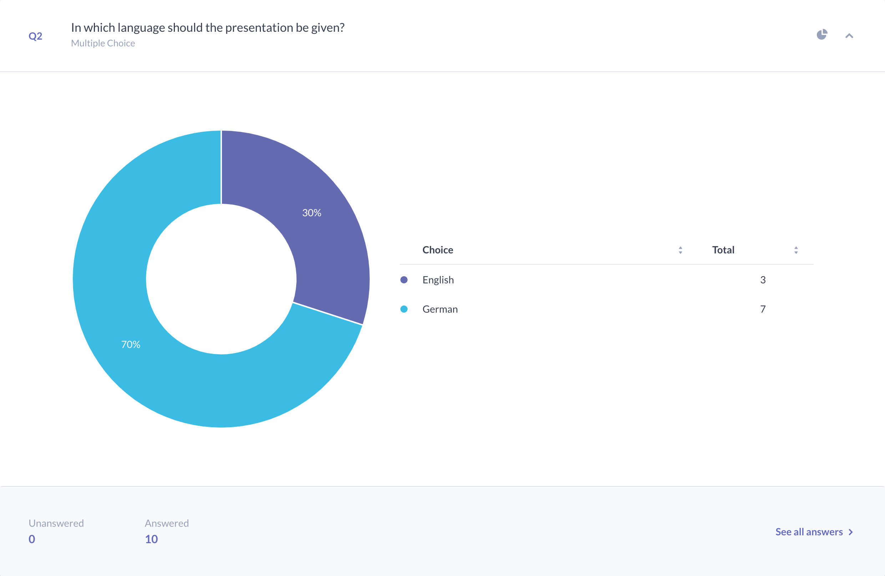
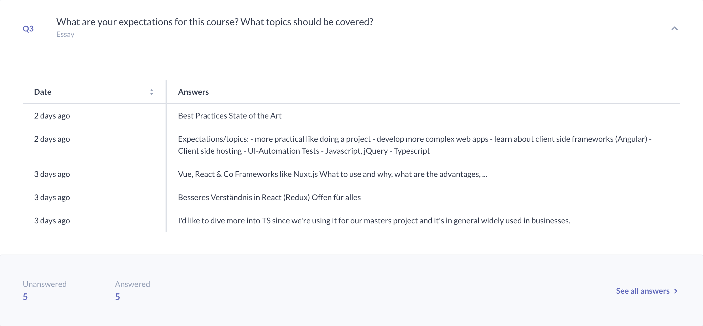
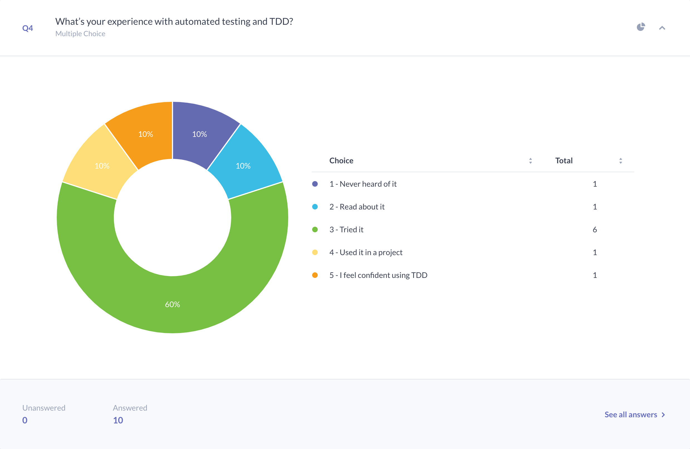
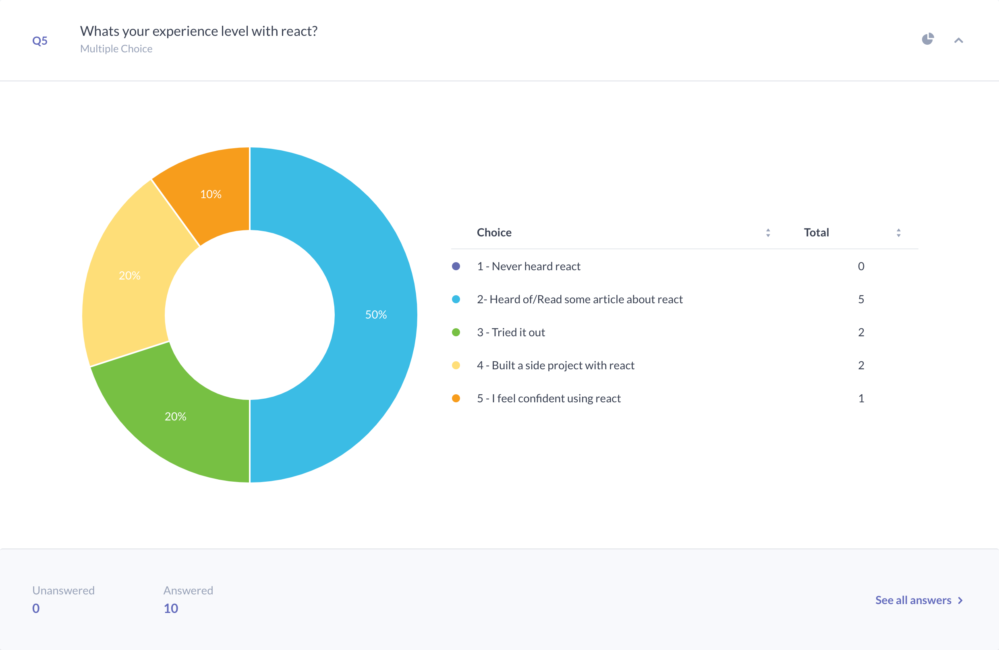
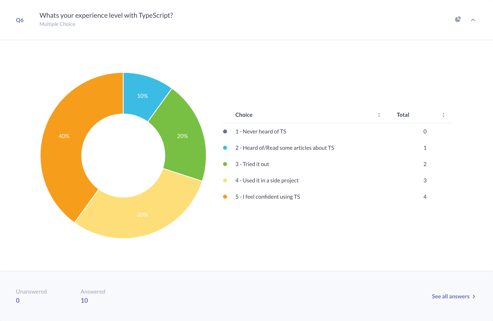
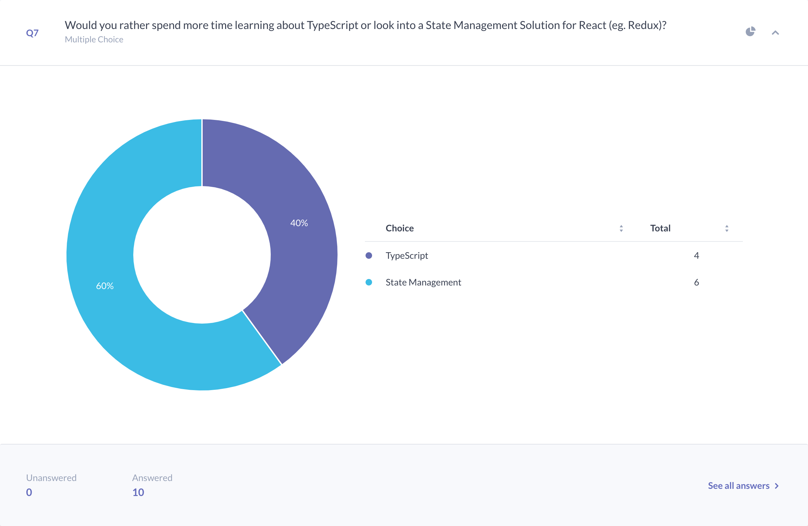

footer: FHS (tmayrhofer.lba@fh-salzburg.ac.at)
slidenumbers: true

# Client Side Web Engineering

## (MMT-M2021)

---

# About/Contact

- Thomas Mayrhofer (@webpapaya)
- E-Mail: tmayrhofer.lba@fh-salzburg.ac.at

---

## Survey

---

## Survey

---

## Survey

---

## Survey [^4]

---

## Survey

---

## Survey

---

## Survey [^1]

 

---

### Roadmap 1/2

- 04.03.2022: react intro
- 14.03.2022: react state management [^1]
- 28.03.2022: typescript introduction
- 04.04.2022: TS advanced and react with TS [^2]

---

### Roadmap 2/2

- 19.04.2022: testing introduction
- 28.04.2022: testing react / browser APIs
- 02.05.2022: Wunschkonzert [^3]

---

# Grading

- 50% Homework
- 50% Exam
- Both positive

---

# Homework

- can be done in pairs
- for first assignment please send me an email (tmayrhofer.lba@fh-salzburg.ac.at) with:
  - link to repository
  - please add names and FHS number to the readme
- hand in exercises via Merge Request/Pull Request

----

# Things I will look at

- functionality
- naming
- duplications
- function/component length
- commits + commit messages
  - please read <https://chris.beams.io/posts/git-commit/>
- code consistency (linting)
  - please add `npm run lint` as npm script
  - linting errors will result in -2 points

---

# Feedback

- Questions: tmayrhofer.lba@fh-salzburg.ac.at
- <https://s.surveyplanet.com/x1ibwm85>

[^1]: with or without redux?

[^2]: generics, type inference, build own runtime type system

[^3]: i18n, better test assertions, debugging/logging

[^4]: quick introduction, testing external apis. Mocking, stubing, ...
