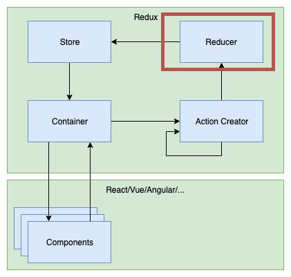
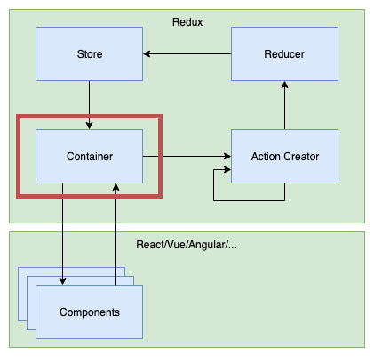

footer: FHS (tmayrhofer.lba@fh-salzburg.ac.at)
slidenumbers: true
### State Management with Redux


---

### Roadmap

- Task connect components with redux
- Functional Programming continue
  - memoization
- Testing redux

---

## Task 1 (Container)

- Try to connect your moneyTransactionCreate dropdown with users from the store


---

## Task 2 (connect to backend)

- Try to connect fetchUsers action creator
- call action creator when the component is rendered initially


---

# Functional programming recap


---

# Functional programming - recap
## Pure Functions

- A function is considered pure when:
  - for the same input it always returns the same output
  - it has no side effects
    - no mutation of non-local state,

```js
const add = (a, b) => a + b
```

----

# Functional programming - recap
## Attributes of pure functions

- They are idempotent
- They offer referential transparency
  - calls to this function can be replaced by the value without changing the programs behaviour
- They can be memoized (or cached)
- They can be lazy
- They can be tested more easy

---

# Functional Programming - recap
## Immutability

> An immutable data structure is an object that doesn't allow us to change its value. (Remo H. Jansen)

---

# Functional Programming - recap
## Immutable objects in JS

````js
const immutableObject = Object.freeze({ test: 1 })
immutableObject.test = 10
console.log(immutableObject) // => { test: 1 }
````

---
# Functional Programming - recap
## Higher Order Functions

> A higher order function is a function that takes or returns a function.

----

# Functional Programming - recap
## Higher Order Functions

```js
const buildCreateUser = (dbAdapter) => {
  return (user) => {
    if (!isValid(user)) { throw new Error('User Invalid') }
    return dbAdapter.create(user)
  }
}
const createUserInPG = buildCreateUser(postgresAdapter)
const createUserInMemory = buildCreateUser(inMemoryAdapter)
```

---

# Functional programming
## Memoization

> `Memoizing' a function makes it faster by trading space for time. It does this by caching the return values of the function in a table. (<https://metacpan.org/pod/Memoize)>

----

# Memoization

- A pure function returns for the same input the same output
- simple mapping from value a to value b
- after calculation is done once, a cached value could be returned

----

# Memoization


---
# Memoization in React
## Unidirectional Dataflow

- Props only flow from parent to children
- Parent is responsible to update data
  - might provide callbacks to do so
- set state rerenders all children of component

---

# Memoization in React

- every state change triggers a complete rerender of the subtree


---

# Memoization in React


> [Source](https://medium.com/@alialhaddad/https-medium-com-alialhaddad-redux-vs-parent-to-child-2583c8e29509)

---

# Memoization in React
## React.memo

>  React.memo() wraps a component, React memoizes the rendered output then skips unnecessary rendering. [^1]

---
# Memoization in React
## without React.memo

- react renders component in virtual DOM
- compares result with DOM
- when DOM differs -> DOM is updated
- this is usually fast enough

---

# Memoization in React
## with React.memo

- React renders component once
- Component is cached
- when component props didn't change
  - cached component is returned
- when component props did change
  - react does a regular rerender [^2]

---

# Memoization in React
## with React.memo

- React.memo shallow compares props
- with Immutable data structures this check becomes simple

```js
const UserList = React.memo(({ users }) => {
//               ^^^^^^^^^^
// memoize component result on subsequent renders
  return (
    <ul>
      {users.map((user) => {
        return (<li key={user.id}>{user.name}</li>)
      })}
    </ul>
  )
})
```

---

# Memoization in React
## when to use React.memo

- Component is a pure
  - renders the same output for the same input
- Component renders often
- Your data structures are immutable
- Component contains many sub-components
- You have performance issues in your app

---

# Memoization in React
## Pitfalls - callbacks

```js
function MyApp({ store, cookies }) {
  return (
      <MemoizedLogout
        username={store.username}
        onLogout={() => cookies.clear('session')}
      />
  );
  //              ^^
  // every time the component is rerendered a new
  // function is created => shallow compare fails
}
```

---

# Memoization in React
## Pitfalls - callbacks

```js
function MyApp({ store, cookies }) {
  const onLogout = useCallback(
    () => cookies.clear('session'),
    [cookies]
//  ^^^^^^^^^
// caches the onLogout callback until the reference
// to cookies changes
  );

  return (
      <MemoizedLogout
        username={store.username}
        onLogout={onLogout}
      />
  );
}
```

---

# Memoization [^3]
## Task - 30 minutes

- Memoize the fibonacci sequence
- Compare results with and without memoize

```js
const memoize = () => {} // TODO: implement me
const fibonacci = memoize((num) => {
  if (num <= 1) return 1
  return fibonacci(num - 1) + fibonacci(num - 2)
})
```

- helper to measure time <https://bit.ly/2UOFgAE>

---

# Memoization and Redux
## computing derived data


---

# Memoization and Redux
## computing derived data

```js
const mapStateToProps = (state) => {
  return {
    users: state.users.filter((user) => !user.disabled)
    //                ^^^^^^^
    // Array.prototype.filter always returns a new
    // array => every time the store changes redux
    // will rerender the connected component
  }
}
```

---

# Memoization and Redux
## computing derived data

> Reselect selectors can be used to efficiently compute derived data from the Redux store.


---

# Memoization and Redux
## computing derived data

```js
const mapStateToProps = (state) => {
  return {
    users: state.users.filter((user) => !user.disabled)
    //                ^^^^^^^
    // Array.prototype.filter always returns a new
    // array => every time the store changes redux
    // will rerender the connected component
  }
}
```

---

# Memoization and Redux
## computing derived data

```js
import { createSelector } from 'reselect'

const getUsers = (state) => state.users
const getEnabledUsers = createSelector(
  getUsers,
  (users) => users.filter((user) => !user.disabled)
// ^^^^^
// this function is only triggered when users change
)

const mapStateToProps = (state) => {
  return {
    users: getEnabledUsers(state)
//         ^^^^^^^^^^^^^^^
// getEnabledUsers returns same array for the same users
  }
}
```

---

# Memoization and Redux
## composing selectors

```js
const getUsers = (state) => state.users
const getEnabledUsers = createSelector(
  getUsers,
  (users) => users.filter((user) => !user.disabled)
)

const getEnabledAndActive = createSelector(
  getEnabledUsers,
// ^^^^^^^^^^^^^^
// reusing previous selector
  (users) => users.filter((user) => user.active)
)

const state = { users: [{ id: 1, enabled: true, active: true}]}

getEnabledAndActiveUsers(state) === getEnabledAndActiveUsers(state)
```

---

# Testing redux


---

# Testing recap


---

# Testing recap
## Fake objects

- Objects have a working implementation
  - but take some shortcuts
  - eg. inMemoryDatabases instead of persistent DB
- example [fake-local-storage](https://github.com/stpettersens/node-fake-storage)

---
# Testing recap
## Stub objects

- Predefined return values for testing
- Instead of calling the real API we return a value for testing
- Examples:
  - retrieving geolocation in tests
  - testing edge cases (eg.: database throws OutOfMemory exception)

```js
const retrieveGPSPosition = () =>
  Promise.resolve({ lat: 12.12, lng: 14.15 })
```

---
# Testing recap
## Spy objects

- Are stubs that also record the way they were called
- Used to verify side effects (eg. E-Mail sending)

```js
it('sends an email on sign up', () => {
  const username = 'username'
  const password = 'password'

  const sendEmail = jest.fn() // create a spy
  const signUp = signUp(username, password, { sendEmail })

  expect(sendEmail).toHaveBeenCalledWith(username, password);
  //                ^^^^^^^^^^^^^^^^^^^^^
  // verify that the spy has been called
})
```

---

# Testing redux
## Action Creators


---

# Testing redux
## Action Creators

```js
// A simple action creator we'd like to test
export const fetchUsers = () => async (dispatch) => {
  const userResponse = await window.fetch('http://localhost:3001/users')
//                           ^^^^^^^^^^^^
// window.fetch is not available in node and would to a query
// against the backend. We'd like to avoid calling our BE
    .then((response) => response.json())


  dispatch({ type: 'users/fetched', payload: userResponse })
}
```

---

# Testing redux
## Action Creators

```js
// fakeFetch.js

// in order to test the action creator without the backend
// we implement a very minimal fake for fetch
export const buildSuccessFullFakeFetch = (response) => {
  return jest.fn().mockReturnValue(Promise.resolve({
    json: () => Promise.resolve(response)
  }))
}
```

---

# Testing redux
## Action Creators

```js
// A simple action creator we'd like to test
export const fetchUsers = () => async (dispatch, _, { fetch }) => {
//                                                   ^^^^^^^
// instead of using window.fetch we pass our as dependency to
// our action creator. In our test we can provide the fake fetch
  const userResponse = await fetch('http://localhost:3001/users')
    .then((response) => response.json())

  dispatch({ type: 'users/fetched', payload: userResponse })
}
```

---

# Testing redux
## Action Creators

```js
// store.js
const store = createStore(
  rootReducer,
  compose(
    applyMiddleware(thunk.withExtraArgument({ fetch: window.fetch })),
    //                                        ^^^^^^^^^^^^^^^^^^^
    // provide a real fetch object for being used in the browser
    // this argument is now being passed to every action creator

    // ... other middlewares
  )
)
```

---

# Testing redux
## Action Creators

```js
describe('fetchUsers', () => {
  it('dispatches users/fetched action', async () => {
    const users = [{"id": 1, "name": "Sepp"}, /* ... */]
    const dispatch = jest.fn() // spy on calls to dispatch

    const fetch = buildFakeResponse(users)
    // create our fake with the predefined list of users

    await fetchUsers()(dispatch, undefined, { fetch })
    // call our action creator

    expect(dispatch).toHaveBeenNthCalledWith(1, {
      type: 'users/fetched',
      payload: users
    })
    // verify that the desired action got dispatched
  })
})
```

---

# Testing redux
## Action Creators

```js
describe('fetchUsers', () => {
  it('dispatches users/fetched action', async () => {
    const users = [{"id": 1, "name": "Sepp"}, /* ... */]
    const dispatch = jest.fn()
    //               ^^^^^^^^^
    // spy on calls to dispatch

    const fetch = buildFakeResponse(users)
    // create our fake with the predefined list of users

    await fetchUsers()(dispatch, undefined, { fetch })
    // call our action creator

    expect(dispatch).toHaveBeenNthCalledWith(1, {
      type: 'users/fetched',
      payload: users
    })
    // verify that the desired action got dispatched
  })
})
```

---

# Testing redux task

- build a fetchUser action creator
- write tests for the action creator
- adapt redux thunk to use window.fetch

---

# Testing redux
## Reducers



---

# Testing redux
## Reducers

```js
// user/reducer.js

const initialState = []
export const userReducer = (currentState = initialState, action) => {
  switch (action.type) {
    case 'users/fetched':
      return uniqueBy('id', [...currentState, ...action.payload])
    default:
      return currentState
  }
}
```

---

# Testing redux
## Reducers

```js
// user/reducer.spec.js

it('when user with same id already exists, does not add user twice', () => {
  const user = { id: 1, name: 'Sepp' }
  const action = { type: 'users/fetched', payload: [user] }
  const state = [user]
  // build a previous state which already contains the user

  const nextState = userReducer(state, action) // call the reducer

  expect(nextState).toEqual(state) // verify that the states are equal
})
```

---

# Testing redux
## Container




---

# Testing redux
## mapStateToProps

- is a simple function and can be tested similar to reducers

---

# Homework (Due Date 2.5.)

see [wiki](https://wiki.mediacube.at/wiki/index.php?title=Client_Side_Web_Engineering_-_SS_2021#6.4._State_Management)

---

# Feedback

- Questions: tmayrhofer.lba@fh-salzburg.ac.at
- <https://de.surveymonkey.com/r/8TW92LL>

[^1]: Source https://dmitripavlutin.com/use-react-memo-wisely/

[^2]: See previous slide

[^3]: Possible implementation will be added to the wiki