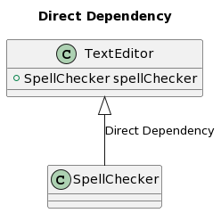
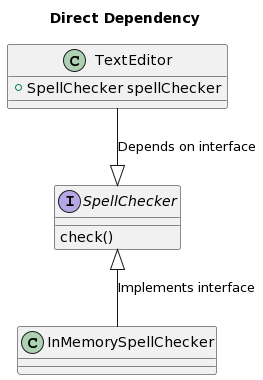

footer: FHS (tmayrhofer.lba@fh-salzburg.ac.at)
slidenumbers: true

# Testing Browser APIs

---

# Dependencies Injection

- Separation between Object creation and usage
  - leads to loosely coupled programs
- Objects which use a different object should not know how it is created

---

# Dependencies Injection

```js
class TextEditor {
    private SpellChecker checker;

    constructor() {
        this.checker = new SpellChecker();
        //             ^^^^^^^^^^^^^^^^^^
        // TextEditor depends the implementation of 
        // the SpellChecker class
    }
}
```

---

# Dependency Injection
## Direct dependency



---

# Dependency Injection
## Inversion of control

```js
interface SpellChecker {
  check(text: string)
}

class TextEditor {
    private SpellChecker checker;

    constructor(spellChecker: SpellChecker) {
        //                    ^^^^^^^^^^^^
        // spell checker is an interface. TextEditor 
        // depends on an abstraction and not a concrete
        // implementation. 

        this.checker = spellChecker;
    }
}

const textEditor1 = new TextEditor(new InMemorySpellCheck())
const textEditor2 = new TextEditor(new GoogleSpellCheck())
```

---

# Dependency Injection
## Inversion of control



---

# IoC in real life

- You have a laptop computer and you accidentally break the screen
  - **Without IoC:** Laptop screen can't be replaced or is not available on the market. You have to replace the whole laptop.
  - **With IoC:** You can  grab almost any desktop monitor from the market, and it'll work.

---

# Side Effects


---

# Side Effects

- Render Elements to the DOM
- DB/HTTP calls
- changing the file system
- querying the DOM
- printing/logging
- accessing system state (eg. Clock, Geolocation,...)

---

# Side Effects

- How do we test/extract the business logic without depending on React/Browser APIs


---

# Dependency Injection React Kata

- [Repository](https://github.com/webpapaya/fhs-react-dependency-injection)


