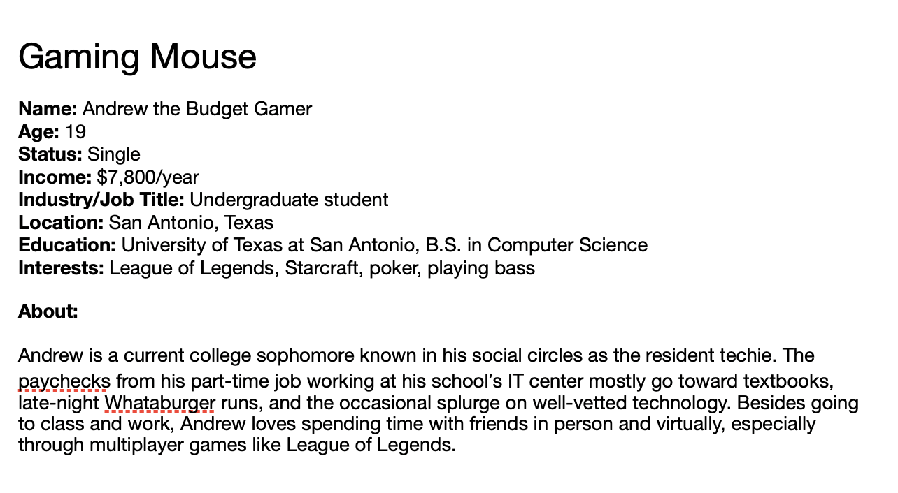

# MMP 2b

---

# MMP Roadmap

- 21. März:
  - Kick-Off/Themenfindung
- 24. - 25. März:
  - Studiotage
    - Ausarbeitung d. Themen (Personas/User-Stories)
- 3. April:
  - Bekanntgabe d. Themas
  - Abgabe der Personas/User Stories
- 02. - 06. Mai 2022:
  - Studiowoche
- 06. Mai 2022:
  - Projektpräsentation

---

# Kick-Off [^2]

- Modalitäten klären
- Erster Workshop zum Finden der Themen

--- 

# Modalitäten

- [Siehe Wiki](https://wiki.mediacube.at/wiki/index.php?title=Multimediaprojekt_2_Web_-_SS_2022#Vorgaben) [^6]

---

# Studiotage [^3]

- Ausarbeiten des Themas
  - kurzer Beschreibung des Themas [^8]
- Definieren der Personas
- User Stories definieren

---

# Personas 1/2

> Develop a precise description of our users and what he wishes to accomplish. We make up pretend users and design software for them. We call these pretend users personas.  [^7]

---

# Personas 2/2

- Create a common understanding of the final user
- Represent similar behavior between a cluster of users, not job descriptions

---

# Persona Example

 []

---

# User stories

>  A user story is an informal, general explanation of a software feature written from the perspective of the end user. Its purpose is to articulate how a software feature will provide value to the customer.

---

# User story template

> As a *persona* I want to ... so that ...

---

# User story template

**As** Andrew the budget gamer **I want to** connect the mouse via bluetooth **so that I** can use it from my couch as a remote control for netflix. 

---

# Studio Week [^4]

* Monday: Kickoff together
* Tuesday: First user story completed and deployed
* Wednesday: Demo of first feature deployed/Retro
* Thursday: Work on features
* Friday Afternoon: User Testing

---

[^1]: infos from wiki overrule presentation
[^2]: 21. März
[^3]: 3. April
[^4]: 24. - 25. März
[^5]: 06. Mai 2022
[^6]: https://wiki.mediacube.at/wiki/index.php?title=Multimediaprojekt_2_Web_-_SS_2022#Vorgaben
[^7]: The Inmates Are Running the Asylum. 1999 https://www.amazon.com/Inmates-Are-Running-Asylum-Products/dp/0672326140
[^8]: Text fürs Portfolio vorbereiten
[^9]: Template