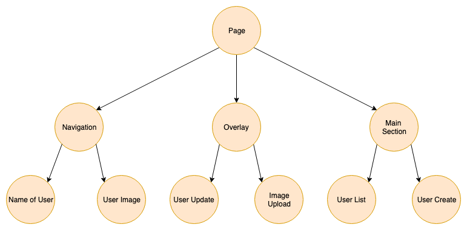
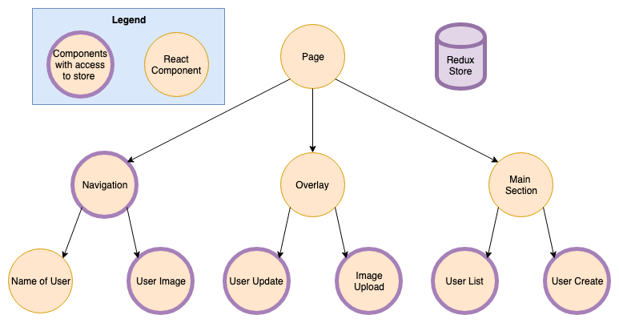

footer: FHS (tmayrhofer.lba@fh-salzburg.ac.at)
slidenumbers: true

# Global State Management


---

## Application State
### What is application state

> An application's state is roughly the entire contents of its memory. ([sarnold](https://stackoverflow.com/a/8102731))

---

## Application State
### State in Redux terms

> Every bit of information the application needs in order to render.


---

## Application State
### React component tree



---

## Application State
### Storing state in components


---

## Application State
### Storing state in components

- Pros
  - Components are independent
    - eg. "Navigation" doesn't know about "User Update"
- Cons
  - User data needs to be fetched multiple times
  - If UserUpdate component changes name of user
    - Navigation needs to refetch user data

---

## Application State
### Storing state in the root component


---

## Application State
### Storing state in the root component

- Pros
  - User data could be fetched only once
  - If UserUpdate component changes name of user
    - navigation component is automatically updated
- Cons
  - State needs to be passed down to every component
  - (Root component contains all state logic)

---

## Application State
### Storing state in the root component


---

## Application State
### Storing state globally



---

## Application State
### Storing state globally

- Global state which acts like local state
- Pros:
  - Components are independent
    - eg. Navigation doesn't know about UserUpdate
  - State changes are synchronised with the whole app
  - State doesn't need to be passed down the tree

---

## Zustand

- Small Statemanagement Solution for react
- react hooks based
- easy to get started
- no context providers needed

---

## Zustand
### Installation

```
npm install zustand
```

---

## Zustand
### Create global state


```js
import { create } from 'zustand'

const useUsers = create((set) => ({
//               ^^^^^^
// create some new state/zustand

  users: [],
  addUser: () => set({ users: [{ id: 1, name: "Sepp" }] }),
}))
```

---

## Zustand
### Create use state


```js
const UserList = () => {
  const users = useUsers((state) => state.users)
  //                                ^^^^^^^^^^^
  // extract users from our zustand

  const addUser = useUsers((state) => state.addUser)
  //                                  ^^^^^^^^^^^^^
  // extract mutation from our zustand

  // ....
}
```

---

## Zustand
### Trigger side effects


```js
import { create } from 'zustand'

const useUsers = create((set) => ({
  users: [],
  fetchUsers: async (state) => {
// 1)                ^^^^^^
// 
    const users = await fetch('./users')

    set({ users: uniqueBy('id', [...state.users, ...users]) })
//           3)  ^^^^^^^^   2) ^^^^^^^^^^^^^^^^^^^^^^^^^^
  },
}))
// 1) current state can be accessed via the argument
// 2) merging the existing users with the already existing users
// 3) remove duplicate users (use lodash)
```

---

## Functional Programming
### Immutability

> An immutable data structure is an object that doesn't allow us to change its value. (Remo H. Jansen)

---

## Functional Programming
### Immutable objects in JS

````js
const immutableObject = Object.freeze({ test: 1 })
immutableObject.test = 10
console.log(immutableObject) // => { test: 1 }
````

---

## Functional Programming
### Changing an immutable value

````js
const immutableObject = Object.freeze({ a: 1, b: 2 })
const updatedObject = Object.freeze({ ...immutableObject, a: 2 })
console.log(updatedObject) // => { a: 2, b: 2 }
````

---

## Functional Programming
### Changing an immutable value

> Working with deeply nested objects is tough

---

## Functional Programming
### Working with nested objects

```js
const nextState = baseState.slice() // shallow clone the array
nextState[1] = {
    // replace element 1...
    ...nextState[1], // with a shallow clone of element 1
    done: true // ...combined with the desired update
}
nextState.push({title: "Tweet about it"})
```

---
## Functional Programming
### Working with nested objects

> Working with deeply nested objects is tough

---

## Functional Programming
### Immer to the rescue

```js
import produce from "immer"

const baseState = [
    {
        title: "Learn TypeScript",
        done: true
    },
    {
        title: "Try Immer",
        done: false
    }
]

const nextState = produce(baseState, draft => {
//                        ^^^^^^^^^
// object to be mutated
    draft[1].done = true
//  ^^^^^^
// Instead of mutating the state we're mutating the draft
    draft.push({title: "Tweet about it"})
})

// baseState !== nextState
```

---
## Functional Programming
### Immer to the rescue

- immutability without new api
- strongly typed
- object freezing out of the box
- deep updates are easy
- small 3kb in size

---


## Functional Programming
### Memoization

> `Memoizing' a function makes it faster by trading space for time. It does this by caching the return values of the function in a table. (<https://metacpan.org/pod/Memoize)>

---

## Pure functions recap

- A pure function returns for the same input the same output
- simple mapping from value a to value b


---

## Memoizing
### memoizee 

- `$ npm install memoizee`

```js
import memoize from "memoizee";

const fibonacci = memoize((num) => {
  if (num <= 1) return 1
  return fibonacci(num - 1) + fibonacci(num - 2)
})
```

---

## Memoizing
### memoizee 

- clearing the cache

```js
const fibonacci = memoize((num) => {
  if (num <= 1) return 1
  return fibonacci(num - 1) + fibonacci(num - 2)
})

fibonacci() // will execute
fibonacci() // cache hit
fibonacci.clear(); 
fibonacci() // will execute
```

---

# Feedback

- Questions: tmayrhofer.lba@fh-salzburg.ac.at
- <https://s.surveyplanet.com/x1ibwm85>

