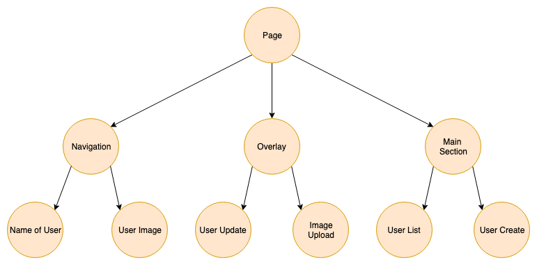

footer: FHS (tmayrhofer.lba@fh-salzburg.ac.at)
slidenumbers: true

# Functional Programming and State Managment in React

---

# Functional Programming

---

## Functional Programming
### What is functional programming

> Applications developed in a functional style use side-effect free functions as their main building blocks. (Made up definition by myself)

---

## Functional Programming
### FP vs. OOP

> Object-oriented programming makes code understandable by encapsulating moving parts. Functional programming makes code understandable by minimizing moving parts. (Michael Feathers)

---

## Functional Programming
### Why functional programming

- More testable
  - pure functions simplify testing
- Declarative APIs which are easier to reason about
- Easy concurrency because of statelessness and immutability
  - State is pushed out of the application core to the boundaries
- Simple caching
  - pure functions easy to cache (we'll see this in an example)

---

## Functional Programming
### Immutability

> An immutable data structure is an object that doesn't allow us to change its value. (Remo H. Jansen)

---

## Functional Programming
### Immutable objects in JS

````js
const immutableObject = Object.freeze({ test: 1 })
immutableObject.test = 10
console.log(immutableObject) // => { test: 1 }
````

---

## Functional Programming
### Changing an immutable value

````js
const immutableObject = Object.freeze({ a: 1, b: 2 })
const updatedObject = Object.freeze({ ...immutableObject, a: 2 })
console.log(updatedObject) // => { a: 2, b: 2 }
````

---

## Functional Programming
### Unfreeze an object

````js
const immutableObject = Object.freeze({ test: 1 })
const unfrozenCopy = { ...immutableObject }
````

---

## Functional Programming
### Object.freeze is mutable

````js
const object = { test: 1 }
Object.freeze(object)
object.test = 10
console.log(object) // => { test: 1 }
````

---

## Functional Programming
### Why immutability

- race conditions impossible
- state of the application is easier to reason about
- easier to test

---

## Functional Programming
### Mutable bug

```js
const users = []
const loadUsers = async () => {
  const result = await fetchUsers('/users')
  users.push(...result)
  return users
}

loadUsers()
loadUsers()
```

---

## Functional Programming
### Immutable version

```js
const loadUsers = () => {
  return fetchUsers('/users');
}

const result1 = await loadUsers();
const result2 = await loadUsers();
```

---

## Functional Programming
### Higher Order Functions

> A higher order function is a function that returns a function.

---

## Functional Programming
### Higher Order Functions

```js
const buildCreateUser = (dbAdapter) => {
  return (user) => {
    if (!isValid(user)) { throw new Error('User Invalid') }
    return dbAdapter.create(user)
  }
}
const createUserInPG = buildCreateUser(postgresAdapter)
const createUserInMemory = buildCreateUser(inMemoryAdapter)
```

---

# Global State Management


---

## Application State
### What is application state

> An application's state is roughly the entire contents of its memory. ([sarnold](https://stackoverflow.com/a/8102731))

---

## Application State
### State in Redux terms

> Every bit of information the application needs in order to render.


---

## Application State
### React component tree



---

## Application State
### Storing state in components


---

## Application State
### Storing state in components

- Pros
  - Components are independent
    - eg. "Navigation" doesn't know about "User Update"
- Cons
  - User data needs to be fetched multiple times
  - If UserUpdate component changes name of user
    - Navigation needs to refetch user data

---

## Application State
### Storing state in the root component


---

## Application State
### Storing state in the root component

- Pros
  - User data could be fetched only once
  - If UserUpdate component changes name of user
    - navigation component is automatically updated
- Cons
  - State needs to be passed down to every component
  - (Root component contains all state logic)

---

## Application State
### Storing state in the root component


---

## Application State
### Storing state globally


---

## Application State
### Storing state globally

- Global state which acts like local state
- Pros:
  - Components are independent
    - eg. Navigation doesn't know about UserUpdate
  - State changes are synchronised with the whole app
  - State doesn't need to be passed down the tree

---

## Custom State Management

---

## Framework agnostic state MGMT
### Creating a library agnostic store

- Create a library agnostic store to be used by any framework

```ts
// Interface
type CreateStore = <T>(stateFactory: () => T) => {
  set: (updateFn: (state: T) => T) => unknown
  get: () => T
}
```

---
## Framework agnostic state MGMT
### Task 

- Create an implementation for CreateStore type
- Add unit tests to your implementation
- Usage:


```ts
const store = createStore(() => ({ someValue: 1 }))

store.get() // { someValue: 1 }
store.set((current) => ({ someValue: current.someValue + 1}))
store.get() // { someValue: 2 }
```


--- 
## React State MGMT Adapter

- Interface for wrapping the agnostic state management

```ts
type UseReactStore<T> = () => [
  T,
  (updateFn: (state: T) => T) => unknown
]

type CreateReactStore = <T>(stateFactory: () => T) => UseReactStore<T>
//                                                    ^^^^^^^^^^^^^^^^
// higher order function which returns a hook
```

--- 
## React State MGMT Adapter
## Task 

- create an implementation for `CreateReactStore`
- Usage:

```ts
const useMyStore = createReactStore(() => ({ someValue: 1 }))
//    ^^^^^^^^^^
// useMyStore is defined globally/outside of the react context

const MyComponet = () => {
   const [myState, setMyState] = useMyStore()
   // ...
}
```

---

## Build adapter for React
### Issue 

- Did you encounter any issues?

---

## Build adapter for React
### Issue 

- state is not updated in components 

---

## Build adapter for React
### useSyncExternalStore

> useSyncExternalStore is a React Hook that lets you subscribe to an external store.

```ts
const todos = useSyncExternalStore(store.subscribe, store.getSnapshot);
// 1)                              ^^^^^^^^^^^^^^^
// 2)                                                ^^^^^^^^^^^^^^^^

// 1) callback function which adds the current component to the list of components 
//    to be updated in case the state changes. (similar to observer pattern)
// 2) callback function which returns an immutable snapshot of the current state.
//    This function is used to get the state into the react component.
```

---
## Build adapter for React
### subscribe function

- callback function which adds/removes components to be notified on state changes

```ts
type Listener = () => unknown
const createMyStore = () => {
  // ...
  const listeners: Listener[] = []

  return () => {
    const subscribe = (listener: Listener) => {
      listeners.push(listener)
// 1)           ^^^^^^^^^^^^^^
      return () => listeners.splice(listeners.indexOf(listener), 1)
// 2)        ^^^^^^^^^^^^^^^^^^^^^^^^^^^^^^^^^^^^^^^^^^^^^^^^^^^^^^
      }
  }
}
// 1) adds listener to be called when the store changes
// 2) removes listener when component gets unmounted
```

---
## Build adapter for React
### notify components about changes

- notify react about state changes

```ts

const createMyStore = <T>() => {
  const listeners: Listener[] = []
  const emitChanges = () => listeners.forEach((listener) => listener())
//                          ^^^^^^^^^^^^^^^^^^^^^^^^^^^^^^^^^^^^^^^^^^^
// notify components about state changes
  
  return () => {
    const set = (updateFn: (state: T) => T) => {
        store.set(updateFn)
        emitChanges()
    }
    // ...
  }
}
```

---
## Build adapter for React
### getSnapshot function

- returns the current state/snapshot of the store

```ts

const createMyStore = () => {
// ...

  const getSnapshot = () => store.get()
//                    ^^^^^^^^^^^^^^^^^
// function which returns the current snapshot of the store                            
}
```

---
## Build adapter for React
### combine callback functions

```ts
const createMyStore = () => {
// ... listeners, emitChanges
  return () => {
    // ...
    const state = useSyncExternalStore(subscribe, getSnapshot);

    return [
      state,
      set
    ]
  }
}
```

--- 
## Build adapter for React
### Task

- Add `useSyncExternalStore` to your state management solution
- Verify that connected components are updated

---

## Functional Programming
### Task

- Add transformer to your state mgmt solution
  - make sure the value is not recalculated on every rerender (use Reacts `useMemo`)
  - value should only be recalculated when state changes
- Throw/log error when state update is not immutable in generic store
  - `previousState` !== `updatedState`

---

# Feedback

- Questions: tmayrhofer.lba@fh-salzburg.ac.at
- <https://s.surveyplanet.com/x1ibwm85>

