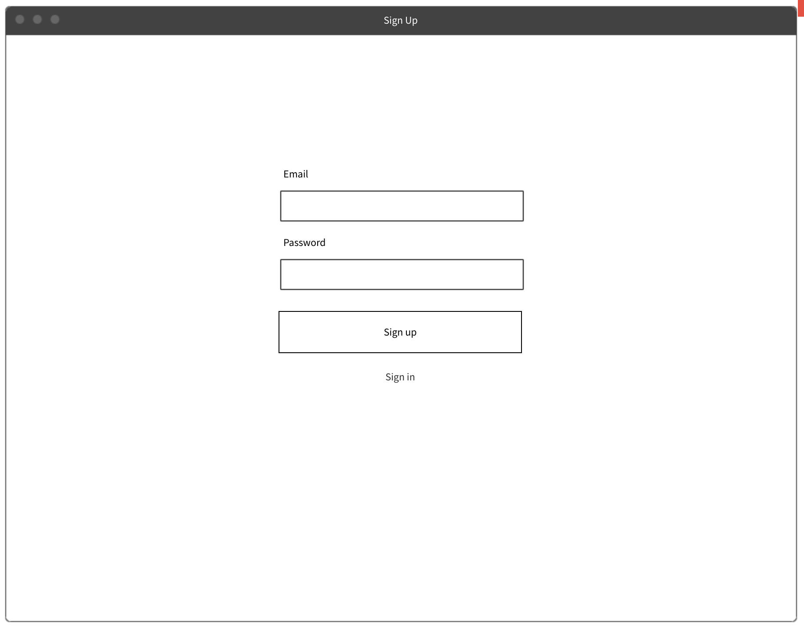

# Frontend Development 2
## (MMT-b2017)

Build/Test/Deploy Client Side Web-Applications

---

# About/Contact

- Thomas Mayrhofer (@webpapaya)
- E-Mail: tmayrhofer.lba@fh-salzburg.ac.at

---

# Roadmap

- 01.04. Introduction to React
- 29.04. - 30.04. Introduction to State Management with Redux
- 13.05. - 14.05. QA Redux/TDD Workshop
- 27.05. Klausur

---

# Grading

- 50% Homework
- 50% Exam
- Both positiv

---

# Homework

- can be done in pairs
- hand-in via email tmayrhofer.lba@fh-salzburg.ac.at
  - email contains link to git reporitory
  - name of students who worked on the assignment

----

# Things I will look at:

- naming
- duplications
- code consistency
- function/component length
- commits + commit messages
- linting

----

# What we'll do

- Simple Splitwise clone or own project with similar scope
  - First homework build UI components (due date 26.04. 23:59:59)
  - Second homework connect those UI components with a backend
  - Third homework enhance app/implement code review

---

----

----

---

# Feedback

https://de.surveymonkey.com/r/J6693VN
