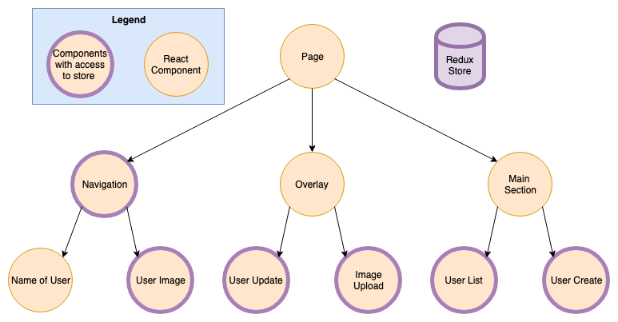

### State Management with Redux
#### (MMT-B2017)

---

### Recap of Homework

----

TODO: add reviews/pitfalls

---

### Composing generic form hook

---

### React Router

- dynamic routing library for
  - react native
  - react web
- [Documentation](https://reacttraining.com/react-router/web/guides/quick-start)

----

### Installation

```
npm install react-router-dom --save
```

----

### Usage

```js
import { BrowserRouter as Router, Route, Switch, Redirect } from "react-router-dom";
import Homepage from './components/homepage'
import SignIn from './components/sign-in'

const App = () => {
  return (
    <Router> /* creates a new routing context */
      <Switch> /* render only one route */
        // define routes and pass component as prop to the route
        <Route path="/sign-in" component={SignIn}>
        <Route path="/" component={Homepage}>

        // if no route matches redirect to 'Homepage'
        <Redirect to='/'>
      </Switch>
    </Router>
  );
}
```

---

### Route priority (without exact)

```js
// path === "/" => renderes Homepage
// path === "/sign-in" => renderes Homepage
const Routes = () => (
  <Switch>
    <Route path="/" component={Homepage}>
    <Route path="/sign-in" component={SignIn}>
  </Switch>
);
```

---

### Route priority (without exact)

```js
// path === "/" => renderes Homepage
// path === "/sign-in" => renderes Homepage
const Routes = () => (
  <Switch>
    <Route path="/sign-in" component={SignIn}>
    <Route path="/" component={Homepage}>
  </Switch>
);
```

---

### Route priority (with exact)

```js
// path === "/" => renderes Homepage
// path === "/sign-in" => renderes Homepage
const Routes = () => (
  <Switch>
    <Route exact path="/" component={Homepage}>
    <Route exact path="/sign-in" component={SignIn}>
  </Switch>
);
```
----
### React Hooks

- makes it possible to use state in functional components
- prefixed with `use`
- Can't be called inside loops, conditions or nested functions
- Can only be called from a React Component

----
### useState

```js
const SimpleForm = ({ onSubmit }) => {
  const [firstName, setFirstName] = useState("");
  return (
    <input
      type="text"
      name="firstName"
      value={firstName}
      onChange={evt => setFirstName(evt.target.value)}
    />
  );
};
```


----
### State Management with Redux

> An application's state is roughly the entire contents of its memory. ((sarnold)[https://stackoverflow.com/a/8102731])

----
### State in Redux terms

> Every bit of information the application needs in order to render.

---
### What information do we need to render this page?


----
### What information do we need to render this page?

| Question?                                  | State Name           | State Type |
|--------------------------------------------|----------------------|------------|
| Is the user authenticated?                 | authenticationStatue | global     |
| Am I owning money to somebody?             | moneyTransactions    | global     |
| Is somebody owning me some money?          | moneyTransactions    | global     |
| Was the money already paid back?           | moneyTransactions    | global     |
| Which users can I owe some money?          | users                | global     |
| Is a form already filled with values?      | formValues           | local      |
| Is the input field hovered/focused/filled? | inputStatus          | local      |
| Which components should be rendered?       | url                  | url        |

----
### Categorizing different types
- Relevant for other parts of the application?
  - add to global state
- Irrelevant for other parts of the application?
  - use component state (useState or setState)
  - also known as UI State

----
### Global State
- relevant for other components
- could be seen as a client side database
  - or a cached version of the server data
- domain object should be stored here
  - eg. users, money transactions, authentication token

----
### UI State
- irrelevant for other parts of the application
  - or state which shouldn't be shared with others
- What to store in UI state?
  - Form states
  - visual enhancements

----
### URL State
- defines which set of components should be rendered
- persists on page reloads
- What to store in URL state?
  - the current route
  - the current page of a paginated list

---
### How to categorize these?
- user authentication status
- list of "money transactions"
- list of users
- filled values of the money transaction create form?
- is the input field focused/hovered/filled?
- which components should be rendered?

----
### How to categorize these? (solution)
- user authentication status (global)
- list of "money transactions" (global)
- list of users (global)
- filled values of the money transaction create form? (UI/local)
- is the input field focused/hovered/filled? (UI/local)
- which components should be rendered? (URL)

----
### React component tree


----
### Storing state in components


----
### Storing state in components
- Pros
  - Components are independent
    - eg. "Navigation" doesn't know about "User Update"
- Cons
  - User data needs to be fetched multiple times
  - If UserUpdate component changes name of user
    - Navigation needs to refetch user data

----
### Storing state in the root component


----
### Storing state in the root component

- Pros
  - User data could be fetched only once
  - If UserUpdate component changes name of user
    - navigation component is automatically updated
- Cons
  - State needs to be passed down to every component
  - (Root component contains all state logic)

----
### Storing state in the root component


----
### Storing state in redux



----
### Storing state in redux
- Global state which acts like local state
- Pros:
  - Components are independent
    - eg. Navigation doesn't know about UserUpdate
  - State changes are synchronised with the whole app
  - State doesn't need to be passed down the tree
- Cons:
  - "Complex" architecture for small apps

---
### Redux


----
### Why Redux

- Managing state in react can be challanging
  - How to synchronize state between distant UI parts
- Redux privides a predictable way to manage state
- State can only be changed by dispatching an action
- Each action might change the previous state to a new updated state

---

### Actions

----

> Something happened in the app which might be interresting.

----

- Payloads of information which send data from the application to the store
- Sent to the store via store.dispatch

```js
const signInAction = {
  type: "signIn",
  payload: {
    username: "peter",
    password: "the clam"
  }
}

store.dispatch(signInAction);
```
----

### Action Creators

- A functions which creates actions
- With redux-thunk action creators can dispatch itself
  - We might discuss redux-thunk next time

```js
const signIn = ({ username, password }) => (dispatch) => {
  return fetch('/sign-in/', { username, password });
    .then(({ token }) => dispatch({ type: 'signIn/success', payload: { token }}))
    .catch(() => dispatch({ type: 'signIn/error', payload: {}}));
  });
};

store.dispatch(signInAction);
```

---

### Reducers

- Specify how state changes in response to actions.

```js
const reducer = (previousState, action) => {
  // some magic
  return nextState;
}
```

----

```js
const initialState = { token: null };
const reducer = (previousState = initialState, action) => {
  switch(action.type) {
    case 'signIn/success':
      return { ...state, token: action.payload.token }
    default:
      return previousState;
  }
}
```
----


---
### Download
- [React dev tools](https://chrome.google.com/webstore/detail/react-developer-tools/fmkadmapgofadopljbjfkapdkoienihi?hl=de)
- [Redux dev tools](https://chrome.google.com/webstore/detail/redux-devtools/lmhkpmbekcpmknklioeibfkpmmfibljd?hl=de)


### Store

----


### Action Creators

### Containers

### Reducers

### Store
