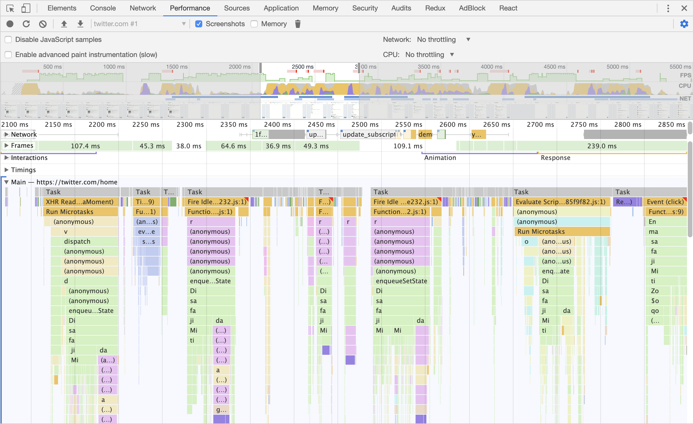

## Debugging
#### (MMT-B2017)

---
# Debugging JS

----
# console.log debugging
- Add console.log statements
- Click through the app
- See the log statements in chrome dev tools
  - easy to get started
  - some problems might be tough to track down

----
# Using Breakpoints
- Chrome/Firefox devtools allow breakpoints
- Breakpoints are a way to pause a programm
  - variables can be inspected
  - custom code can be executed

----
# Using Breakpoints
- Chrome/Firefox devtools allow breakpoints
- Breakpoints are a way to pause a programm
  - variables can be inspected
  - custom code can be executed

----
# How to add breakpoints
- Via EventListeners
  - DevTools > Sources > EventListener Breakpoints
- Via DOM events
  - eg. element is removed/added to dom
- In DevTools
  - Sources > find line of code > click on line number
- Via Code
  - add debugger statement

----
# Debugging NodeJS
- https://dev.to/john_papa/debug-your-nodejs-app-in-60-seconds-5cni

----
# Task
- Try to setup debugger for backend
- Start the backend and set breakpoint
- Maybe you have a bug which you want to investigate

---
# Debugging performance issues

----
# Chrome performance tab

- Determine why CPU is busy
- Flame graph Visualisation of
  - call stack
  - duration of fn call

----
# Bottom up
- Which functions had the most impact on performance

----
# CPU Performance

- Open dev tools
- Go to Performance > Record
  - Click stop

----
# Task 1
- clone: https://github.com/webpapaya/compup
- npm i && npm run start:development
- Users complain that some button clicks take very long
  - Don't look on commit history =)

----
# Task 2
- Go to your master project
- Open profiler
  - find the slowest function

---
# Feedback

https://de.surveymonkey.com/r/J6693VN
