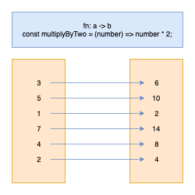
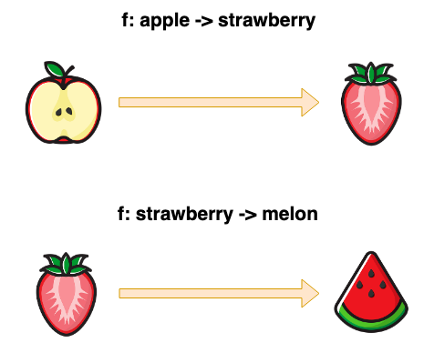
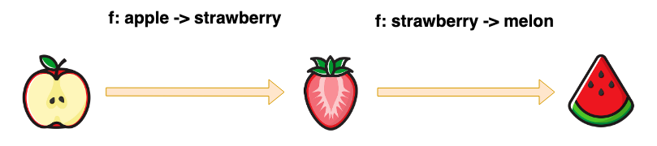
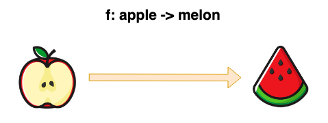

# Functional Programming
## (MMT-M2018)

---
## Roadmap

- Functional Programming introduction
- Eventstorming Session
- Use results from Eventstorming in Typescript
- Debugging in JS

---
# FP vs. OOP (TODO: add OOP description From: TS FP Book)

> FP tries to reduce the number of places where state changes happen.

---
# Why functional programming

- More testable
  - pure functions simplify testing
- Declerative APIs which are easier to reason about
- Easy concurrency because of statelessness and immutability
  - State is pushed out of the application core to the boundaries
- Simple caching
  - pure functions easy to cache (we'll see this in an example)

---
# What is functional programming

> Object-oriented programming makes code understandable by encapsulating moving parts. Functional programming makes code understandable by minimizing moving parts (Michael Feathers)

- Way how the application is built
- In comparison to other styles a function is the main building block

---
# First class functions

- Functions can be treated as any other datatype
  - Can be passed to a function as argument
  - Can be assigne a variable

```js
const helloWorld = () => 'hello world!';
const main = helloWorld;
```

---
# Pure Functions

A function is considered pure when:
- for the same input it always returns the same output
- it has no side effects (no mutation of non-local state, eg. database)

```js
const add = (a, b) => a + b;
```

----
# Attributes of pure functions

- They are idempotent
- They offer referential transparency
  - calls to this function can be replaced by the value without changing the programs behaviour
- They can be memoized (or cached)
- They can be lazy
- Testable more easy

----
# Which of these functions are pure 1/3

```js
const array = [1,2,3,4,5,6];
const fn1 = (array) => array.slice(0,3);
const fn2 = (array) => array.splice(0,3);
const fn3 = (array) => array.shift();
const fn4 = (array) => array.pop();
const fn5 = (array) => array.sort((a, b) => a - b);
const fn6 = (array) => [...array].sort((a, b) => a - b);
const fn7 = (array) => array.map((item) => item * 2);
const fn8 = (array) => array.forEach((item) => console.log(item));
```
----
# Which of these functions are pure 2/3

```js
let minimumAge = 18;
const isAllowedToDrink = (age) => age >= minimumAge;
```

```js
const minimumAge = 18;
const isAllowedToDrink = (age) => age >= minimumAge;
```

----
# Which of these functions are pure 3/3

```js
const isIndexPage = () => window.location.pathname === '/';
const isIndexPage = (pathname) => pathname === '/';
```

---
# Side-Effects

> A side effect is a change of system state or observable interaction with the outside world that occurs during the calculation of a result. (TODO: add citation)

- Any function with a side effect is not pure
- Programms without side effects are useless

----
# Some side effects

- DB/HTTP calls
- changing the file system
- querying the DOM
- printing/logging
- accessint system state (eg. Clock, Geolocation,...)

---
# Higher Order Functions
> A higher order function is a function that takes or returns a function.

```js
const createRecordInDb = () => { /* do someting in the database */ }
const createUser = (createRecordInDb) => {
  return (user) => {
    if (!isValid(user)) { throw new Error('User Invalid'); }
    return createRecordInDb(user);
  }
}
```

---
# Memoization

> `Memoizing' a function makes it faster by trading space for time. It does this by caching the return values of the function in a table. (https://metacpan.org/pod/Memoize)

----
# Pure functions recap

- A pure function returns for the same input the same output
- simple mapping from value a to value b



----
# Memoization in the real world


----
# Task:

- Memoize the fibonacci sequence
- Compare results with and without memoize

```js
const memoize = () => {}; // TODO: implement me
const fibonacci = (num) => {
  if (num <= 1) return 1;
  return fibonacci(num - 1) + fibonacci(num - 2);
};

const memoizedFibonacci = memoize(fibonacci);
```

- helper to measure time https://bit.ly/2UOFgAE

---
# Recursion (TODO: add slide)

---
# Currying

- Imagine a programming language where every function only accepts one argument.
- How would you add up 2 numbers with pure functions only?

----
# Currying 2/*

```js
const addLong = (a) => {
  return (b) => {
    return a + b
  }
};
const addShort = (a) => (b) => a + b;

addShort(1)(2);
```

----
# Currying 3/*

> Currying is the process of translating a function with multiple arguments into a sequence of functions with single arguments.

- Side Note: If you start doing functional programming you automatically swap the arguments

----
# Currying 4/*

```js
import { curry } from 'ramda';

const isGte = curry((boundary, value) => value >= boundary);
const filter = curry((filterFn, array) => array.filter(filterFn));

filter(isGte(5), [1,2,6,3,6,7,9,6,5]);
```

----
# Arity of a function

> The arity of a function is the number of arguments it receives.

```js
const add = (a, b) => a + b;
console.log(add.length) // => 2
```

----
# Task:

Implement your own curry function

```js
const add = curry((a, b) => a + b);
add(1)(2);
add(1, 2);
```

## Hints:
- https://developer.mozilla.org/de/docs/Web/JavaScript/Reference/Global_Objects/Function/bind
- https://developer.mozilla.org/de/docs/Web/JavaScript/Reference/Global_Objects/Function/call

----
# Possible solution

```js
const curry = (targetfn) => {
  const arity = targetfn.length;
  const fn = (...args) => args.length < arity
    ? fn.bind(null, ...args)
    : targetfn.call(null, ...args);

  return fn;
}
```
---
## Functional composition



----
## Functional composition



----
## Functional composition



- You don't know if it was composed by smaller functions
- The strawberry disappeared
  - encapsulate internal representations

----
## Functional composition

```js
const add = curry((a, b) => a + b);
const multiply = curry((a, b) => a * b);
const isEven = (value) => value % 2 === 0;

const calculateInsuranceRace = pipe(
  add(5),
  multiply(4),
  isEven,
);

calculateInsuranceRace(5); // => true
```

----
# pipe vs. compose

```js
// Left to right
pipe(first, second, third);
```

```js
// Right to left
compose(third, second, first);
```

----
# Task
- Build your own pipe function

### Hints
- https://developer.mozilla.org/de/docs/Web/JavaScript/Reference/Global_Objects/Array/reduce


---
# Domain Modeling and TS

- Requirements:
  - A user needs to have a first and last name
  - A user needs to have exactly one contact
    - a contact is either:
      - adress (contains street/zip code/country)
      - phone (contains phone)
      - email (contains email)
    - a contact can be verified

----
# Resulting Model

```ts
type User = {
  firstName: string,
  lastName: string,
  street?: string,
  zipCode?: string,
  country?: string,
  email?: string,
  isEmailVerified?: bool,
  phone?: string,
  isPhoneVerified?: bool,
}
```

----
# Can you spot issues with this model?

```ts
type User = {
  firstName: string,
  lastName: string,
  street?: string,
  zipCode?: string,
  country?: string,
  isAdressVerified?: bool,
  email?: string,
  isEmailVerified?: bool,
  phone?: string,
  isPhoneVerified?: bool,
}
```
----

> Can you spot issues with this model?

----

```ts
const user = {
  firstName: 'Sepp',
  lastName: 'Dupfinger',
  street: 'Hinterholz 8',
};
```

----
# 1 correct address and 7 falsy states

```ts
type User = {
  // ...
  street?: string,
  zipCode?: string,
  country?: string,
  // ...
}
```

----
# Requirements:
  - A user needs to have a first and last name
  - A user needs to have exactly one contact
    - a contact is either:
      - adress (contains street/zip code/country)
      - phone (contains phone)
      - email (contains email)
    - a contact can be verified

----
# Classify the type

```ts
type User = {
  firstName: string,
  lastName: string,

  // via post
  street?: string,
  zipCode?: string,
  country?: string,
  isAdressVerified?: bool,

  // via email
  email?: string,
  isEmailVerified?: bool,

  // via phone
  phone?: string,
  isPhoneVerified?: bool,
}
```

----
# Extract smaller bits

```ts
type PostContact = { street: string, zipCode: string, country: string, isVerified: bool }
type EmailContact = { email: string, isVerified: bool }
type PhoneContact = { phone: string, isVerified: bool }
type Contact = PostContact | EmailContact | PhoneContact

type User = {
  firstName: string,
  lastName: string,
  contact: Contact,
}
```

----
# Extract common properties


```ts
type Verifiable<T> = T & { isVerified: boolean }

type PostContact = Verifiable<{ street: string, zipCode: string, country: string }>
type EmailContact = Verifiable<{ email: string }>
type PhoneContact = Verifiable<{ phone: string }>
type Contact = PostContact | EmailContact | PhoneContact

type User = {
  firstName: string,
  lastName: string,
  contact: Contact,
}
```

----
# Use it

```ts
const user:User = {
  firstName: 'Sepp',
  lastName: 'Dupfinger',
  contact: { email: 'sepp@hinterholz.at', isVerified: true },
}
```

----

> Can you still spot issues with this model?

----

```ts
const user:User = {
  firstName: '',
  lastName: '',
  contact: { email: '', isVerified: true },
}
```

----
# Type aliases

```js
type Email = string
```

----

```ts
type Maybe<T> = T | null
type Email = string

const validateEmail = (maybeEmail: unknown): Maybe<Email> => {
    if (typeof maybeEmail === 'string' && maybeEmail.match(/.@./)) {
        return maybeEmail as Email;
    }
    return null;
}
```
----
TODO: add working gist

```ts
type Maybe<T> = T | null
type Verifiable<T> = T & { isVerified: boolean }

type Email = string
type Phone = string
type Street = string
type ZipCode = string
type Country = string

type PostContact = Verifiable<{ street: Street, zipCode: ZipCode, country: Country }>
type EmailContact = Verifiable<{ email: Email }>
type PhoneContact = Verifiable<{ phone: Phone }>
type Contact = PostContact | EmailContact | PhoneContact

//...
```


# Ressources
## Books/Blogs
- [Domain Modeling Made Functional](https://www.amazon.com/Domain-Modeling-Made-Functional-Domain-Driven/dp/1680502549?tag=fsharpforfuna-20)
- [Hands-On Functional Programming with TypeScript](https://www.amazon.com/Hands-Functional-Programming-TypeScript-applications/dp/1788831438)
- [Mostly adequate guide to FP](https://github.com/MostlyAdequate/mostly-adequate-guide)
- [F# for fun and profit](https://fsharpforfunandprofit.com/)

## Talks
- [Functional Design Patterns](https://www.youtube.com/watch?v=srQt1NAHYC0)
- [Domain Modeling Made Functional](https://www.youtube.com/watch?v=Up7LcbGZFuo)
- [Hey Underscore, You're Doing It Wrong!](https://www.youtube.com/watch?v=m3svKOdZijA)

---------------------------------------------------------------------------------


## Feedback

https://de.surveymonkey.com/r/J6693VN


---
# Event Storming
- Orange events
  - it has to be an orange sticky note
  - it needs to be phrased in the past
  - it has to be relevant for the domain
  - eg. item added to cart/user registred
- Yellow People
  - people involved in the application
  - eg. a waiter/waitress, a restaurant visitor
- Purple Hot Spots
  - External Systems
    - eg. Google Analytics/Emails
- Blue Commands


# What is Eventstorming
- Workshop format.
- Gather requirements for products

# Things to prepare
- 8-9m of plotter paper
- Black Markers
- Sticky notes


# Introduction question
> We're asking you to write the key events in your domain as an orange sticky not, in a verb at past tense, and place them along a timeline

# Goal
> We are going to explore the business process as a whole by placing all the relevant events along a timeline. We'll highlight ideas, risks and opportunities along the way.


Example of a Domain Event:
> Item added to cart.

-

- Only introduce a dummy domain event and let the team do the rest
- When a not is not in the past turn it 45 counter clockwise

Special keywords mark them on a dedicated sticky note.
eg. Investment - The amount actually put in a specific loan.


- Orange Domain Events
  - item placed to cart
  - money was borrowed
  - money was lended
- Purple stickies
  - Put warning signs on
  - uncertainties
- Pink stickies external dependencies
  - external organisations
  - external services
  - ...
- Yellow Stickies Actors
  - eg. User/Creditor/Debitor
- Blue Commands
  - eg. Places Order


- Big Picture Event storming
  - project kickoff
- Invite the right people
  - people who care about the problem
  -


- Complex vs complicated