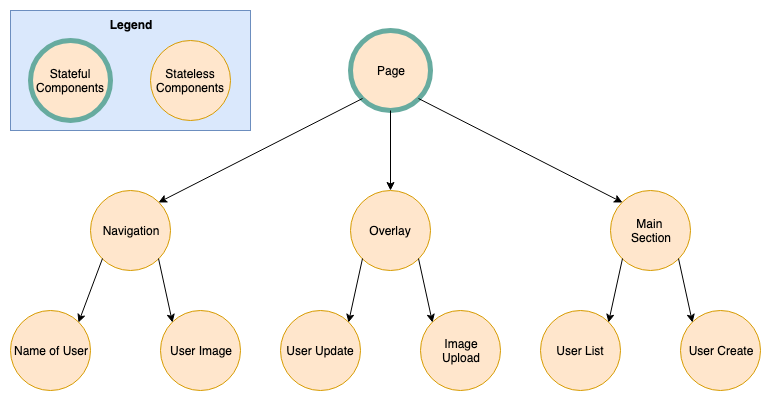
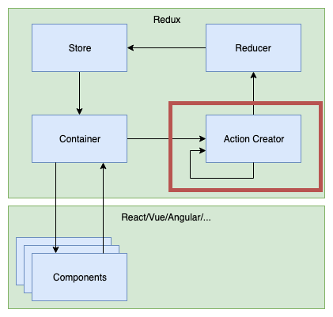

### State Management with Redux
#### (MMT-B2017)

---

### Roadmap
- State Management with Redux

---
### State Management with Redux

----
### What is application state

> An application's state is roughly the entire contents of its memory. ([sarnold](https://stackoverflow.com/a/8102731))

----
### State in Redux terms

> Every bit of information the application needs in order to render.

----
### What information do we need to render this page?


----
### What information do we need to render this page?

| Question?                                  | State Name           |
|--------------------------------------------|----------------------|
| Is the user authenticated?                 | authenticationStatus |
| Is a form already filled with values?      | formValues           |
| Is the input field hovered/focused/filled? | inputStatus          |
| Am I owning money to somebody?             | moneyTransactions    |
| Is somebody owning me some money?          | moneyTransactions    |
| Which users can I owe some money?          | users                |
| Which components should be rendered?       | url                  |

----
### Categorising different types
- Relevant for other parts of the application?
  - add to global state
- Irrelevant for other parts of the application?
  - use component state (useState or setState)
  - also known as UI State

----
### Global/Local/URL?

| State Name           | State Type |
|----------------------|------------|
| authenticationStatus |            |
| moneyTransactions    |            |
| users                |            |
| formValues           |            |
| inputStatus          |            |
| url                  |            |

----
### Global/Local/URL?

| State Name           | State Type |
|----------------------|------------|
| authenticationStatus | global     |
| moneyTransactions    | global     |
| users                | global     |
| formValues           | local      |
| inputStatus          | local      |
| url                  | url        |


----
### Global State
- relevant for other components
- could be seen as a client side database
  - or a cached version of the server data
- domain object should be stored here
  - eg. users, money transactions, authentication token

----
### UI State
- irrelevant for other parts of the application
  - or state which shouldn't be shared with others
- What to store in UI state?
  - Form states
  - visual enhancements

----
### URL State
- defines which set of components should be rendered
- persists on page reloads
- What to store in URL state?
  - the current route
  - the current page of a paginated list

---
### React component tree


----
### Storing state in components


----
### Storing state in components
- Pros
  - Components are independent
    - eg. "Navigation" doesn't know about "User Update"
- Cons
  - User data needs to be fetched multiple times
  - If UserUpdate component changes name of user
    - Navigation needs to refetch user data

----
### Storing state in the root component



----
### Storing state in the root component

- Pros
  - User data could be fetched only once
  - If UserUpdate component changes name of user
    - navigation component is automatically updated
- Cons
  - State needs to be passed down to every component
  - (Root component contains all state logic)

----
### Storing state in the root component


----
### Storing state in redux


----
### Storing state in redux

- Global state which acts like local state
- Pros:
  - Components are independent
    - eg. Navigation doesn't know about UserUpdate
  - State changes are synchronised with the whole app
  - State doesn't need to be passed down the tree
- Cons:
  - "Complex" architecture for small apps

---
### Redux


----
### Why Redux

- Managing state in react can be challenging
  - How to synchronise state between distant UI parts
- Redux provides a predictable way to manage state
- State can only be changed by dispatching an action
- Each action might change the previous state to a new updated state
- Works with react, vue, angular, ...

---
### Actions



----
### Actions

> Something happened in the app which might be interesting.

----
### Actions

- An action is data from the application which might be relevant for the store
- Information is sent to the store via store.dispatch

```js
const signInAction = {
  type: "signIn",
  payload: {
    username: "peter",
    password: "the clam"
  }
}

store.dispatch(signInAction);
```
----

### Action Creators

- A functions which creates actions
- With redux-thunk action creators can dispatch itself
  - This is where side effects are handled

```js
const actionCreator = () => (dispatch) => {
  dispatch({ type: 'action1', payload: {} });
  dispatch({ type: 'action2', payload: { something: 'random' } });
  dispatch({ type: 'action3', payload: { something: 'random' } });
  // ...
};

store.dispatch(actionCreator());
```

----
### Async action creators

```js
const createMoneyTransaction = ({ creditorId, debitorId, amount }) =>
  async (dispatch) => {
    dispatch({ type: 'createMoneyTransaction/initiated', payload: {}});
    try {
      const moneyTransaction = await fetch('/money-transaction/', {
        creditorId,
        debitorId,
        amount,
      });
      dispatch({
        type: 'createMoneyTransaction/success',
        payload: moneyTransaction
      });
    } catch (e) {
      dispatch({ type: 'createMoneyTransaction/error', payload: e });
    };
  };

store.dispatch(signInAction({ creditorId: 1, debitorId: 2, amount: 10.3 }));
```

---
### Reducers


----
### Reducers

> Reducers specify how the application's state changes in response to actions sent to the store. ([Source](https://redux.js.org/basics/reducers))

----
### Reducers

- Specify how state changes in response to actions.
- Pure function
  - input appState and action
  - output next application state

```js
const initialState = {};
const reducer = (previousState = initialState, action) => {
  // do something with the state
  return nextState;
}
```

----
### Reducers

```js
const initialState = [];
const moneyTransactionReducer = (previousState = initialState, action) => {
  switch(action.type) {
    case 'createMoneyTransaction/success':
      return [...previousState, action.payload];
    case 'reset':
      return initialState;
    default:
      return previousState;
  };
};
```

---
### Container components


----
### Container components

- Glue between react and redux
- Provides data from the global store to the components
- Provides "callbacks" to trigger actions

----
### Container Components

```js
import { createMoneyTransaction } from '../action-creators/money-transactions'
const mapStateToProps = (state, props) => {
  return {
    moneyTransactions: state.moneyTransactions
  };
};

const mapDispatchToProps = (dispatch, props) => {
  return {
    createMoneyTransaction: (payload) =>
      dispatch(createMoneyTransaction(payload))
  };
};

export default connect(
  mapStateToProps,
  mapDispatchToProps,
)(MoneyTransactionList);
```

----
### mapStateToProps
- extract data from the store and provides it to a component
- data filtering can be done here
- `function mapStateToProps(state, ownProps?)`
  - state -> the entire application state
  - ownProps -> properties which are passed from other components
- [Docs](https://react-redux.js.org/using-react-redux/connect-mapstate)

----
### mapDispatchToProps
- binds actions with the store and provides those actions to a component
- `function mapStateToProps(dispatch, ownProps?)`
  - dispatch -> the stores dispatch function
  - ownProps -> properties which are passed from other components
- [Docs](https://react-redux.js.org/using-react-redux/connect-mapdispatch)

---
## Task 1 (Actions)
- Download
  - [React dev tools](https://chrome.google.com/webstore/detail/react-developer-tools/fmkadmapgofadopljbjfkapdkoienihi?hl=de)
  - [Redux dev tools](https://chrome.google.com/webstore/detail/redux-devtools/lmhkpmbekcpmknklioeibfkpmmfibljd?hl=de)
- in src/store.js
  - add `window.store = store`;
- `npm run start`
- go to localhost:8081
- open dev tools/redux tab
- create fetchUsers action creator (type fetchUser/success)
  - mock user data for now
  - `dispatch(fetchUsers())`

----
## Task 2 (Reducer)

- Add a userReducer reducer
  - entry point: `src/reducer/index.js`
  - listen to 'fetchUser/success'
    - try to populate the redux store with a new user

----
## Task 3 (Container)

- Try to connect your moneyTransactionCreate dropdown with users from the store

----
## Task 4 (connect to backend)
- install https://www.npmjs.com/package/compup-api-wrapper
- Try to connect fetchUsers action creator to backend

```js
import { userRepository } from 'compup-api-wrapper'

// Returns all users
await userRepository.all();
```

---
# Further Links

- [Redux Tutorial](https://redux.js.org/basics/basic-tutorial)
- [Mostly adequate guide to FP](https://github.com/MostlyAdequate/)
- [Hands-On Functional Programming with TypeScript](https://www.amazon.com/Hands-Functional-Programming-TypeScript-applications/dp/1788831438)

---
# Feedback

https://de.surveymonkey.com/r/J6693VN
