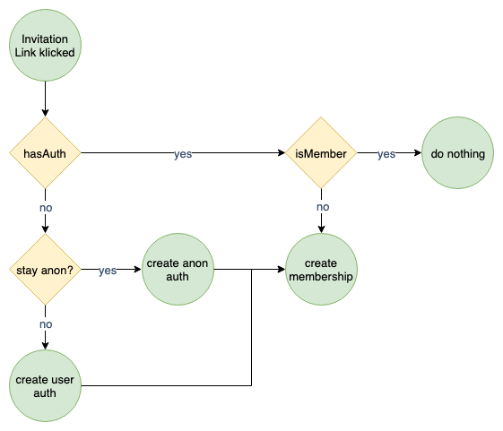
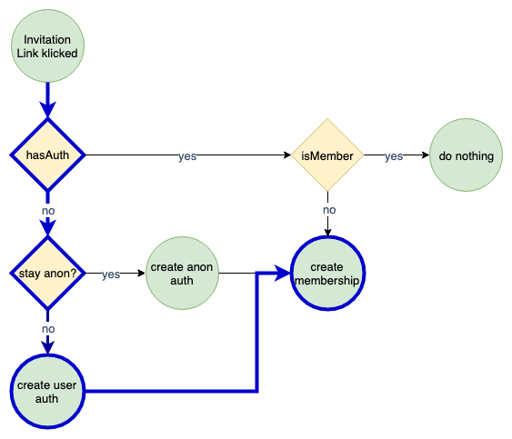

### Client Side Testing
#### (MMT-B2017)

---
# TDD

- Test driven development (also known as TDD)
- Type of software development
- Introduced by Kent Beck
  - Author of [Extreme Programming](https://www.amazon.de/Extreme-Programming-Explained-Embrace-Change/dp/8131704513/ref=sr_1_1?__mk_de_DE=%C3%85M%C3%85%C5%BD%C3%95%C3%91&keywords=kent+beck+extreme+programming+englisch&qid=1557045753&s=books&sr=1-1-catcorr)


---
# Testing Pyramid


---
# Enterprise test Pyramid


---

> TDD doesn't drive good design. TDD gives you immediate feedback about what is likely to be bad design. (Kent Beck)

---
# Why TDD

- Driving the design of our application
- Testing is a side-effect
- Possibility to refactor
- Documentation
  - Can't get out of sync
  - [Docs for pomeranian-durations](https://github.com/webpapaya/pomeranian-durations)

---
# Shortest intro to TDD

https://www.youtube.com/watch?v=WSes_PexXcA


----
# Essential vs. accidental complication

- Essential complication
  - The problem is hard
  - eg. Tax return Software
  - nothing we can do about
- Accidental complication
  - We are not so good in our job
  - eg. future proofing code
    - (it might be usefull in the future)
  - we can try to improve ourselfs

----
# Accidental complication

- future proofing code
- cutting corners
  - to get stuff out of the door
  - we're not going to change this anyways
- drives up the cost/development time of a feature
  - mostly the feature isn't complex
  - the way the app is built drives the cost of a feature
- big refactorings are hard to sell

----
# What can we do?

- Baby steps and TDD
- Refactor a little after every feature/green test
  - clean the kitchen
  - prevents big refactorings
    - which are hard to sell to business
- Without refactoring features will take longer


---
# TDD Cycle


---
# TDD Cycle

- Red: Write a test and watch it fail
- Green: Write just as much code to make the test pass
- Refactor: Clean up

----
# Red
- Think about the test description
- Running the test suite should describe what the program is doing

```js
it('returns 3$, when product A given', () => {
  assert.equal(calculatePrice('productA'), '3$');
});
```

----
# Green
- Write just enough code to make the test pass
  - if there is only 1 product just return 3$

```js
function caluculatePrice() {
  return '3$';
};

it('returns 3$, when product A given', () => {
  assert.equal(calculatePrice('productA'), '3$');
});
```

----
# Refactor
- Change the code without changing any of the behaviour
- "Clean the kitchen"

```js
const caluculatePrice = () => '3$';

it('returns 3$, when product A given', () => {
  assert.equal(calculatePrice('productA'), '3$');
});
```

---
# Anatomy of a Test

- **A**rrange => test setup
- **A**act => call the unit to test
- **A**ssert => verify the result

----
# Anatomy of a Test
```js
it('returns a list of employees ordered by their name', () => {
  // Setup
  const employees = [
    { name: 'Sepp' },
    { name: 'Max' },
    { name: 'Anton' },
  ];

  // Act
  const result = employeeReport(employees);

  // Assert
  assertThat(result, orderedBy((a, b) => a.name < b.name));
});
```

---
# Testing Pyramid


----
# Enterprise test Pyramid


----
# What is an integrated test?

> A test where the success or failure depends on many different bits of interesting behaviour at once. (@jbrains)

----
# What is an integrated test?

> Any test where the reason of a failure is hard to track down.

----
# How many code paths?



----
# How many code paths?



----
# has authentication

- auth given
  - but expired?
  - user was deleted?
  - user was disabled?
- not auth given?

----
# create user auth

- email already taken?
- password to short?
- db/auth service down?
- ...

----
# create membership

- group does not exist anymore?
- group was disabled?
- invitation got revoked?
- user was already added from other device?
- ...

----
# How many integration tests to write?


----
# Integrated tests:

- hasAuth (4 paths)
- create user auth (3 paths)
- create membership (4 paths)
- Exponential growth
  - 4 * 3 * 4 = 48 tests

----
# Unit tests:

- hasAuth (4 paths)
- create user auth (3 paths)
- create membership (4 paths)
- 4 + 3 + 4 = 11 tests + 2 contract tests

----
# Unit tests only?  <!-- .element: class="color--white" -->

<!-- .slide: data-background="https://media.giphy.com/media/d5ut1zCCPGta0/giphy.gif" -->
<!-- .slide: data-color="white" -->

----
# Happy path tests

- 1 integrated test
  - check if the communication between components work
  - run against
    - controller
    - main function
    - ...

----

> If the design has problems. The tests will be hard to write. (@jbrains)

---
# Steps

- Step 1: Think
- Step 2: Write a test
- Step 3: How much does this test suck?
- Step 4: Run the test and watch it fail
- Step 5: Write just enough code to make it pass
- Step 6: Cleanup

---
# Code Kata
- Small exercise
  - to improve programming skills
  - by challanging your abilities
  - end encouraging you to find multiple approaches

---
# Mocks/Stubs/Spys

---
# Testing legacy applications

> By “legacy code”, I mean profitable code that we feel afraid to change.

----
# Golden Master tests

- Sampling
- Snapshot of the current acceptable result


----
# Unit tests only?
- Happens that unit test pass
  - but pru

---
# Resources
- [Integrated Tests are a Scam](https://vimeo.com/80533536)
-