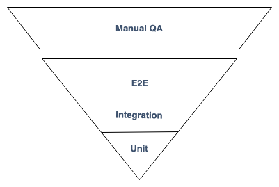

### Client Side Testing
#### (MMT-M2018)

---

### Wunschkonzert for next time?
- debugging/logging
- i18n
- Scaling CSS
- Other testing kata
- Functional programming 2?

---
# Roadmap

- Recap of React/Redux
  - Finish user list data fetching
  - Routing in React
- Client Side Testing
  - Unit Testing
  - Integration testing
  - e2e testing
- (how to write test assertions)
- (validations with io-ts)

---
# Recap of react/redux  <!-- .element: class="color--white" -->

<!-- .slide: data-background="https://media.giphy.com/media/jJOKTwGlSS7OU/giphy.gif" -->

---
### React Router

 - dynamic routing library for
  - react native
  - react web
- [Documentation](https://reacttraining.com/react-router/web/guides/quick-start)

----
### Installation

 ```
npm install react-router-dom --save
```

----
### Usage

 ```js
import { BrowserRouter as Router, Route, Switch, Redirect } from "react-router-dom";
import Homepage from './components/homepage'
import SignIn from './components/sign-in'
 const App = () => {
  return (
    <Router> { /* creates a new routing context */ }
      <Switch> { /* render only one route */ }
        { /* define routes and pass component as prop to the route */ }
        <Route path="/sign-in" component={SignIn}>
        <Route path="/" component={Homepage}>
        { /* if no route matches redirect to 'Homepage' */ }
        <Redirect to='/'>
      </Switch>
    </Router>
  );
}
```

----
### Route priority (without exact)

 ```js
// path === "/" => renders Homepage
// path === "/sign-in" => renders Homepage
const Routes = () => (
  <Switch>
    <Route path="/" component={Homepage}>
    <Route path="/sign-in" component={SignIn}>
  </Switch>
);
```

----
### Route priority (without exact)

 ```js
// path === "/" => renders Homepage
// path === "/sign-in" => renders Homepage
const Routes = () => (
  <Switch>
    <Route path="/sign-in" component={SignIn}>
    <Route path="/" component={Homepage}>
  </Switch>
);
```

----
### Route priority (with exact)

 ```js
// path === "/" => renders Homepage
// path === "/sign-in" => renders sign-in
const Routes = () => (
  <Switch>
    <Route exact path="/" component={Homepage}>
    <Route exact path="/sign-in" component={SignIn}>
  </Switch>
);
```

----
### Add Links from html

 ```js
 import { Link } from "react-router-dom";

const Routes = () => (
  <nav>
    <Link to="/">Home</Link>
    <Link to="/sign-in">Sign in</Link>
  </nav>
);
```

----
### Add redirects from JS

 ```js
 import { withRouter } from "react-router-dom";

const SignIn = withRouter(({ history }) => {
  const onSubmit = (evt) => {
    evt.preventDefault();
    history.push('/')
  };

  return (
    <form onSubmit={onSubmit}>
      { /* ... */ }
    </form>
  )
});
```

----
### Task

- finish user data fetching
- add sign up component with redirect after submit

----
### Example Redux App

- Source: https://github.com/webpapaya/compup
- Live: https://compup.agilesoftware.dev

---

# Client Side Testing

---
### Testing Pyramid


----
### Testing Pyramid

- Unit tests
  - lots of small and isolated tests which are fast to execute
- Integration tests
  - some integration tests which test external systems like databases
- E2E
  - few tests which test the whole system

----
### Enterprise test pyramid



---
# Unit testing and TDD

- Test driven development (also known as TDD)
- Type of software development
- Introduced by Kent Beck
  - Author of [Extreme Programming](https://www.amazon.de/Extreme-Programming-Explained-Embrace-Change/dp/8131704513/ref=sr_1_1?__mk_de_DE=%C3%85M%C3%85%C5%BD%C3%95%C3%91&keywords=kent+beck+extreme+programming+englisch&qid=1557045753&s=books&sr=1-1-catcorr)

----
### Why TDD

- early/fast feedback during development
- Driving the design of our application
  - Testing is a side-effect
- Possibility to refactor
  - Confidence that app is still working
- Break down large problems into small problems
  - Think about edge cases
- executable documentation
  - Can't get out of sync
  - [Docs for pomeranian-durations](https://github.com/webpapaya/pomeranian-durations)

----
### TDD to me

> Getting confidence that refactoring doesn't break a feature.

----
### TDD

> TDD doesn't drive good design. TDD gives you immediate feedback about what is likely to be bad design. (Kent Beck)

> I want to go home on Friday and don't think I broke something. (Kent Beck)

----
### What is TDD not

- Silver bullet for clean code
  - it eventually leads to better code
- Replacement for other testing strategies
  - TDD doesn't catch all bugs
  - Helps adding regression tests

----
> The best TDD can do, is assure that the code does what the developer thinks it should do. (James Grenning)

---
### TDD intro in 7:26 minutes

https://www.youtube.com/watch?v=WSes_PexXcA

----
### Essential vs. accidental complication

- Essential complication
  - The problem is hard
    - eg. Tax return Software
  - nothing we can do about
- Accidental complication
  - We are not so good in our job
  - eg. future proofing code
    - (it might be useful in the future)
  - we can try to improve ourselves

----
### Accidental complication

- future proofing code
- cutting corners
  - to get stuff out of the door
  - we're not going to change this anyways
- drives up the cost/development time of a feature
  - mostly the feature isn't complex
  - the way the app is built drives the cost of a feature
- big refactoring is hard to sell

----
### Avoid accidental complication

- Baby steps and TDD
- Refactor a little after every feature/green test
  - clean the kitchen
  - prevents big bang refactoring
    - which are hard to sell to business
- Without refactoring features will take longer

---
# TDD Cycle


----
### TDD Cycle

- Red: Write a test and watch it fail
- Green: Write just as much code to make the test pass
- Refactor: Clean up

----
### Red
- Think about the test description
- Descriptions should reflect the behaviour of the program

```js
it('returns 3$, when product A given', () => {
  assert.equal(calculatePrice('productA'), '3$');
});
```

----
### Green
- Write just enough code to make the test pass
  - if there is only 1 product just return 3$

```js
function caluculatePrice() {
  return '3$';
};

it('returns 3$, when product A given', () => {
  assert.equal(calculatePrice('productA'), '3$');
});
```

----
### Refactor
- Change the code without changing any of the behaviour
- "Clean the kitchen"

```js
const caluculatePrice = () => '3$';

it('returns 3$, when product A given', () => {
  assert.equal(calculatePrice('productA'), '3$');
});
```

---
# Anatomy of a Test

- **A**rrange => test setup
- **A**act => call the unit to test
- **A**ssert => verify the result

----
### Anatomy of a Test
```js
it('returns a list of employees ordered by their name', () => {
  // Setup
  const employees = [
    { name: 'Sepp' },
    { name: 'Max' },
    { name: 'Anton' },
  ];

  // Act
  const result = employeeReport(employees);

  // Assert
  assertThat(result, orderedBy((a, b) => a.name < b.name));
});
```

---
# Code Kata

- Small exercise
  - to improve programming skills
  - by challenging your abilities
  - and encouraging you to find multiple approaches

---
# Steps

- Step 1: Think
- Step 2: Write a test
- Step 3: How much does this test suck?
- Step 4: Run the test and watch it fail
- Step 5: Write just enough code to make it pass
- Step 6: Cleanup

----
### Roman numerals

- go to http://tddbin.com/
- http://codingdojo.org/kata/RomanNumerals/


---
# What makes a good test

- Deterministic
  - randomness hard to test
  - current date time hard to test
- Tests not affecting state of the system
  - changing global state (eg. database => without cleanup)
- no external systems
- little test setup
- behaviour is described and not implementation details

---
### TDD Trap

- Bad tests
- How do good tests look like
- Don't focus on implementation detail but behaviour
- Tests are getting in their way
- TDD is not easy to start
- Extremely hard to master
- Deleting tests is fine (if they're not required anymore)

---

# Tools to test units under isolation

----
# Dummy objects
- Objects which aren't used
  - so that the compiler doesn't complain
  - used to fill parameter lists

----
# Fake objects
- Objects have a working implementation
  - but take some shortcuts
  - eg. inMemoryDatabases instead of persistent DB

----
# Stub objects
- Predefined return values for testing
- Instead of calling the real API we return a value for testing
- Useful when:
  - retrieving geolocation
  - testing edge cases (database throws OutOfMemory exception)

```js
const retrieveGPSPosition = () =>
  Promise.resolve({ lat: 12.12, lng: 14.15 });
```

----
# Spy objects
- Are stubs that also record the way they were called
- Useful when:
  - A hard to verify side effect is triggered (eg. E-Mail sending)

```js
it('sends an email on sign up', () => {
  const sendEmail = buildFunctionSpy();
  const signUp = signUp({ sendEmail }, username, password);
  assertThat(sendEmail, wasCalled());
});
```

---
### Clock in kata

- go to http://tddbin.com/
- http://kata-log.rocks/clock-in-kata

----
# Remember steps

- Step 1: Think
- Step 2: Write a test
- Step 3: How much does this test suck?
- Step 4: Run the test and watch it fail
- Step 5: Write just enough code to make it pass
- Step 6: Cleanup

----


---
# Integrated tests  <!-- .element: class="color--white" -->

<!-- .slide: data-background="https://media.giphy.com/media/l3JDFjQK5E3vr18T6/giphy.gif" -->

----
# What is an integrated test?

> A test where the success or failure depends on many different bits of interesting behaviour at once. (@jbrains)

----
### What is an integrated test?

> Any test where the reason of a failure is hard to track down. (@jbrains)

----
### How many code paths?


----
### How many code paths?


----
### has authentication

- auth given
  - but expired?
  - user was deleted?
  - user was disabled?
- not auth given?

----
### create user auth

- email already taken?
- password to short?
- db/auth service down?
- ...

----
### create membership

- group does not exist anymore?
- group was disabled?
- invitation got revoked?
- user was already added from other device?
- ...

----
### How many integration tests to write?


----
### Integrated tests:

- hasAuth (4 paths)
- create user auth (3 paths)
- create membership (4 paths)
- Exponential growth
  - `4 * 3 * 4 = 48 tests`

----
### Unit tests:

- hasAuth (4 paths)
- create user auth (3 paths)
- create membership (4 paths)
- `4 + 3 + 4 = 11 tests + 2 contract tests`

----
# Unit tests only?  <!-- .element: class="color--white" -->

<!-- .slide: data-background="https://media.giphy.com/media/d5ut1zCCPGta0/giphy.gif" -->

----
### Happy path tests

- 1 integrated test per use-case
  - check if the communication between components work
  - run against
    - controller
    - main function
    - ...

---
# Testing Databases

- Arrange
  - Open a transaction
- Act
  - execute your business logic
- Assert
  - verify your results
- Cleanup
  - Rollback the transaction

----
# Task
- Clone https://github.com/webpapaya/fhs-neo4j-tests
- Update tests so that they run inside a transaction
  - rollback the transaction before the test finishes

---
# E2E tests

----
### E2E tests
- Test the whole application from start to finish
- Ensure right information is passed between systems
- Hard to setup/maintain
  - Changing submit button label to sign-up might break tests

----
### E2E testing recommendation
- Find a couple of happy paths through the app
  - max 10
- Run those happy paths agains supported browsers
- Many things can go wrong
  - retry your tests

----
# Selenium

- Tool to automate browsers
- Can be used to write e2e tests
- Webdrivers for all major browsers
  - Chrome
  - Firefox
  - IE/Edge
  - Safari

----
### API

- Pretty low level
- Poor documentation
- build own API on top of Selenium API

----
# Setup a new driver

```js
// process.env.SELENIUM_DRIVER one of chrome, edge, safari, firefox
const driver = await new Builder().forBrowser(process.env.SELENIUM_DRIVER).build();

await driver.quit();
```

----
# Navigate somewhere

```js
await driver.get('https://compup.agilesoftware.dev');
```

----
# Click a link

```js
const clickLink = async (driver, href) => {
  const element = By.js(`return document.querySelector('[href="${href}"]');`);
  await driver.wait(until.elementLocated(element));
  await driver
    .findElement(element)
    .click();
};
```

----
# Fill a form field

```js
const fillFormField = async (driver, { name, value }) => {
  const element = By.js(`return document.querySelector('[name=${name}]');`)
  await driver.wait(until.elementLocated(element));
  await driver
    .findElement(element)
    .sendKeys(value); // Sends form values to field
};
```

----
# Click some text

```js
const clickText = async (driver, text) => {
  const element = By.xpath(`//*[text()[contains(.,'${text}')]]`);
  await driver.wait(until.elementLocated(element));
  await driver
    .findElement(element)
    .click();
}
```

----
# Hit Enter in text field

```js
const hitEnterInFormField = async (driver, { name }) => {
  const element = By.js(`return document.querySelector('[name=${name}]');`)
  await driver.wait(until.elementLocated(element));
  await driver
    .findElement(element)
    .sendKeys(Key.ENTER);
};
```

----
# E2E tests
- What would be good E2E tests for
  - https://compup.agilesoftware.dev

----
# Task 1/2
- clone https://github.com/webpapaya/fhs-e2e-tests
- Write the following tests
  - Lending money to somebody else
    - Sign up 2 different users
    - One is lending money to somebody
    - The other pays back
    - Verify sum at top changed to 0

----
### Task 2/2
- Write the following tests
  - Changing username
    - Sign up
    - change username
    - sign out
    - sign in again
    - go to settings
    - verify username

----
### Homework

- We'll review it together next time
  - Think about some e2e test cases for your project

---
# Resources
- [Integrated Tests are a Scam](https://vimeo.com/80533536)
- [Is TDD Dead](https://www.youtube.com/watch?v=z9quxZsLcfo&list=PLJb2p0qX8R_qSRhs14CiwKuDuzERXSU8m)
- [Is TDD Dead](https://www.youtube.com/watch?v=z9quxZsLcfo&list=PLJb2p0qX8R_qSRhs14CiwKuDuzERXSU8m)
- [Mocks,Stubs,Spys](https://martinfowler.com/bliki/TestDouble.html)
- [Extreme Programming](https://www.amazon.de/Extreme-Programming-Manifest-Kent-Beck/dp/3827317096)
- [TDD](https://www.amazon.de/Test-Driven-Development-Example-Signature/dp/0321146530/ref=pd_lpo_sbs_14_img_2?_encoding=UTF8&psc=1&refRID=KGXDT4ZNWGXMT5Y96H3F)

---
# Feedback

https://de.surveymonkey.com/r/J6693VN

