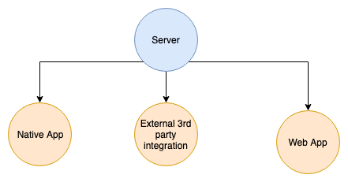

# Wunschkonzert

---

#i18n/l10n

---

# Numeronym
- Number based word
- mostly used as a shortend form of a word
- eg.
  - W3C (World Wide Web Concortium)
  - k8s (kubernetes)
  - g11n (globalization)
  - i18n (internationalisation)
  - l10n (localisation)
  - a11y (accessibility)

----
# i18n definition
> Internationalization is the design and development of a product, application or document content that enables easy localization for target audiences that vary in culture, region, or language. **(W3C)**

----
# i18n
- Process of designing apps which can be localized later
  - use UTF-8 as encoding instead of latin-1
  - handling timestamps accross different timezones

----
# l10n definition
> Localization refers to the adaptation of a product, application or document content to meet the language, cultural and other requirements of a specific target market (a locale). **(W3C)**

----
# l10n
- Localisation might contain:
  - Formating (datetime/numeric/... values)
  - Graphics which might be inappropriate in a given culture
  - Changes due to legal requirements
    - eg. a VAT-ID is required in certain countries on purchase

---
# Things to consider
- Language
- Writing Direction (RTL, LTR)
- Formatting (Date, Time, Currency, ...)
- Relative Time (Days ago, ...)
- Pluralisation
  - some language differenciate between one, few, many

---
# CLDR
- Common locale data repository
- Most extensive repository for locale-specific data
- Developed/Maintained by the Unicode Consortium
- Pretty big 72mb of JSON (xml is bigger)

----
# CLDR
- certain translations
  - language names
  - terretory country names
  - calendric names (weekdays, months,...)
- formatting/parsing numbers, dates
- conversion rules
  - numeral systems (eg. roman -> arabic numbers)
  - calendar systems (eg. julian -> gregorian calendar)
  - spelling numbers as words
- Country infos
  - which day does a week start
  - ...

---
# ICU
- International Components for Unicode
- OpenSource Project for internationalisation
- Uses CLDR internally
- Ported to many environments
  - JS [formatjs](https://formatjs.io)
  - Java
  - C++
  - ...

----
# ICU
- Simple string translations: 'Hello everybody'
- Simple string with placeholder: 'Hello {name}'
- Formatters
  - Number
  - Date
  - Time
  - Select
  - Plural
  - Custom formats eg. currencies

---
# ICU Basic Numbers
- `{ count, number }`
  - en: 21,629,693
  - ca: 21.629.693
  - de: 21629693

----
# ICU Currency Numbers
- `{ count, number, currency }`
  - en: $1,693.10
  - ca: 1.693,10 USD
  - de: 1.693,10 $

- `{ count, number, currency:EUR }`
  - en: May 1, 2019
  - ca: 1.693,10 €
  - de: 1.693,10 €

----
# ICU Date

- `{ count, date }`
  - en: May 1, 2019
  - ca: 1 de maig de 2019
  - de: 1. Mai 2019

- `{ count, date, short }`
  - en: 5/1/19
  - ca: 1/5/19
  - de: 1.5.19

----
# ICU Plural
```
{ count, plural,
    =0    {Zero}
    =1    {One}
    other {Many} }
```

----
# ICU Select
```
{ gender, select,
    male {He avoids bugs}
  female {She avoids bugs}
   other {They avoid bugs} }
```

---


---
# ISO 639 (Language codes)
- Language Names

---
# ISO 3166 (Country codes)
-
- ISO 3166-1 (two character country codes)
- ISO 3166-2 (three character country codes)
  -  4965 different countries

---
# Locale
- Language code + country code
  - 'de-AT', 'deu-AT'
  - 'de-DE', 'deu-DE'
  - 'en-US'

---
> Adding i18n early to a project is much easier than afterwards.

---
# Why
- Size difference needs to be taken into account
  - eg. bezahlen -> pay
- RTL vs. LTR
- Adding translate functions afterwards is a big task
  - doing this right away is a no brainer
- easiest translation `const t = (text) => text;`
  - wrap all hardcoded text with t function
  - use IDE to find all references afterwards

---
# How to select the correct language
- on the client
  - `navigator.language || navigator.userLanguage`
- on the server
  - via HTTP Accept-Language header

---
# Define a hierarchy
- use system settings
- (use custom user settings)
  - when many people share the same device
- use url parameter (mostly for debugging)

----
> All our translations are done on the client we don't locales on the backend.

----
# How to handle server validations
- examples:
  - email already taken
  - invitation token expired
  - ...
- Send error code via API to client (translate on client)

----
# How to add a new validation
- eg. email can't end with trash-mail.com


----
# How to handle server validations

- Adding validation rules becomes hard
  - all clients need to update
- Solution translate as local as possible
  - eg. directly in the server validations


---
# ISO8601

----
# Regional differences
- Erdapfel => Kartoffel
- Jänner => Januar
-


- debugging/logging
- i18n
- css
- functional programming
- caching graphql

Klausur Tag:
- code retreat

